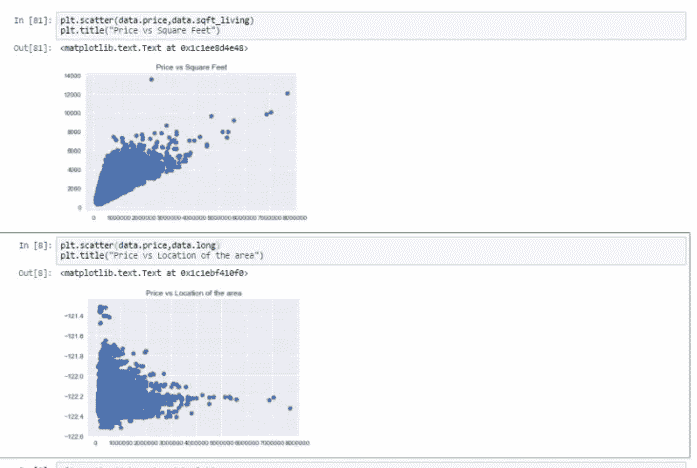

# 探索您的数据集以获得洞察力

> 原文：<https://medium.datadriveninvestor.com/exploring-your-data-set-for-insight-c548bcab9732?source=collection_archive---------18----------------------->

在数据科学中，机器学习、深度学习、数据分析等数据集是所有这些的中心点，了解您的数据可以让您真正了解您的数据集以及如何有效地使用它。

我们需要做的第一件也是最重要的事情是可视化数据，因为当我们以图形形式看到它时，我们可以更好地理解它，所以绘制图形和图表是非常重要的，在 python 中，你需要 pyplot，你可以阅读文档。

A screenshot of a visualized data set

如果你不是新手，跳过这一部分。为了用 python 可视化我们的数据，我们需要 python 库 pyplot 及其依赖项

***导入 py plot****然后 ***导入 matplotlib.pyplot 作为 plt****

*我们应该做的另一件重要的事情是查看我们导入的原始数据，并描述这些数据，这样才能真正理解这些数据。在 python 中，这几行代码应该会有所帮助。*

****housing _ price _ data frame = PD . read _ CSV****然后将原始数据***housing _ price _ data frame . describe()****或****housing _ price _ dataset . head()*******

**你还必须能够正确地处理你的列和行数据，因为太多的特征可能会导致**诅咒维度**，这是我们正在避免的。另一件要做的事情是识别数据集中包含的数据类型，并尝试修复它们，尤其是包含空格的字符串，例如**大数据**尝试将其更改为**大数据**。**

**相关性指的是两个变量之间的关系，以及它们如何一起变化或不一起变化。如果数据集高度相关，一些机器学习模型如逻辑回归将表现不佳**

**接下来是询问关于您的数据集的问题，为什么您会看到特定的数字？或者这些数据集有什么共同点？哪些特定的特性对数据有很好的影响？将我们的数据可视化并正确地看待它会引发这些问题。**

**这只是一个介绍，我希望你喜欢这本书，除了第二部分，请在评论区鼓掌和提问。**