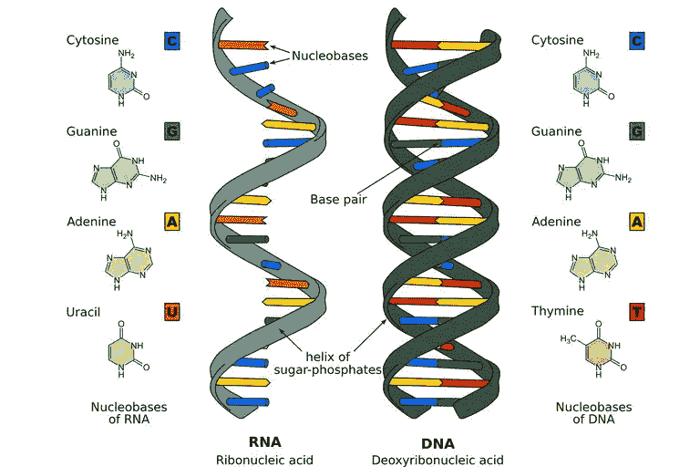
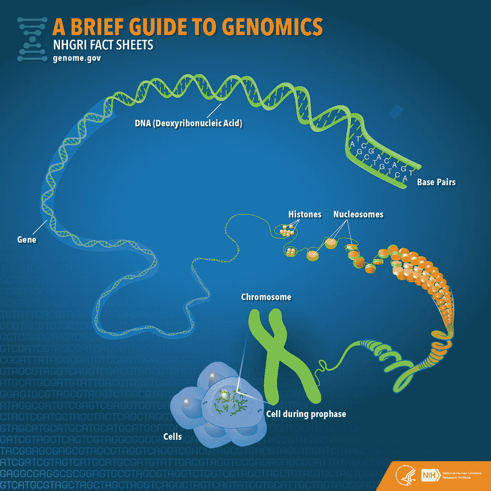
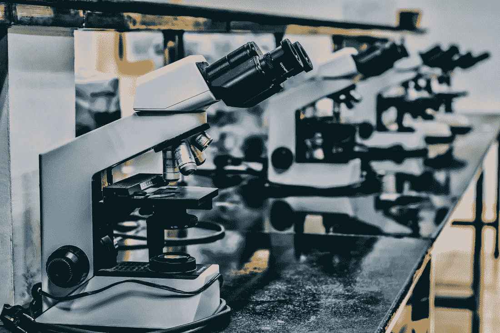

# 探索你的基因组

> 原文：<https://medium.datadriveninvestor.com/exploring-your-genome-6f69861ca94b?source=collection_archive---------7----------------------->

我们都是由数十亿个微小细胞组成的。它们让我们活着，帮助我们发挥作用，让我们成长和改变。它们是地球上所有生命的基础，但你对它们真正了解多少呢？

## 在最小的层面上

让我们从最小的层面开始，从 DNA 开始。**脱氧核糖核酸(DNA)** 就像是你的一切的使用说明书。所有让你发展并让你能够进行活动的遗传密码被浓缩成看起来像螺旋一样的微小扭曲的股。这些链实际上配对形成“双螺旋”，这是我们都承认的 DNA 的形状。但是它们不会以任何随机的顺序配对。

 [## 流氓基因组编辑扭曲 DNA 伦理-数据驱动的投资者

### 基因组编辑是科学的前沿。这在道德上也是有问题的，在许多方面可能是非法的…

www.datadriveninvestor.com](https://www.datadriveninvestor.com/2019/02/18/rogue-genome-editing-twists-dna-ethics/) 

在 DNA 中有四个化学单位，称为核苷酸碱基，它们总是通过这四个化学单位配对。这些碱基是(A)腺嘌呤、(T)胸腺嘧啶、(G)鸟嘌呤和(C)胞嘧啶。 **A + T 总是将**配对在一起，这意味着 **C + G 总是将**配对在一起。这些碱基的顺序决定了其中信息的含义。

除了 DNA，我们还有核糖核酸。与 DNA 的主要区别是**不与另一条链**配对，因为它们的主链中有额外的氧，使得配对不可能。这种差异实际上非常有用，因为它使它们成为完美的信使。**信使 RNA (mRNA)** 是一种中间信使，用于将我们基因中包含的信息传递给细胞的其他部分。它们是我们 DNA 的副本，所以一旦它们离开细胞核，它们就被翻译成蛋白质，帮助细胞。

## 变大了一点

既然我们已经知道了什么是 DNA，让我们来看看它是如何适应细胞的。由于 DNA 非常小，它紧紧地包裹在一种叫做组蛋白的蛋白质周围。组蛋白是阳性的，所以它们吸引阴性的 DNA，这实现了它们压缩 DNA 链的主要目的。**没有组蛋白，DNA 大约有 1.8 米长**，但是有了组蛋白，它只有大约 90 毫米的染色质。组蛋白然后聚集在一起形成**核小体**，看起来像串珠子。每个核小体有八个组蛋白，因此命名为“组蛋白八聚体”。核小体然后聚集在一起形成一包染色质 T21。两条染色质形成一条**染色体**。

每个细胞包含 **23 对染色体**，这意味着一个细胞实际上包含 **46 条染色体**。22 对染色体在男性和女性中看起来相对相同，被称为**常染色体**。第 23 对看起来不同，被称为性染色体，因为它们决定你看起来像男性还是女性。女性有两条 X 染色体，而男性有一条 X 染色体和一条 Y 染色体。总是有一份“X”染色体的副本，因为母亲会将它们传递下去。

## 整体看来

科学家认为，人体包含大约 30 - 40 万亿个细胞，这意味着你有大约 700 万亿条染色体。所有这些染色体都含有构成你的器官和组织的 DNA 和 RNA。这是你的**基因组；一个生物体的全套 DNA** 。这些基因组的研究被称为**基因组学**。

## 基因组测序

研究基因组的主要方法是通过基因组测序。简单来说，**基因组测序就是确定 DNA 链中**核苷酸碱基的顺序。有许多方法可以对基因组进行测序，但目前最常用的是合成测序。这是通过使用 **DNA 聚合酶**在特定链的基础上生成一条新的 DNA 链来实现的。聚合酶将**化学标记的核苷酸**结合到链中，这使得碱基在光照下发出明亮的颜色，显示出它们的差异。

基因组测序有很多用途，其中之一就是**疾病检测**。测序时，DNA 中偶尔会出现**异常(变异、突变等。)**那可能有助于疾病的发展。通过发现这些异常，我们可以使用基因疗法来修复/消除它们。

基因组测序的另一个用途是**个性化医疗**。通过了解 DNA 的布局和任何异常，我们可以找出最好的药物来帮助或创造新的更有帮助的药物。

## 关键要点

*   DNA 包含了所有让你成为你的遗传密码
*   在四个 DNA 碱基中，A + T 总是配对，C + G 总是配对
*   RNA 不配对，这意味着它是一个很好的细胞间信使
*   DNA 储存在每个细胞的 23 对染色体中
*   基因组是生物体的一整套 DNA
*   基因组学是对基因组的研究
*   基因组测序可以揭示我们身体的许多秘密，包括疾病

感谢您阅读我关于基因组学的文章，希望您喜欢！请在下面留下评论，告诉我你喜欢什么/我可以改进什么。另外，如果你想读更多我的文章，可以看看这篇关于人工智能基础的文章。