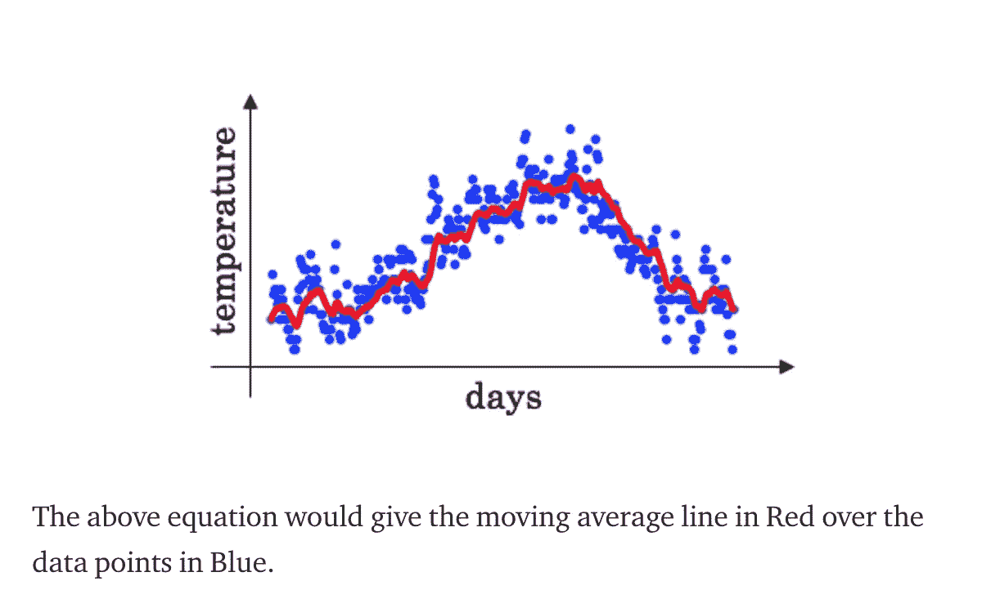
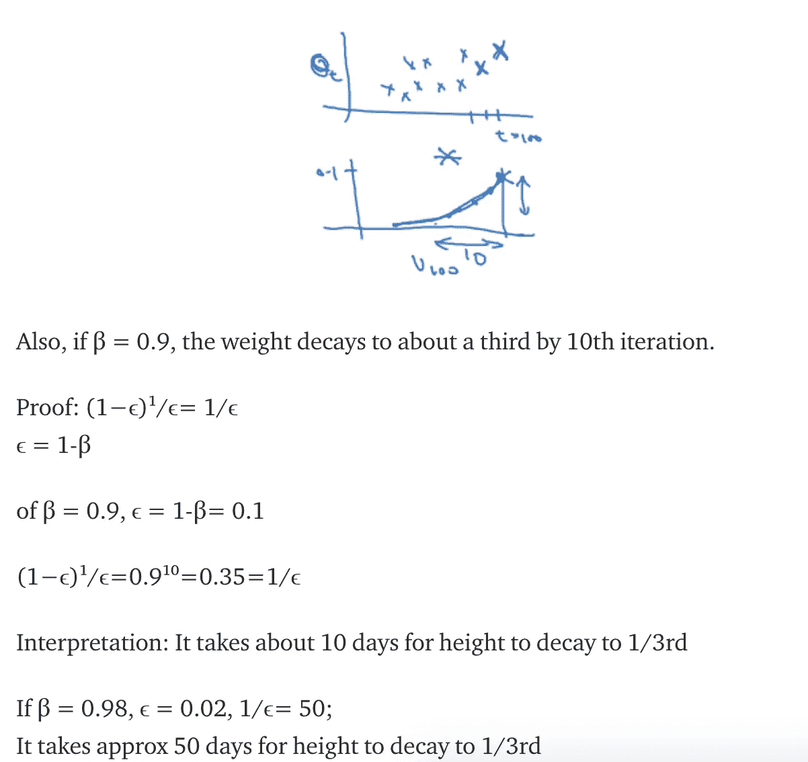
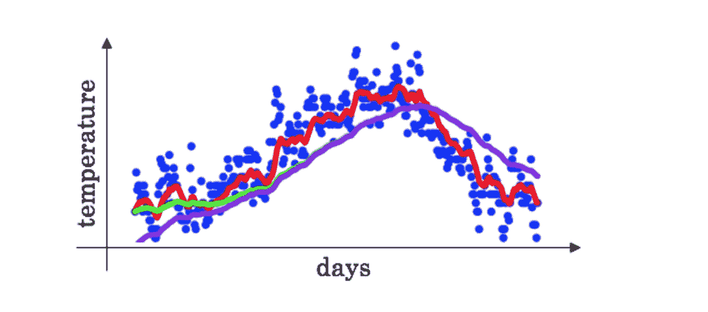

# 深度神经网络的指数加权平均

> 原文：<https://medium.datadriveninvestor.com/exponentially-weighted-average-for-deep-neural-networks-39873b8230e9?source=collection_archive---------1----------------------->

该算法是目前使用的最重要的算法之一。从金融时间序列、信号处理到神经网络，它的应用非常广泛。基本上，任何在**序列**中的数据。

**该算法主要用于减少噪声时间序列数据。**也叫**平滑**数据。

我们实现这一点的方法基本上是**权衡观察的数量并使用它们的平均值。**这叫做**移动平均线。**

示例:几天内的温度θt，计算移动平均值

**数学符号“下标”，“上标”**

Vt:第‘t’天的移动平均值

vsub 00 = 0
vsub 1 = 0.9 vsub 0+0.1θsub 1
vsub 1 = 0.9 vsub 1+0.1θsub 2
..
Vt = 0.9 Vt 1+0.1θt

如果β= 0.9
Vt =βVt 1+(1β)θt

## 什么是和意味着

Vt:在**1/1β**天内的平均值(近似值)

为了前任。，对于 **β** =0.9，**1/1β~ = 10**；
β= 0.9 10 天平均值(平滑曲线:红线)

对于 **β** =0.98，~ = 50；
**β**= 0.98 50 天的平均值(更平滑的曲线:绿线)—不是非常准确的表示

对于 **β** =0.5，~ = 2；
**β** = 0.5 两天的平均值(变化:黄线)—噪音更大

的正确值是使用超参数调谐计算的 **β**

从 V100 往后，
Vsub100 = 0.1θsub100+0.9 Vsub99
vsub 99 = 0.1θsub 99+0.9 vsub 98
代入 vsub 99，
vsub 100 = 0.1θsub 100+0.9(0.1θsub 99+0.9 vsub 98)
或者，vsub 100 = 0.1θsub 100

**概化，** vsub 100 = 0.1θsub 100+0.1∑0.9∑θsub 99+0.1∑(0.9)θsub 98+0.1∑(0.9)θsub 97+0.1∗(0.9)⁴θsub96+…..

Vsub100 基本上是两个度量/函数的元素式计算——一个是包含递减值(0.9，0.9，0.5)的指数衰减函数。⁹，……和另一个具有θt 所有元素的人

## 实施指数加权平均

Vsubθ: v 正在计算参数θ的指数加权平均值。

第 0 天:Vsubθ = 0 第 1 天:vsubθ=βv+(1-β)θsub 1
第 2 天:vsubθ=βv+(1-β)θsub 2
…

算法:Vsubθ =0 重复:{

获取下一个θt

vθ:=βvsubθ+(1β)θt

}

快速有效计算指数加权移动平均的单线实现。

## 指数加权移动平均中的偏差校正

使 EWMA 更准确-由于曲线从 0 开始，在最初几天没有很多值可以平均。因此，曲线最初低于正确值，然后与预期值一致。

图:理想的曲线应该是绿色的，但是它从紫色曲线开始，因为最初的值是零

例:从 t=0 开始向前，
vsub 0 = 0 vsub 1 = 0.98 vsub 0+0.02θsub 1 = 0.020θsub 1
vsub 2 = 0.98 vsub 1+0.02θsub 2 = 0.0196θsub 1+0.02θsub 2

Vt 的初始值将非常低，需要进行补偿。
使**vt = vt/1βsupt**t5】为 t=2，1βsupt =1−0.9⁸= 0.0396(偏置校正系数)

vsub 2 = V2/0.0396 = 0.0196θsub 1+0.02θsub 2/0.0396

当 t 较大时，1/1βsupt = 1，因此当 t 足够大时，偏置校正系数不起作用。

学分:

吴恩达