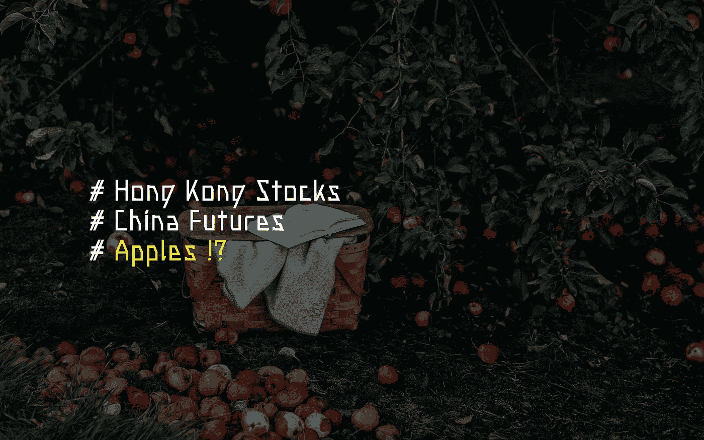
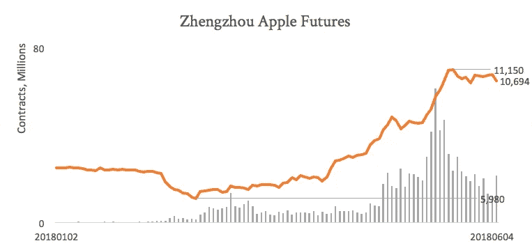

# 接触中国最热门的商品

> 原文：<https://medium.datadriveninvestor.com/exposure-to-the-hottest-commodity-in-china-9331da07643?source=collection_archive---------1----------------------->

# 两只苹果股票在香港上市

在上周的亚洲投资者峰会上，我们听到一份报告提到苹果公司(这种水果🍎)期货成为中国交易量最大的商品之一！出于怀疑，我们决定自己挖掘这些数字。

原来苹果期货是最近在郑州商品交易所(ZCE)上市的产品。去年年底，中国北方出现了意想不到的寒冷天气，这加剧了人们对今年供应短缺的预期。

在高峰时期，ZCE 苹果期货的交易量相当于上海和深圳证券交易所 a 股交易量的总和！尽管最近为市场降温的措施产生了影响，但价格仍比今年年初的低点上涨了约 80%。

这让我们想知道在香港是否有任何经营苹果的公司可能会受到这种狂热的影响。

# 方法学

我们假设参与苹果业务的公司会在年报中提到苹果这个词。我们查看最新一批年度报告，将宇宙最小化，并保持结果最新。

我们最初的筛选产生了 350 多份文件。主要的假阳性是:

*   苹果公司(Apple Inc .):这家美国科技巨头在许多报道中占据显著位置，从作为宏观指标被提及到开发商吹嘘自己是租户
*   ESG 报告:许多公司种植苹果树作为他们 CSR 努力的一部分。乍一看，这种现象似乎是 h 股独有的。也许中国政府已经明确地给了公司这样的指导。

除此之外，在项目和公司名称中也随机提到了苹果这个词，比如《苹果日报》。为了减少干扰，我们使用文档频率中的术语频率(TF–IDF)对报告进行了排名。这将使用我们的搜索词“apple ”,并根据文档中的总字数来衡量频率。我们用页面长度来代表字数。

这排除了大多数误报，但仍让游戏公司在报告中突出提到苹果的应用商店。幸好没有太多，所以我们手动从结果中剔除了这些。这给我们留下了 8 家公司，其中两家因为太不相关而被排除在外。

其余 6 家公司按照与主题的相关性降序分为三大类；

1.  相关，但没有有意义的影响
2.  期货经纪人
3.  浓缩苹果汁制造商

# 结果

# 相关，但没有有意义的影响

**0413 华南控股**
华南控股是一家 OEM 玩具制造商。该公司将其业务分为[1]贸易[15]制造业(OEM 玩具)[2]房地产投资[16]开发[3]投资控股公司和[4]农业[17]林业。作为农业和林业部门的一部分，它拥有 144，000 棵苹果树。然而，这一部门仅占收入的 0.36%，因此不太可能对公司的业绩产生任何有意义的影响。

**0220 统一企业中国控股**
公司持有烟台北方安德利果汁 17.87%的股份，烟台北方安德利果汁是一家纯上市公司，如下图所示。该公司将其从 Andre 和其他投资中获得的利润份额添加到其运营利润中，以实现 EBIT。这些数字约占 EBIT 的 2%。

作为资产的一部分，烟台的股份价值约 2%。

值得注意的是，该公司任命了 Andre 的一名非执行董事，因此对 Andre 有重大影响。但是，可归属的收入和资产太小，与公司的业绩无关。

# 期货经纪公司

参与 ZCE 交易的大多数券商可能会从交易量的增加中受益。然而，我们没有列出这些公司，而是坚持使用这种方法，只报告在搜索术语“苹果”时出现的公司。

**01461 郑路期货公司**
顾名思义，该公司是一家期货经纪公司。他们在最近的年度报告中三次明确提到苹果期货是一种新产品。很难说他们将从销量的爆炸中直接受益多少，但有理由假设市场容量和收入之间将存在直接关联。

**6881 中国银河证券**中国银河证券是一家券商。该公司从事股票和期货交易，同时也从资产管理、承销和财务咨询中获得收入。期货经纪佣金占总佣金的 6.15%。绝大部分佣金还是从股票上赚的——75.8%。作为他们市场展望的一部分，该公司提到苹果期货已经在 ZCE 开始。

# 浓缩苹果汁制造商

**2218 烟台北方安德烈果汁**
安德烈是一家浓缩果汁生产商。浓缩苹果汁占该公司收入的 85%,表面上看这是一笔不错的纯利润。

该公司大约 35%的业务是通过子公司进行的。运营费用占总费用的百分比大致相等，表明整个集团的成本情况相似。

该公司 78%的收入来自国外。他们认为欧洲是浓缩果汁的主要竞争对手。这将需要进一步的分析，以确定在不损失市场份额的情况下，他们可以将多少商品成本转嫁给消费者。值得注意的是，该公司的浓缩果汁似乎被客户用作原料。

在库存方面，他们手头大约有价值 7.55 亿元人民币的成品，因此他们有可能在现有库存的基础上安然度过当前的价格上涨。原材料为人民币 5.08 亿元，占 SG&A 的 63%。

**0359 中国海生果汁控股**

海生是另一家浓缩果汁生产商。苹果汁占该集团收入的 77%。与 Andre 不同，该公司是垂直整合的，在其农业部门下生产自己的苹果。虽然该公司直接销售新鲜水果产品，但这仅占总收入的 6.4%。

这意味着大部分水果产品成为浓缩果汁的原料。想必这是计入销售成本的，占收入的 79%。

和安德烈一样，大部分收入 71%来自海外，表明对全球市场价格的敏感性。此外，像安德烈一样，他们在不把市场份额输给欧洲竞争对手的情况下，能在多大程度上转嫁增加的成本，将决定苹果价格上涨对他们的影响。

值得注意的是，这两家公司都公布了较好的同比收益。他们都将欧洲产量不佳列为原因。当 2017 年冷锋影响欧洲生产时，客户转而从中国进口。如果中国生产成本飙升，这两个国家可能会受到同样的影响。

# 摘要

**0413 华南控股**—144 万棵苹果树，农工商 0.32%营收
**0229 统一中国** — 17%股权安德烈= 2%收益/资产
**01461 郑路期货公司** —提及苹果期货
**6881 中国银河证券** —提及苹果期货
**2218 烟台北方安德烈果汁** →70%

找到安德烈和海生是个好结果。它们都是纯业务，可能会受到苹果价格的影响。

安德烈的市值为 5.3 亿英镑(6800 万美元)，上个月上涨了 25%。海生的市值为 432 毫米(5500 万美元)，基本持平。

两家公司都没有提到期货，也没有对冲项目，所以他们不太可能锁定价格。下一步将是模拟它们对基础商品价格变化的敏感度。尤其值得一提的是，当 2017 年欧洲类似的天气条件影响产量时，全球需求是如何转移到中国的，并建立了相反的模型。

