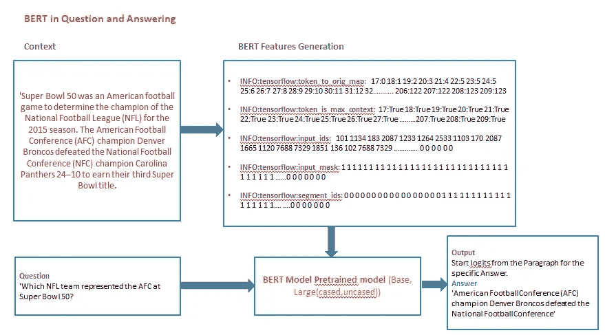
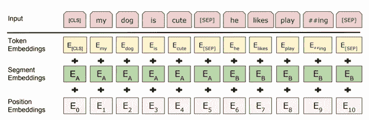
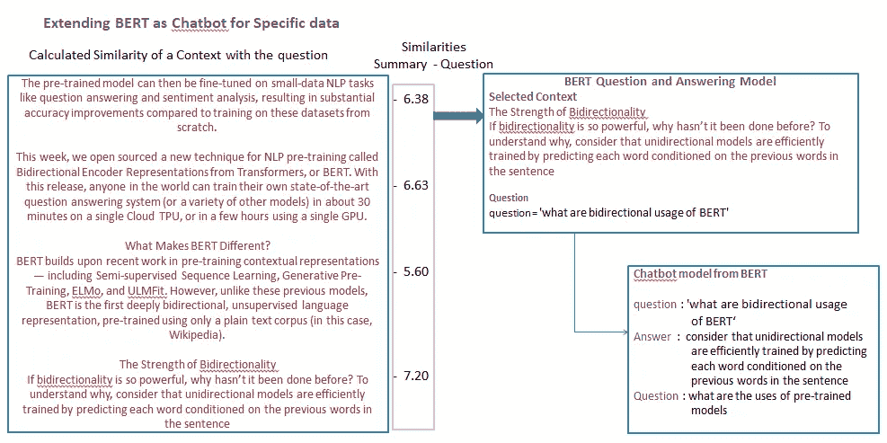

# 将 Google-BERT 扩展为问答模型和聊天机器人

> 原文：<https://medium.datadriveninvestor.com/extending-google-bert-as-question-and-answering-model-and-chatbot-e3e7b47b721a?source=collection_archive---------1----------------------->

[](http://www.track.datadriveninvestor.com/1B9E)

Photo by [Luca Bravo](https://unsplash.com/@lucabravo?utm_source=medium&utm_medium=referral) on [Unsplash](https://unsplash.com?utm_source=medium&utm_medium=referral)

> ERT 问答系统仅适用于有限数量的文字摘要，如 1 至 2 段。光靠理解 10 多页的数据是无法回答好的。我们可以扩展 BERT 问题和回答模型，使之在大型文本上像聊天机器人一样工作。为了理解超过 10 页的数据，这里我们使用了一种特定的方法来挑选数据。

**伯特如何工作**

BERT(来自变压器的双向编码器表示)预先训练语言表示的方法。通过使用预先训练的 BERT 模型，我们可以利用预先训练的句子结构、语言的记忆信息，以及它已经训练的几百万或*几十亿*带注释的训练示例的大型语料库的文本语法相关记忆。

[](https://www.datadriveninvestor.com/2019/02/08/machine-learning-in-finance/) [## 金融中的机器学习|数据驱动的投资者

### 在我们讲述一些机器学习金融应用之前，我们先来了解一下什么是机器学习。机器…

www.datadriveninvestor.com](https://www.datadriveninvestor.com/2019/02/08/machine-learning-in-finance/) 

然后，预训练的模型可以在小数据 NLP 任务(如[问答](https://en.wikipedia.org/wiki/Question_answering)和[情感分析](https://en.wikipedia.org/wiki/Sentiment_analysis))上进行*微调*，与从头开始在这些数据集上进行训练相比，准确性有了实质性的提高。

> BERT 是一个庞大的模型，24 个变压器块，每层 1024 个隐藏单元，340M 参数。
> 
> 该模型在 33 亿词的语料库中对 40 个时期进行了预训练，包括图书语料库(8 亿词)和英语维基百科(25 亿词)。

关于 BERT 的更多信息，我们可以通过谷歌人工智能博客([https://AI . Google blog . com/2018/11/open-sourcing-BERT-state-of-art-pre . html](https://ai.googleblog.com/2018/11/open-sourcing-bert-state-of-art-pre.html))

在这里，我们可以看到作为问答系统的 BERT 和针对特定数据的 Chatbot 的实现。

[**使用 BERT 进行问答**](https://github.com/Nagakiran1/Extending-Google-BERT-as-Question-and-Answering-model-and-Chatbot)

Bert 模型在理解给定的文本摘要和从该摘要回答问题方面被很好地定义。为了理解与问题相关的信息，Bert 在班数据集和其他带标签的问题和回答数据集上进行了训练。

S**S**tanford**Qu**estion**A**nswering**D**ataset(SQuAD)是一个阅读理解数据集，由一组维基百科文章上的众包工作人员提出的问题组成，其中每个问题的答案都是相应阅读文章中的一段文字，或者是 *span* ，或者问题可能无法回答。

**SQuAD2.0** 将 SQuAD1.1 中的 100，000 个问题与超过 50，000 个新的、无法回答的问题相结合，这些问题由众包工作人员以对立的方式编写，看起来与可回答的问题相似。



BERT Feature generation and Question answering

因为 SQUAD 是一项正在进行的工作，它没有像开源数据集一样向公众公开，样本数据可以从 SQuAD 网站[https://rajpurkar.github.io/SQuAD-explorer/](https://rajpurkar.github.io/SQuAD-explorer/)下载

为了获得完整的数据集，必须在理解摘要的过程中建立单独的模型，并回答来自样本训练数据集的问题，并且必须提交该模型，基于评估标准，数据集将被共享。

在 BERT 模型中，通过使用 run_squad.py 文件，我们可以针对 squad 中给出的特定样本训练数据获得特定问题的答案。为使其适用于个人摘要代码已编辑并给出，

你可以尝试执行 **run_squad.py** 文件，根据总结理解提取答案。

## 班数据集中使用的样本 JSON 文件信息，

```
{'data': [{'title': 'Super_Bowl_50',
   'paragraphs': [{'context': 'Super Bowl 50 was an American football game to determine the champion of the National Football League (NFL) for the 2015 season. The American Football Conference (AFC) champion Denver Broncos defeated the National Football Conference (NFC) champion Carolina Panthers 24–10 to earn their third Super Bowl title. The game was played on February 7, 2016, at Levi\'s Stadium in the San Francisco Bay Area at Santa Clara, California. As this was the 50th Super Bowl, the league emphasized the "golden anniversary" with various gold-themed initiatives, as well as temporarily suspending the tradition of naming each Super Bowl game with Roman numerals (under which the game would have been known as "Super Bowl L"), so that the logo could prominently feature the Arabic numerals 50.',

     	'qas': [{'answers': [{'answer_start': 177, 'text': 'Denver Broncos'},
        	{'answer_start': 177, 'text': 'Denver Broncos'},
        	{'answer_start': 177, 'text': 'Denver Broncos'}],
       		'question': 'Which NFL team represented the AFC at Super Bowl 50?',
       		'id': '56be4db0acb8001400a502ec'}]}]}],
 		'version': '1.1'}
```

小队数据由一些信息的文本摘要和相关问题组成，在给定的段落摘要内具有答案开始和答案串信息。

为了将 BERT 模型用于问题和回答，需要准备类似于所提到的小队数据结构的数据。

文本信息应该提到给定的 JSON 格式的上下文键

BERT 模型用于理解给定上下文的特征



## 使用 BERT 运行问答模型的命令

运行 run_squad.py，并提及问题的上下文和问题的参数，此处“上下文”变量表示未知的数据字符串,“问题”是该上下文中提出的问题。

```
 python run_squad.py \
  --vocab_file=BERT_BASE_DIR/vocab.txt \
  --bert_config_file=BERT_BASE_DIR/bert_config.json \
  --init_checkpoint=BERT_BASE_DIR/bert_model.ckpt \
  --do_predict=True\
  --context= Super Bowl 50 was an American football game to determine the champion of the National Football League (NFL) for the 2015 season. The American Football Conference (AFC) champion Denver Broncos defeated the National Football Conference (NFC) champion Carolina Panthers 24–10 to earn their third Super Bowl title. The game was played on February 7, 2016, at Levi\'s Stadium in the San Francisco Bay Area at Santa Clara, California. As this was the 50th Super Bowl, the league emphasized the "golden anniversary" with various gold-themed initiatives.\
  --output_dir=Data
  --question=Which NFL team represented the AFC at Super Bowl 50?
```

## 为上面显示的示例 JSON 数据上下文生成的特性

1.  Token to orig map:将每个单词的索引视为一个特征整数— - `INFO:tensorflow:token_to_orig_map: 17:0 18:1 19:2 20:3 21:4 22:5 23:5 24:5 25:6 26:7 27:8 28:9 29:10 30:11 31:12 32:13 33:14 34:15 35:16 36:17 37:17 38:17 39:17 ...............................196:115 197:116 198:117 199:118 200:119 201:120 202:121 203:121 204:121 205:122 206:122 207:122 208:123 209:123`
2.  Token 是 max content:每个单词的布尔索引，表示该单词在上下文中是否重要。——`INFO:tensorflow:token_is_max_context: 17:True 18:True 19:True 20:True 21:True 22:True 23:True 24:True 25:True 26:True 27:True 28:True 29:True 30:True 31:True 32:True ...........................202:True 203:True 204:True 205:True 206:True 207:True 208:True 209:True`
3.  Input_ids 通过考虑来自预训练的 BERT 的单词字典数据，将单词向量 id 分配给上下文中的每个单词。— `INFO:tensorflow:input_ids: 101 1134 183 2087 1233 1264 2533 1103 170 2087 1665 1120 7688 7329 1851 136 102 7688 7329 1851 1108 1126 1821 26237 1389 1709 1342 1106 4959 1103 3628 1104 1103 1569 1709 2074 113 183 2087 1233 114 1111 ............................ 0 0 0 0 0 0 0 0 0 0 0 0 0 0 0 0 0 0 0 0 0 0 0 0 0 0 0 0 0 0 0 0 0 0`
4.  Input_mask:基于上下文单词的存在对上下文单词进行布尔掩码，后跟零填充，以满足用于特定下载的 BERT 模型的最大单词向量表示。- `INFO:tensorflow:input_mask: 1 1 1 1 1 1 1 1 1 1 1 1 1 1 1 1 1 1 1 1 1 1 1 1 1 1 1 1 1 1 1 1 1 1 1 1 1 1 1 1 1 1 1 1 1 1 1 1 1 1 1 1 1 1 ............... 0 0 0 0 0 0 0 0 0 0 0 0 0 0 0 0 0 0 0 0 0 0 0 0 0 0 0 0 0 0 0 0 0 0 0 0
    0 0 0 0 0 0 0 0 0 0 0`
5.  Segment_ids 指示令牌属于第一序列还是第二序列的段 id。—生成有效长度—`INFO:tensorflow:segment_ids: 0 0 0 0 0 0 0 0 0 0 0 0 0 0 0 0 0 1 1 1 1 1 1 1 1 1 1 1 1 1 1 1 1 1 1 1 1 1 1 1 1 1 1 1 1 1 1 1 1 1 1 1 1 1 1 1 1 1 1 1 1 1 1 1 1 1 1 1 1 1 1 1 1 1 1 1 1 1 1 1 1 1 1 1 1 1 1 1 1 1 1 1 1 1 1 1 1 1 1 1 1 1 1 1 1 1 1 1 1 .............0 0 0 0 0 0 0 0 0 0 0 0 0 0 0 0 0 0 0 0 0 0 0 0 0 0 0 0 0 0`

这将产生如下输出:摘要中所提问题的输出

```
American Football Conference (AFC) champion Denver Broncos defeated the National Football Conference
```

命令中传递的上下文和命令中提到的问题可以根据需要进行更改。BERT 能够通过学习生成的特征来理解上下文，并能够在训练数据的范围内回答问题。

# 将 BERT 扩展为特定数据的聊天机器人

伯特问题和回答系统的意思和工作，以及为只有有限数量的话总结一样，1 至 2 段而已。光靠理解 10 多页的数据是无法回答好的。我们不能指望用一个大的语料库有好的结果，因为它是在班问题和回答数据上训练的，它有较少的摘要段落和与之相关的问题。

[我们可以扩展 BERT 问答模型，让它像聊天机器人一样处理大型文本](https://github.com/Nagakiran1/Extending-Google-BERT-as-Question-and-Answering-model-and-Chatbot)。为了理解超过 10 页的数据，这里我们使用了一种特定的方法来挑选数据。

```
DocumentData.txt

The pre-trained model can then be fine-tuned on small-data NLP tasks like question answering and sentiment analysis, resulting in substantial accuracy improvements compared to training on these datasets from scratch. 

This week, we open sourced a new technique for NLP pre-training called Bidirectional Encoder Representations from Transformers, or BERT. With this release, anyone in the world can train their own state-of-the-art question answering system (or a variety of other models) in about 30 minutes on a single Cloud TPU, or in a few hours using a single GPU. 

What Makes BERT Different?
BERT builds upon recent work in pre-training contextual representations — including Semi-supervised Sequence Learning, Generative Pre-Training, ELMo, and ULMFit. However, unlike these previous models, BERT is the first deeply bidirectional, unsupervised language representation, pre-trained using only a plain text corpus (in this case, Wikipedia).

The Strength of Bidirectionality
If bidirectionality is so powerful, why hasn’t it been done before? To understand why, consider that unidirectional models are efficiently trained by predicting each word conditioned on the previous words in the sentence
```

## 数据准备

用于提问的数据必须复制到一个简单的文本文件中，用三个' \n '分隔。

数据应该具有不同的偏离信息聚类才能很好地使用相似性算法。



在这里，我们首先将数据分离成段落的各个部分，然后将其传递给模型。一旦数据被分离，基于所问的问题，我们将使用 gensim 模型的 word_vectors 获得包含答案相关信息的最相似段落。数据准备以馈入

数据准备非常简单，这里我们打算提供与 BERT 最相似的段落，而不是提供我们在提问中拥有的所有数据文档。

```
python run_squad.py \
  --vocab_file=BERT_BASE_DIR/vocab.txt \
  --bert_config_file=BERT_BASE_DIR/bert_config.json \
  --init_checkpoint=BERT_BASE_DIR/bert_model.ckpt \
  --do_predict=True\
  --interact=True\
  --context=data.txt \
  --output_dir=Data
```

这将产生一个交互式聊天机器人界面，如下所示:摘要中所提问题的输出

```
>>>'what are bidirectional usage of BERT‘
consider that unidirectional models are efficiently trained by predicting each word conditioned on the previous words in the sentence
>>>what are the uses of pre-trained models
fine-tuned on small-data NLP tasks like question answering and sentiment analysis
>>>quit

An exception has occurred, use %tb to see the full traceback.

SystemExit
```

我们可以用 BERT 阅读大文档、书籍等信息内容，不需要太多的手动效果。

## 添加的代码不会改变 BERT 的基本功能，我们可以使用相同的配置进行训练和预测。

以下命令允许使用训练样本班数据训练模型，并对开发集数据进行预测。

```
python run_squad.py \
  --vocab_file=$BERT_BASE_DIR/vocab.txt \
  --bert_config_file=$BERT_BASE_DIR/bert_config.json \
  --init_checkpoint=$BERT_BASE_DIR/bert_model.ckpt \
  --do_train=True \
  --train_file=$SQUAD_DIR/train-v1.1.json \
  --do_predict=True \
  --predict_file=$SQUAD_DIR/dev-v1.1.json \
  --train_batch_size=12 \
  --learning_rate=3e-5 \
  --num_train_epochs=2.0 \
  --max_seq_length=384 \
  --doc_stride=128 \
  --output_dir=/tmp/squad_base/
```

dev set 预测将保存到一个名为`predictions.json`的文件中，该文件位于`output_dir`中:

```
python $SQUAD_DIR/evaluate-v1.1.py $SQUAD_DIR/dev-v1.1.json ./squad/predictions.json
```

应该会产生这样的输出:

```
{"f1": 88.41249612335034, "exact_match": 81.2488174077578}
```

您应该会看到一个类似于`BERT-Base`报纸上报道的 88.5%的结果。

更多信息和代码，请参考[资源库](https://github.com/Nagakiran1/Extending-Google-BERT-as-Question-and-Answering-model-and-Chatbot)

## 赞成的意见

训练模型不需要时间，训练数据准备简单快速。它可以扩展到大量的数据理解。不需要指定问题的意图或任何其他回答。

## 骗局

BERT 不适合理解问题和从上下文中获取与问题相关的信息。即使是小段落也不能产生好的效果。通过使用这个聊天机器人，你将能够很好地评价 bert 的性能(我已经检查了基本和大型 BERT 模型)。