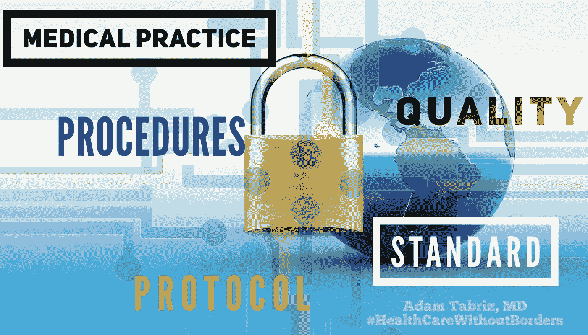

# 协议、标准操作程序的极端应用

> 原文：<https://medium.datadriveninvestor.com/extreme-application-of-protocols-standard-operating-procedures-the-impending-struggle-in-medical-baaa387671bd?source=collection_archive---------3----------------------->

## 医疗实践中迫在眉睫的斗争

Extreme application of protocols, Standard Operating Procedures, the impending struggle in medical practice

从我们醒来到入睡，我们如何生活，如何互动，以及如何运作，都包含了大量的行动号召。我们日复一日无情地专注于执行相同或至少相似的任务。伴随而来的是无意识的，我们寻找方法去一致地、有效地完成那些重复的差事。我们孜孜不倦地传播无意识的研究，为一个过程、行动或事物创造标准，作为一种简化我们日常行为的方式，或者作为一种由权威建立和确立的东西，作为在更重要的纬度上衡量需要的数量、重量、范围、价值或质量的原则。今天，标准概念正在数以千计的组织中被应用到无数的环境中，从国际制造标准等技术到所谓的“医疗标准”下的医疗实践。

如前所述，一个实体采用一套标准有很多原因。在大型机中，不管单个任务执行的频率如何，它都需要定义范围、质量和方法的规则来遵循。如果不标准化，它将无法支持确保质量和减少人为错误的可见性。

 [## 大笔资金和尖端技术:人工智能/人工智能投资将如何革新医疗保健…

### 在过去几年人工智能(AI)和机器学习(ML)的显著发展中…

www.datadriveninvestor.com](https://www.datadriveninvestor.com/2018/03/22/big-money-and-cutting-edge-technology-how-investment-in-ai-ml-will-revolutionize-the-healthcare-industry/) 

由于某种程度上的规范化没有争议，最大的争论不一定是为什么我们需要一个标准指南，而是在不引起利益冲突的情况下将必要的协议和程序放在适当的位置是多么重要。

每一个标准都受到一个独特的参照点的限制，这个参照点作为一个公认的固定的有形或无形的协调或同情的主题。任何偏离典故的行为都将被视为偏离既定标准的质量、效率或可接受性的衡量标准。

标准化设计的一个重要挑战是考虑到容易改变的元素和容易变化的特征或因素。变量的概念在直接影响人类生活的情况下是值得注意的，例如医疗实践。变量和参考点是一对约束条件；除非在个人附近的环境中处理，否则它会变得过于敏感。因此，由谁、如何、为谁以及在哪里制定标准至关重要。

医学是一门不确定变化的科学，因此尊重个人的人文价值是他们决定标准和背景应该适当的美德。

决定性标准的极端应用是歧视性貌相、隔离和官僚主义的先决条件。实际上，它将通过创建标准操作程序(SOP)和指导方针(顺便说一下，是基于大多数人的个人或集体行为)来控制不一致的利益，从而规定任何行动。

为了将标准转化为所谓的标准操作程序(SOP ),需要开发一个协议，该协议将作为执行任何特定过程的规则。

标准操作程序(SOP)是一系列基于商定标准的逐步指令，以确保代理人熟练、统一地履行复杂的职责，并达到预期的接近质量，同时减少沟通失误和不遵守行业准则的情况。

如前所述，为了展示和利用产品和服务的质量、价值和效率，协议、指南和标准操作程序可能是技术中有价值的工具，因为它们在很大程度上应用于每个行业。生产有形产品或固定形式的可交付产品，其中稀缺的变量限制了其衍生产品的优势和价值。相反，在医疗保健行业，人类的差异就像全球个体的数量一样广泛，如果严格应用标准化，人们应该预见到重大的利益冲突。因此，对实体、技术和人类生活的标准进行一刀切的广泛征集，不可能通过一种共享的普遍方法来实现。人们可能会认为，这就是我们目前的医疗保健体系框架内正在接受的东西。但证据表明情况恰恰相反。

**为什么要规范人类的生活？**

是为了提高护理质量还是改善控制，还是关于微观管理？

在某种程度上，在面对更广泛的可变性和有偏见的参考点时，不加区分地提交协议和指南会导致系统脱离质量保证而进入受控的再保证，从而与[许可](https://link.medium.com/fDtIYyII1X)和认证一起补充并行控制。

就像一个有用的工具指南和程序对实体一样，对技术来说更是如此，它在人类生活中不必要的使用与奴役有着隐喻性的相似。它通过彻底改造适用于机器人或人工智能的东西，使人类生活商品化。

在 21 世纪，由普通人群健康方法规定的医疗实践协议和指南已经被任意地固定在病人护理的不同方面，从预防性医疗行动的范围到设施操作。在某些情况下，医学从程序中获益。但是，总的来说，我们因其未经证实和不分青红皂白的管理而命运多舛。他们在医学上的自由处决类似于现代奴隶制条款中晦涩的枷锁。

医疗保健中 SOP 和协议的应用是一个复杂的状态。如果忽略了基本的限制而广泛应用，它将会产生一个矛盾的结果。就先例而言，医疗护理标准是医学中常用的法律术语。它是法医诉讼程序中的一个司法工具。然而，在当前的医疗环境中，护理标准的位置和可变性是模糊的。

在较大的医疗保健组织中，建立护理标准是通过精心制作礼仪来揭示医疗事故的黑暗面，从而巩固偏离规范的行为。随着协议的大规模采用，其结果将引发医疗实践的官僚化。如果没有操作方法和指导，主治医师必须预见辩护论点，在法庭上寻找支持辩护医师为特定患者选择的方法的同行。这两种极端的设置可能会有两种不同的控制方式，但结果可能相似，其中法律依据可能有利于原告或被告，也可能不利于原告或被告。

负责批准已执行协议的个人或实体，或者在后一种情况下，作证的专家，在不同的情况下确实会对特定患者的标准持有不同的立场。

# 政府微观管理、官僚主义、标准操作程序、更多协议的恶性循环

医疗实践程序，像其他标准操作程序一样，是由沿着管理层级链的上层强加协议来规定的。例如，如果一个医疗机构预测要启动一套用于治疗社区获得性肺炎的实践，不管治疗医生选择开抗生素的种类和方式，他们都必须从食品和药物管理局(FDA)批准和推荐的一套药物中进行选择。或者在某些情况下，他们可以选择从患者的保险公司允许的处方集列表中开药，进一步缩小了从 FDA 批准的选项列表中选择抗生素的数量。

标准化程序是如何微观管理一个有独裁倾向的行政系统，在这个系统中，大多数程序构成了一个严格但直截了当的自上而下的反映，反映了中央命令意图支配的排序方法。

**反思当前的医疗危机**

几十年来，互联网数据的自由流动和独立研究的潜力解放了主流人群。他们代表着那些通过发展更高的期望和对他们需求的个性化观点来直觉地实践他们的自由的病人。在天平的另一端，我们保留了花费数十亿美元启动一系列标准指南、立法和程序的医疗保健管理。这种通过手工操作自上而下强制执行不灵活解决方案的程序会随着指令一次一个部门地消失，并且会受到每一只手的修改。这种功利主义观念下的方法已经运作了几个世纪，迫使选民被动参与。但是，它的缺点已被证明是不可避免的。

目前的病人心态将安装到一个可行的程度；在较小的人口样本中倾向于更广泛的约束。正在进行的人口保健提供模式系统将在更大的社区范围内考虑质量和价值的社会决定因素。因此，由于管理层级链的末端可能与个体患者的积极结果和满意度不一致，因此通过使用预定义的参考点结合一般群体动态来规定边缘护理。

现有的医疗保健系统给医生的工作带来了巨大的负担。那些有权监管并开始使用不妥协策略的千篇一律的药物的组织将会占上风。但是有一个明显的缺陷。后来的尺寸。随着公开参与病人护理的组织发展到一定的规模，官僚机构将会获胜——病人和医生失去了对他们身体的自主权和控制权。

**解决方案**

没有坚实的基础，就不可能有有效的医疗保健解决方案。打破医学中严格协议的自由应用的挑战太大了，甚至无法考虑自上而下的改造。

独立医生缺少一个或多个我称之为医疗实践改革先决条件的元素。这五(5)件作品是:

1.**学习**——“知识就是力量。信息正在解放。教育是每个社会、每个家庭进步的前提，”曾任联合国第七任秘书长的加纳外交官科菲·安南曾经说过。

知识是任何门的钥匙；了解我们面临的问题的根源是至关重要的。

2.**适应** —知识和 p，坚持是适应的根本前提。适应不断变化的环境通过提供战胜系统挑战的能力，使个人领先一步，而不管系统的质量和性质如何。

3.**占上风**——一旦适应，这个人就能克服与系统缺陷相关的障碍，扫清通往卓越的道路。

4.**出类拔萃**——那些擅长完成现有任务的人，大多是那些会在未来规划更好解决方案的人。因此，他们被认为是改革的真正先驱。

5.**改革** —改善体制的改变并不是路的尽头，而是学习更多知识的机会，并为进一步改革带来的更多挑战做好准备。

面对过度热衷的标准化和特征描述，高层反对医疗保健故障的竞争将引发更多的标准和官僚主义，从而重复指令和权威禁令的恶性循环。作为一种选择，所有标准操作程序都必须缩小适用范围和重点。

较小的社区维度将意味着一个无关紧要的可变元素配置文件，集中精确的参考点。后者是通过权力下放实现的，在每个病人周围的直接市政范围内产生更多的方向。对这一角色的行政忽视最终必须包括高水平的宏观管理，减少对专业临床判断的组织干预，以及更多的顶级安全、保障和质量保证监督。

 [## 现代奴隶制的轴心:金钱、权力和控制及其对 21 世纪的影响…

### 每个人的生活都是一次旅行。不同于其他有着不可预测的避风港的航行，人类的努力有着…

medium.com。](https://medium.com/be-unique/the-axis-of-modern-day-slavery-money-power-and-control-and-its-implication-on-21st-century-a61a752a2a7a)  [## 医学作家|医学博士亚当·塔布里兹

### 医学博士亚当·塔布里兹是一名医生、作家和医疗保健政策专家，他提供个性化的代笔和医学写作…

www.adamtabrizmd.com。](https://www.adamtabrizmd.com/)