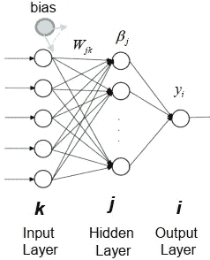
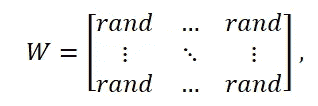
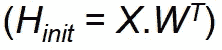
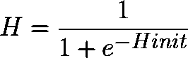
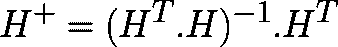
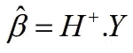
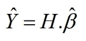

# 用于简单分类的极限学习机

> 原文：<https://medium.datadriveninvestor.com/extreme-learning-machine-for-simple-classification-e776ad797a3c?source=collection_archive---------1----------------------->


所以上周大学的朋友找我帮忙实现**极限学习机**的代码。当时，我并不太理解这个算法——但我决定在学习和理解它的同时，无论如何都要提供帮助。我不仅仅是帮助我的朋友，我想分享我的学习经验，帮助理解这个算法有困难的人。

[](https://www.datadriveninvestor.com/2019/03/03/editors-pick-5-machine-learning-books/) [## DDI 编辑推荐:5 本让你从新手变成专家的机器学习书籍|数据驱动…

### 机器学习行业的蓬勃发展重新引起了人们对人工智能的兴趣

www.datadriveninvestor.com](https://www.datadriveninvestor.com/2019/03/03/editors-pick-5-machine-learning-books/) 

其实我早就想这么做了；分享我通过写作学到的东西，但不知道从哪里开始。所以不用担心，就是这样！我的第一个帖子是关于**极限学习机**的简单实现。

# **极限学习机**

极限学习机是[单层前向神经网络(SLFN)](https://en.wikipedia.org/wiki/Feedforward_neural_network) 的简单学习算法。理论上，**极限学习机算法(ELM)** 往往在极快的学习速度下提供良好的性能。

不同于传统的前馈网络学习算法，如[反向传播(BP)](https://en.wikipedia.org/wiki/Backpropagation) 算法，ELM 不使用[基于梯度的](https://en.wikipedia.org/wiki/Gradient_descent)技术。使用这种方法，所有参数只需调整一次。该算法不需要迭代训练。

## ELM 实现



1.  为输入图层创建随机权重矩阵和偏差。

权重矩阵和偏差的大小为( *j x k* )和(1 *x k* ),其中 *j* 为隐藏节点数， *k* 为输入节点数。



2.计算隐藏层输出矩阵

初始隐含层输出矩阵通过将训练数据乘以权重矩阵的转置来计算



3.选择激活功能

你可以选择任何你想要的激活功能。但在这个例子中，我会选择 [sigmoid](https://en.wikipedia.org/wiki/Sigmoid_function) 激活函数，因为它容易实现。



4.计算出[摩尔-彭罗斯伪逆](https://en.wikipedia.org/wiki/Moore%E2%80%93Penrose_inverse)

有几种方法可以用来计算 **H** 的 Moore-Penrose 广义逆。这些方法可以包括但不限于正交投影、正交化方法、迭代法和[奇异值分解(SVD)](https://en.wikipedia.org/wiki/Singular_value_decomposition) 。



5.计算输出权重矩阵β



6.对测试数据集重复步骤 2，创建一个新的 **H** 矩阵。之后，创建名为 ŷ.的结果矩阵我们使用已知的β矩阵。



# 数据

我们将使用来自 sklearn 的[**make _ class ification**](https://scikit-learn.org/stable/modules/generated/sklearn.datasets.make_classification.html)库来制作随机分类数据。

# **型号**

# 试验模型

```
Accuracy: 0.89
```

我们的模型导致了 0.89**的精确度。这可以通过许多因素来改善，例如:**

*   我们使用的激活函数
*   隐藏神经元的数量
*   无论数据是否标准化

# 结论

极端学习机算法是神经网络中最有效的机器学习算法之一。由于非迭代训练，所有参数都是一次调整。这导致了高训练速度。它的实现很容易理解，可以用来解决复杂的问题。

感谢阅读！我们已经到了这篇文章的结尾，希望你觉得这很有趣。如果你有任何问题和/或建议，请在评论中告诉我。

# 参考资料:

[1]极限学习机:理论与应用光，秦，萧启庆.