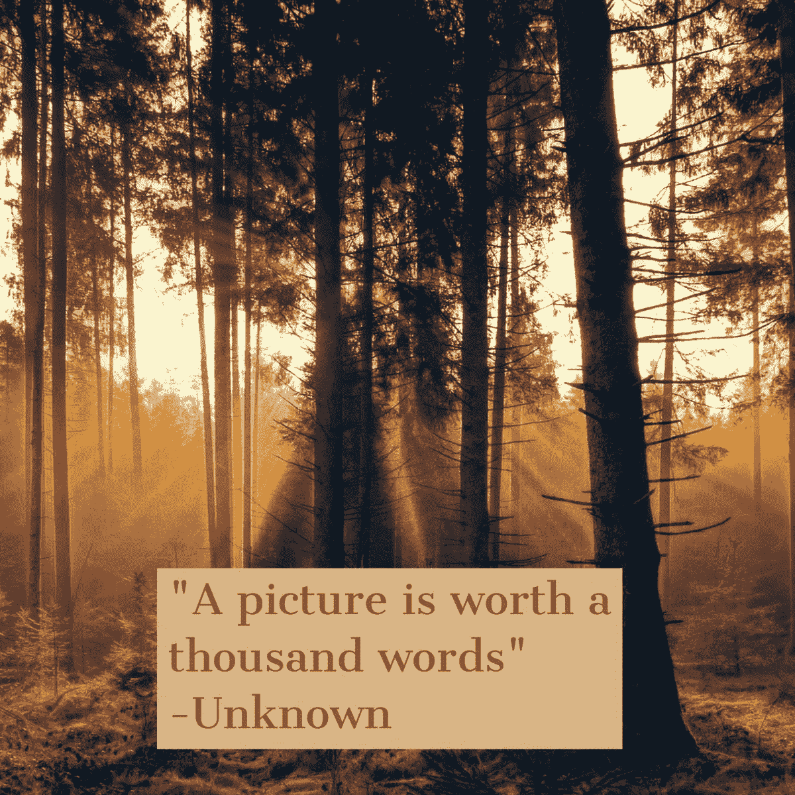
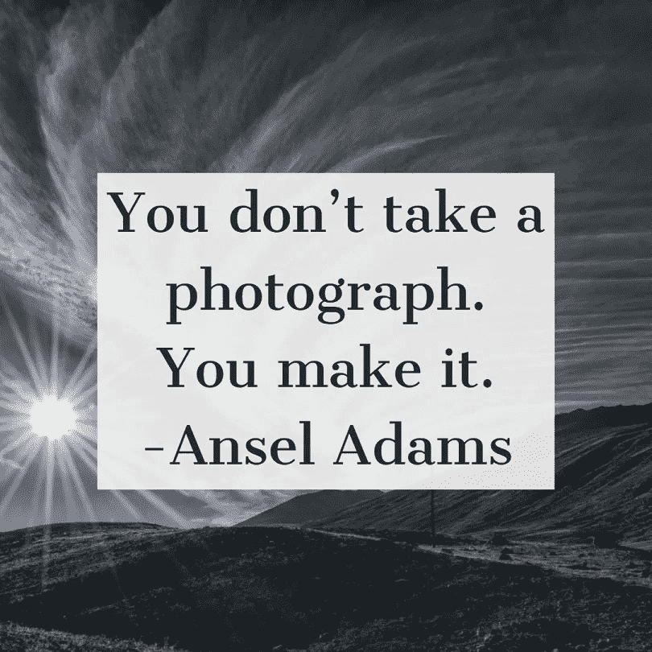
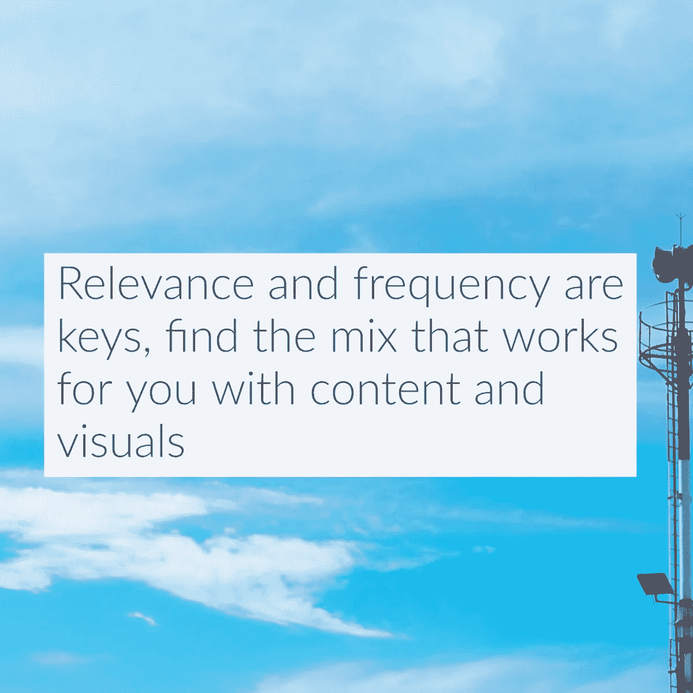
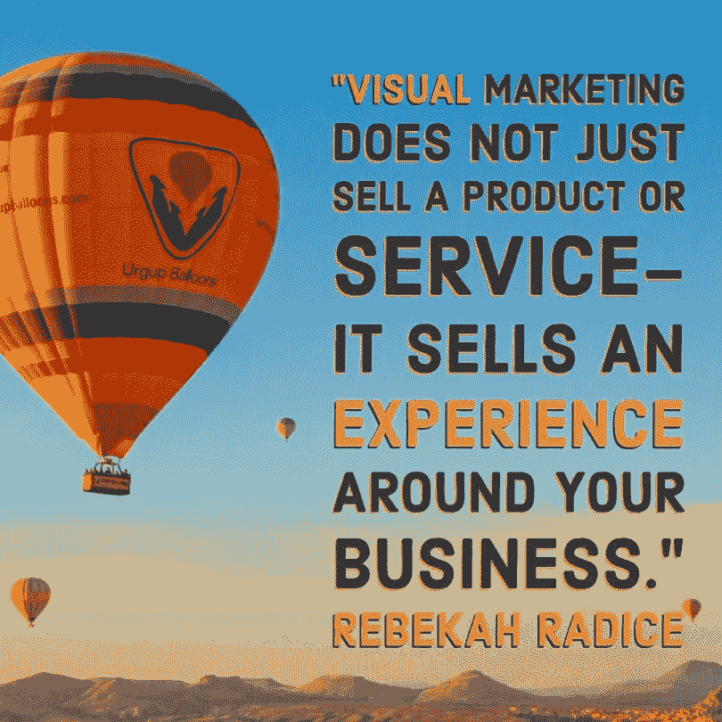
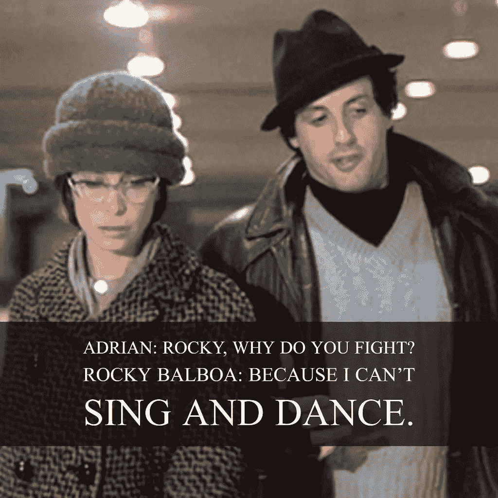

# 眼睛糖果图片甜蜜的奖励

> 原文：<https://medium.datadriveninvestor.com/eye-candy-pictures-sweet-rewards-837903d501e6?source=collection_archive---------11----------------------->

## 让图形建立在你想要讲述的故事之上

视觉内容吸引眼球。这是一个让内容吸引读者来创造参与度的钩子。

[乔·马丁](https://twitter.com/joeDmarti)作为 [Adobe](https://twitter.com/Adobe) 的社交分析主管，是一切视觉事务的关键人物。他与金融行业最受欢迎的专业人士之一温妮·孙(Winnie Sun)讨论了如何创造引人注目的视觉内容。

 [## 2019 年值得关注的 20 种数字营销趋势和技术|数据驱动的投资者

### Faisal 在加拿大工作，拥有金融/经济和计算机方面的背景。他一直积极从事外汇交易…

www.datadriveninvestor.com](https://www.datadriveninvestor.com/2019/02/04/20-digital-marketing-trends-techniques-to-watch-out-for-in-2019/) 

“视觉内容将浏览者和读者吸引到帖子上，”孙说。“许多人更喜欢观看他们的内容。看看 YouTube、Instagram 和其他平台的成功就知道了。

如果有一个故事要讲，让图形建立在经验上。

“视觉内容为你的帖子增加了故事元素，”马丁说。“它创造了一种与内容互动的独立方式，有助于唤起情感。它实际上胜过千言万语。

“我在 Adobe Insights 的老团队从 2013 年起就一直在展示使用数据，”他说。“它揭示了视觉内容比文字帖子更吸引人。”

太多的图像看起来像是从装配线上下来的，而它们可能是这样的。它们在视觉上相当于穆扎克——毫无灵感，毫无生气。

“质量总是很重要，”孙说。“无论是平面图像还是视频，我们都有机会投入时间和精力制作有吸引力的视觉内容。这是我们社区应得的。

# 不全是视觉的

图像应用得有多好也很重要。

“相关性和频率，”马丁说。“仅仅因为图片和视频是最吸引人的，并不意味着每个帖子都应该充斥着视觉内容。

“努力找到一种组合，优化你与观众的互动，”他说。

利用直观的应用程序和网站创建引人注目的图像。

“我们是 Adobe Premiere Pro 套件、、Adobe Photoshop、Adobe Spark 和各种社交媒体原生工具的忠实粉丝，这些工具帮助我们的内容看起来更清晰，”孙说。

马丁说他“不是全垒打手”，他也支持 Adobe Spark。

“这是迄今为止我最喜欢的用设计过滤器创建视觉内容的方式，”他说。“它很容易使用，而且我是它的超级粉丝。此外，它是免费的，并且可以与您的 [Creative Cloud](https://www.adobe.com/creativecloud.html) 帐户集成——如果您是订户的话。”

 [## 图像以图形方式赋予内容以生命

### 个人和企业创建自己的专业视觉效果

jkatzaman.medium.com](https://jkatzaman.medium.com/images-graphically-bring-content-to-life-5cc21a8e59bd) 

如果你没有做平面设计的专业知识或经验，请一位专家。如果你试着用最便宜的方式来做，最终的产品会是这样的。如果你看到好的图片，请联系制作它们的公司。

“这更多的是一个关于你生产多少内容以及你的视觉内容能带来多少收入的问题，”孙说。

“许多工具，如 Adobe Spark 和 Canva 可以完成许多你通常雇佣平面设计师做的事情，”她说。

# 一条又一条线索

马丁补充说，大小很重要。

“如果你是一家小企业，这是一个资源问题，”他说。“如果你有稳定的销售线索，销售人员来完成这些线索，营销人员来继续扩大你的渠道，为什么不增加一名员工或代理设计师呢？

“把一个设计师带到一个需要他的公司，有点像给尼尔·皮尔特为拉什设计的系列增加一个鼓。这只会让事情变得更好。"

孙虽然不是视觉专家，但他被视觉的力量吓了一跳。

“我们从视觉内容中学到的最令人惊讶的事情就是图像和高质量视频的不可思议的力量，”她说。“与传统的书面内容相比，这种参与非常重要。”

专家马丁更从容地处理图形方面的问题。

“视觉效果当然是可以解读的，”他说。“如果你是一个品牌，确保你的视觉效果停留在品牌信息上，不会被误解。”

 [## 视频快照-完美的图片内容

### 客户有了另一种了解、喜欢和信任你的方式

medium.datadriveninvestor.com](/video-snaps-picture-perfect-content-38284ac0da52) 

就像写作一样，对图形有一个编辑或第二意见。你可能不是品味差或麻木不仁的最客观的评判者。

"当设计你的视觉内容时，问问你自己，那个图像的目标是什么？"孙说。“你为什么喜欢它？它以你想要的方式让别人兴奋吗？其他人会喜欢吗？最重要的是，它是否符合、突出或符合你的品牌信息？

“保持品牌，”她说。“如果你是一个积极的人或公司，图片应该反映这一点。如果你在一个安静的行业，你的图像应该反映这一点。”

“定义你作为一个品牌，并努力坚持那个空间，”马丁说。“视觉效果应该是支持你的整体信息的一种方式，并为你在空间中展示的内容提供背景。”

他谈到了视觉内容的最新趋势，以及它们将如何继续发展。

“思科预计，全球视频互联网流量将很快占到所有互联网流量的 80%，”马丁说。“我甚至对过去两年中视频数量的激增感到惊讶。

“多年前，我曾为 Adobe Insights 报道过一些热门趋势，”他说。“我记得当一个视频刚刚开始时，它没有广告库存，市场份额为零。爆炸的方式太疯狂了。”

# 始终如一

知道你的品牌代表什么。你的愿景、使命和信息是视觉内容外观的关键影响因素。你的品牌应该是一致的，以便在所有平台上给你一个清晰的标识。

“我们试图真正明智地利用我们的时间，这是我们最有价值的商品，”孙说。"所以，[我们更喜欢视频](https://www.youtube.com/user/SunGroupWP)胜过其他任何东西."

马丁重申所有的元素都应该融合。

“调色板、措辞、设计——它们都应该融入你作为一个品牌的形象，”他说。“你的内容和图像应该支持你试图描绘的内容和你试图抓住的客户群。”

 [## 品牌在生活色彩中脱颖而出

### 一致的视觉风格增强了解、喜欢和信任

blog.markgrowth.com](https://blog.markgrowth.com/brands-stand-out-in-living-color-566ac6044168) 

视觉内容营销影响书面、音频和视频内容的精神。它反映了你人格的灵魂。

“现在大多数网络文章都包含了图像、图片或视频形式的视觉内容，”孙说。“它让故事变得栩栩如生。

她说:“在你的企业中，几乎所有的事情都应该如此。”"网站、宣传册等需要图像来吸引读者并讲述故事."

做得好，结果是一个畸形的产品。

“它们共同形成内容的[巨量级](http://powerrangers.wikia.com/wiki/Megazord)，”马丁说。"每一个都为整体战略提供了一个重要的结构和参与部分."

孙和马丁展望未来，预测视觉内容营销将如何继续变化和发展。

“将会有越来越多的视觉内容，”孙说。“我们必须变得更聪明，更善于创造更好、更有意义的视觉内容。

“从长远来看，用智能手机拍摄不会有什么影响，”她说。"用平淡的字体发布糟糕的照片需要重新考虑."

马丁关注趋势。

“2016 年， [HubSpo](https://en.wikipedia.org/wiki/HubSpot) t 报告称，43%的消费者希望看到更多视频，”他说。“我预计这一数字会逐年增加。

“我可以看到品牌以某种方式进入更长形式的视频内容，网飞的品牌相关系列或类似的东西，”他说。

# 吸引人的零碎东西

实际上，任何人都可以创建一口大小的视觉内容。

“把你的视频剪辑成小的‘可吃的’迷你预告视频，”孙说。“只要看看 Instagram stories 的成功就知道这是怎么回事了。”

不是特别艺术，马丁用工具成功。

“拥抱你擅长的，”他说。“我使用 Adobe Spark 主要是因为我不是设计师。我用 Illustrator 会很像因唱歌和跳舞而出名的[洛基](https://en.wikipedia.org/wiki/Rocky_Balboa)。

“我喜欢 Spark 或 Creative Cloud 等 Adobe 产品的一点是，它们给任何人提供了制作优秀图像的机会，”马丁说。“我相信我们现在正在经历一场创意复兴，有太多伟大的图像需要命名。”

精心制作的图像会吸引人们对你的品牌的注意。潜在客户需要知道你的存在，你才有希望创造收入。

“品牌需要在社交渠道上与有影响力的人保持一致，”孙说。“图像只是传递内容的一种方式。正是这种团队合作可以帮助你增加收入。

“现在 Instagram 允许你销售，这更令人兴奋，”她说。

最好的图片也能提升你的价值。

“它们支持品牌信息，赋予产品内在价值，”马丁说。"他们也可以有一种方式来创造拥有的自豪感或对一个品牌的忠诚度."

**关于作者**

吉姆·卡扎曼是拉戈金融服务公司的经理，曾在空军和联邦政府的公共事务部门工作。你可以在[推特](https://twitter.com/JKatzaman)、[脸书](https://www.facebook.com/jim.katzaman)和 [LinkedIn](https://www.linkedin.com/in/jim-katzaman-33641b21/) 上和他联系。