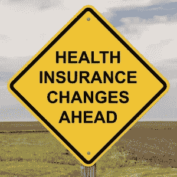

# F.史密斯与医药和保险的未来

> 原文：<https://medium.datadriveninvestor.com/f-e-smith-and-the-future-of-pharmaceuticals-and-insurance-6d68701367e8?source=collection_archive---------23----------------------->

> “也许还不知道，大人，但消息肯定更灵通。” *——f·e·史密斯在被一位法官告知之后，“我已经听了你一个小时了，我一点也不明白。”*

不回顾过去，很难预测未来。我们将更进一步，由前内阁大臣兼律师 F. E .史密斯，他是温斯顿·丘吉尔的朋友，来审视过去对未来的展望。在他 1930 年去世前不久，他写了一本名为《公元 2030 年的 T4 世界》的书，书中他分享了一些关于 100 年后世界将会是什么样子的预测。

要理解史密斯对医疗保健和寿命的观点，重要的是要记住，他写作的时候，结核病是英国和世界各地的主要死亡原因之一。据英国广播公司(BBC)报道，“(史密斯)非常乐观地表示，到 2030 年根除(结核病)和其他流行病是‘相当确定的’，就像‘发现治疗癌症等疾病的方法’一样。”

史密斯还认为我们会活得更长，科学家发明的“返老还童”注射液可以将我们的平均寿命延长到 150 岁。然而，英国广播公司解释说，“[他]承认这将带来‘巨大的人口增长’带来的‘严重问题’。他还预见到了极端的代际不平等，想知道“20 岁的年轻人如何在职业或业务上与 120 岁仍处于壮年、有一个世纪的经验可以借鉴的精力充沛的人竞争？”"

因此，很明显，虽然史密斯做对了一些事情，但他在其他事情上却大错特错。一个很好的例子是他预测到 2030 年汽车将被淘汰，因为我们都将拥有私人飞机。2030 年的人将在工作后乘一架小型快速的飞机去度周末，这种飞机和我们今天所依赖的汽车一样可靠和便宜。其他预测更加现实。考虑到他在登月前 40 年就去世了，他惊人地准确预测到 2030 年，载人火星任务的第一次准备工作将会开始。不幸的是，英国广播公司还说，他认为“前六次尝试可能会完全错过这颗行星，让宇航员在远离地球时死在船上。”应该有人警告一下埃隆·马斯克。

其他看似古怪的预测包括大英帝国的生存，尽管他确实暗示首都可能会从伦敦转移到加拿大或澳大利亚的某个地方。他也对可再生能源持怀疑态度，预测说，“通过在任何大的程度上利用潮汐能，我们应该会降低地球自转的速度。(如果过度使用的话)，在遥远的未来，一天工作 48 小时是可能的。”

史密斯还预测优生学的使用会增加，优生学是一门科学，近年来由于与纳粹及其在第二次世界大战期间的暴行有关而失去了人们的青睐。史密斯没有活着看到这一点，所以也许他会改变主意。这个想法是通过控制生殖和最终人为塑造进化来“改善”人类。BBC 称，“他声称一个聪明的年轻人会‘在求婚前考虑他未婚夫的遗传肤色’。作为回报，“当时的年轻女子会拒绝他，因为他从父亲那里继承了一种基因，这种基因会使他们的孩子容易争吵”。"

最后，在食品和药物方面，史密斯有一些想法，包括实验室合成食品取代传统农业以满足不断增长的人口的想法。他说，“从一块嫩嫩的‘母’牛排上，就有可能长成你想要的又大又多汁的牛排。”如果这听起来很熟悉，那么你可能听说过实验室培育的肉类的最新进展，支持者认为这将减少对虐待动物的担忧，同时减少动物农业对环境的影响。

至于药品，史密斯写道，“如果化学在未来一百年能够发现像烟草一样令人愉快和无害的新物质，但每种物质对消费者都有不同的影响，这将赢得世界上每一个辛勤工作的男人和女人的感谢。”这真的很讽刺，考虑到他在一生的酗酒和吸烟后于 58 岁去世。

史密斯对未来的展望既出人意料地有先见之明，又十分古怪，但我想把它写在这里是有原因的。这是一个重要的提醒:预测未来是一个愚蠢的游戏，一个几乎不可能赢的游戏。尤其是当那些幻觉延伸到如此遥远的未来，以至于没有机会活着看到预言是否成真的时候。

对未来的预测不可能 100%准确。然而，这根本不是逃避思考未来的借口，它只是提醒我们应该对这些预测持保留态度。考虑到这一点，让我们来看看未来会发生什么——私人飞机不包括在内。

# 制药业的未来

在撰写我即将出版的第二本书时，我有幸被邀请为 PharmaBoardroom 投稿，这是一个医疗保健网站，提供来自世界各地的行业趋势、新闻和报告。随着 2018 年进入 2019 年，我被要求写一篇预测制药行业未来的文章，这让我开始思考。

制药业颠覆的时机已经成熟。毕竟，它已经半个多世纪没有真正改变了，尽管事实上互联网和万维网已经彻底改变了这个星球上几乎所有其他的主要行业。

要了解制药业的未来，我们首先需要了解现在。好消息是，Ingrid Torjesen 在她为制药之旅撰写的一篇文章中提到了我们，她在文章中解释道:“在一种药物被认为适合患者之前，它必须经过严格的测试和成本效益分析。每年都有几十种新药获得使用许可，但随之而来的是成千上万种候选药物半途而废。这些新药进入市场的研发过程将耗时约 12 年，耗资约 11.5 亿英镑。”

当研究人员进行研究以了解疾病背后的过程时，药物开发之旅就开始了。这通常包括识别与疾病有关的基因或蛋白质，然后寻找作用于目标的分子或化合物。Torjesen 说:“多达 10，000 种化合物可能被考虑并被削减到仅仅 10 到 20 种，这些化合物在理论上可能会干扰疾病的进程。”

从那里，我们继续进行临床前测试，然后进行临床试验，通常包括 1 期、2 期和 3 期试验。这些阶段中的每一个都有助于在无效或不安全药物进入提交给 MHRA(英国)或 FDA(美国)以试图获得药物上市许可的阶段之前将其剔除。“如果许可被授予，这并不是过程的结束，”Torjesen 解释说。“在英格兰和威尔士，对于大多数患者来说，制药公司需要的不仅仅是上市许可，他们还需要国家健康和护理卓越研究所(NICE)推荐通过 NHS 提供治疗。”

从那里，我们继续申请专利，并最终全面发布，但我今天想重点介绍的是这些早期步骤。这是因为一种名为人工智能的小东西有可能极大地简化药物发现过程。

人工智能非常擅长处理大量数据并得出结论，尤其是当它与它的姐妹技术机器学习结合在一起时。它还可以用于模拟真实世界场景的复杂模拟，并让研究人员在开始之前就知道应该把精力放在哪里。它可以简化开发过程并节省资金，缩短药物上市时间，同时降低临床试验阶段的风险。

让我们重新审视现有的药物开发模式。人工智能可以从一开始就提供帮助，处理数据，帮助研究人员识别基因和蛋白质，以及可能对它们产生潜在影响的化合物。它有效地为研究人员指出了正确的方向，有点像卫星导航。它可能不会每次都做对，但这就是为什么它会受到人类监督的原因。同样，如果卫星导航告诉你开车到海里，你也不会跟着它走，研究人员将能够对人工智能的发现持保留态度，并在必要时否决它。

人工智能还将能够模拟临床试验，甚至模拟如果药物在现实世界中发布并进入公众手中会发生什么。这不会取代传统的 1 期、2 期和 3 期临床试验，但它可以通过阻止制药公司投资那些在开始前就注定失败的临床试验来节省资金。这些节省——以及更快、更简化的研究过程带来的固有节省——有助于降低管理费用，并最终使制药公司能够以更低的价格销售药物。毕竟，他们要收回的总投资会更少。

制药的未来不仅仅是人工智能和机器学习。例如，在数据存储和传输方面，区块链技术有很大的潜力，而可穿戴设备可以帮助患者控制自己的健康，并首先减少对药物的需求。如果辉瑞、强生和其他主要制药公司将重点转向更具预防性的模式，在这种模式下，它们不仅成为传统制药公司，还成为软件和硬件开发商，我不会感到惊讶。

但这是一种最有可能带来颠覆的人工智能，至少在我看来是这样。这不仅适用于制药行业，也适用于整个医疗保健行业。2019 年只是一个开始。

# 健康保险的未来

Richard A. Young 和 Jennifer E. DeVoe 在为《家庭医学年鉴》 撰写的一项研究中预测，到 2033 年，家庭健康保险的费用将等于家庭收入的中位数。也许最令人吃惊的事实是，这些数字不包括每年为资助医疗保险和医疗补助支付的税收，因此美国公众的真实成本甚至更高。作者解释说，“除非对美国医疗体系进行重大改革，否则中低收入的美国人将越来越负担不起私人医疗保险。”

有趣的是，在 2010 年，我们见证了《患者保护和平价医疗法案》(PPACA)的通过，同年，在 500 万美国人在经济衰退中失去了基于就业的医疗保险后，没有医疗保险的美国人数量上升到 5070 万人的历史高点。“讽刺的是，未保险率紧随旨在减少未保险人数的 PPACA 之后上升，”作者说。

“医疗保健系统是复杂的和适应性强的，”他们继续说道，“因此有可能发生其他变化来避免系统的完全崩溃。增加费用分担可能会改变一些患者的期望和行为。赋予消费者选择(并支付)服务的权力也可能增加价格透明度，特别是对于昂贵的非紧急服务，如门诊磁共振成像。然而，医疗保健消费主义是有局限性的，因为当一个人得了阑尾炎时，他不可能到处去找外科医生和医院。

至于未来，Young 和 DeVoe 并不乐观，“在过去的 50 年里，没有一项利用支付变化来调整医疗费用的努力弯曲了成本曲线。美国需要更深入地讨论医疗系统在我们生活中的角色和重要性，可能包括对医患关系的新期望。或者，我们可以选择继续走当前的道路，这将把艰难的决定留给我们的子孙后代，他们将被这一代人的过度消费所造成的债务压垮。”

正如医疗保健的许多方面一样，要理解未来，首先回顾过去会有所帮助。Greg Scott、Paul Keckley 和 Bill Copeland 在为 Deloitte 撰写的一份报告中解释道:“在现代，有两件事推动了该行业的发展:为了招募从二战中归来的老兵，公司利用他们的医疗保险来区分招聘工作。1972 年，作为尼克松政府的一部分，当对雇主实施工资和价格控制以控制失控的通货膨胀时，医疗保险费用没有被计入紧缩的工资上限。雇主提供的健康保险成为标准费用——第一美元的覆盖范围，适度的共同支付(如果有的话),低保费和免赔额，以及可供选择的大型医生和医院网络是许多计划的共同特征。实际上，员工享受的福利减轻了从日常办公室访问和药物治疗到严重医疗问题住院治疗的全部风险。国会对雇主缴纳的保险费给予免税，如今这部分保险费价值 2160 亿美元。”

这使得健康保险不同于其他类型的保险。“与承保灾难或大件物品风险的保险不同，”作者解释说，“健康保险演变成一种全面承保的形式，涵盖从轻微割伤和例行检查到器官置换和意外事故的一切。这类似于一个假设的汽车保险计划，涵盖了瘪胎，而不仅仅是碰撞。更复杂的是，在传统的雇主赞助的保险中，公司支付 75%的保费，所以个人的份额相对较低，过度使用医疗服务的趋势很高。因此，消费者在游戏中没有多少利益。由于这些结构性缺陷，医疗保险被广泛使用，因为它涵盖了一切——出于同样的原因，它也很昂贵。”

对我来说，这既是一种祝福也是一种诅咒，它暗示了我期望我们在未来会看到更多的东西。随着我们作为一个社会，转向更具预防性的医疗保健模式，保险公司将预先花钱阻止疾病的发展，这样他们就不必在未来花费更多的钱来治疗本来可以预防的疾病。这是对未来的投资，从长远来看可以为保险公司省钱。

唯一的问题是，保险公司不愿意进行这些前期投资，因为存在这样的风险:他们会投资这笔钱，然后他们的客户会转向不同的提供商。我可以理解这种担忧，但如果整个行业都转向这种更具预防性的模式，理论上应该会达到平衡，人们从公司转向保单的任何损失都应该被来自另一家提供商的新投保人的收益所抵消。只有当我们看到广泛的转变时，它才会起作用，但我很乐观，我预计我们很快就会看到医疗保险行业的早期创新者朝着更具预防性的模式迈进。一旦这些早期的开拓者铺平了道路，该行业的其余部分肯定会跟进。

# 想了解更多？

我在我的书《医疗保健的未来:人类和机器合作获得更好的结果》中更多地谈到了新技术及其对医疗保健行业的影响。点击此处为自己购买一份。