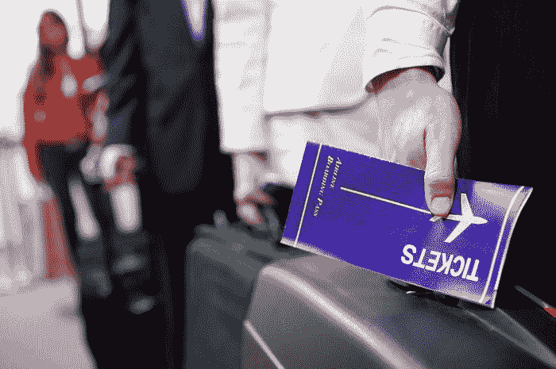
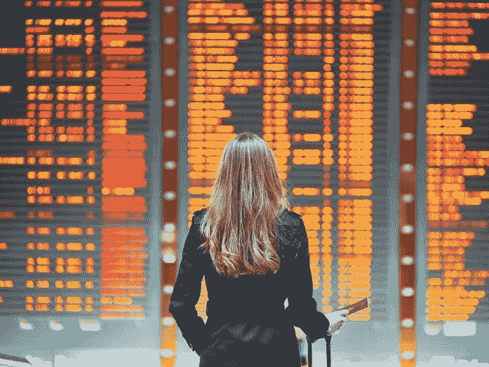

# 联邦航空局的规定证明了技术可能是昂贵的

> 原文：<https://medium.datadriveninvestor.com/faa-regulation-is-proof-that-technology-can-be-costly-bade94b34ee4?source=collection_archive---------28----------------------->

## 这就是为什么当局需要说到做到。

几十年来，制造商似乎一直负责在技术和安全标准范围内对飞机进行合格鉴定和认证。这就是为什么一般来说，你可以去 Priceline T1，花几百美元就能买到几趟航班。还不算太差。但是为这些飞机投入的资金数量会让你大吃一惊。

# 美国联邦航空局将需要惊人的 18 亿美元来处理国内的飞机

猜猜这会对航班定价产生什么影响？—会涨。这对经济不好，对品牌也不好，比如达美航空、美国航空或 Spirit。

 [## 危机管理乘“飞机”飞行——真相数据驱动的投资者

### 当埃塞俄比亚航空公司的一架 737 Max 飞机起飞后不久坠毁，整个国家陷入危机。最好的…

www.datadriveninvestor.com](https://www.datadriveninvestor.com/2019/03/26/crisis-management-flies-on-plane-truth/) 

问题是飞机认证的外包，而且没有足够的开销来实现它。鉴于发生在印尼和埃塞尔比亚的这两起坠机事件，每个人都在担心安全问题——每个人都在担心*技术*可能在任何时间点坠毁，从而导致飞机坠毁！因此，联邦航空局需要做的是确保每一架飞机都经过认证，这在[航空工业](https://vigyaa.com/@pierre/3-stories-on-the-aviation-industry-that-put-the-technology-sector-863507f4/)的历史上从来没有真正做过。

相当惊人。

如今，卓越的技术是成功的关键，它推动着多个行业的发展，而航空无疑是其中的佼佼者。是的，这对就业很有好处——但是经济会发生什么变化呢？谁知道呢。

然而，好消息是，安全比以往任何时候都更加重要。登机时会有额外费用——保证你获得最大的成功。没有风险。也许甚至更少的延误，中途停留和重新安排。飞行将不再像过去那样繁琐，而且可以肯定的是，恐怖分子再也不会试图爬上一架飞机，企图撞上一栋大楼。

如果管理得当，国会成功资助联邦航空局，其他的技术收益也会随之而来。

# 航空工业的成功改造、振兴和改进

安全措施的最佳技术？检查。更好的设计呢？仔细检查。我们可以为我们的乘客提供更多——不仅仅是更安全的旅行，而是更多的便利，或许更多的可用性。在我看来，这是一场胜利，或许值得政府给航空业 18 亿美元。

你对航空领域的技术进步有什么看法？ [**注册一个 VIGYAA 账号开始发布**](https://vigyaa.com/accounts/login/) ，一定要 [**查看《数据驱动投资人》获取更多技术洞察**](http://datadriveninvestor.com) **！**