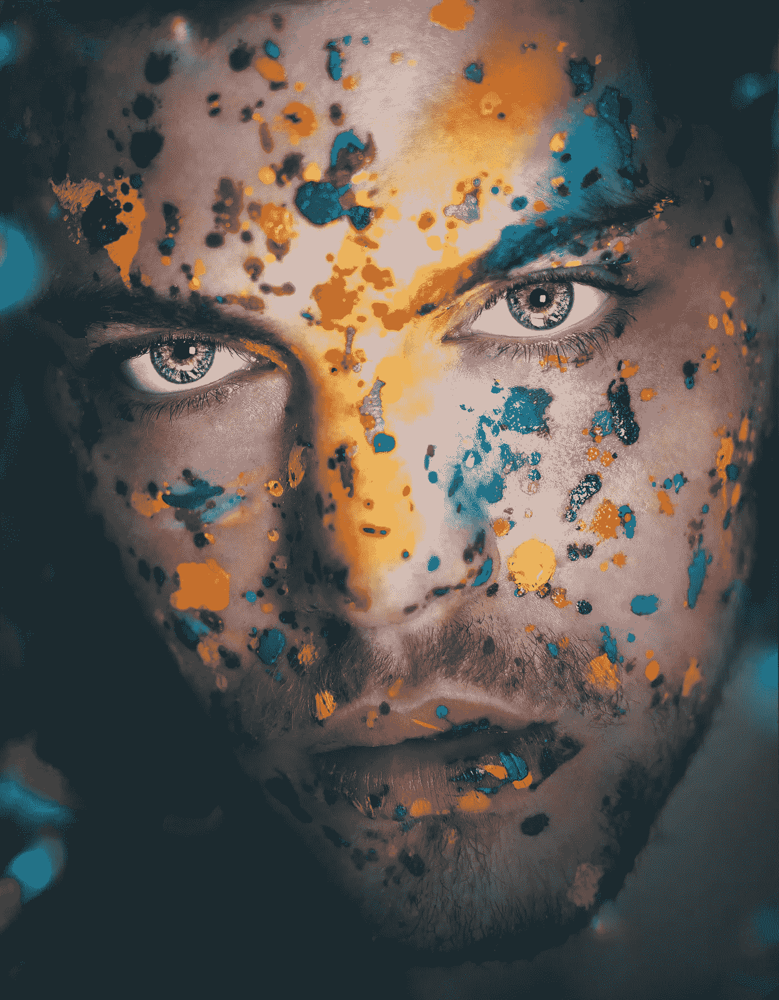

# 面对:人工智能的面部识别技巧及其未来用途

> 原文：<https://medium.datadriveninvestor.com/face-off-ais-facial-identity-tricks-and-its-future-uses-1dc14e694475?source=collection_archive---------7----------------------->

©pierrick-van-troost -Unsplash

在当今这个软件密集型的世界里，问 [乌西莫多](https://en.wikipedia.org/wiki/The_Hunchback_of_Notre-Dame)(巴黎圣母院的驼背)或[约瑟夫·梅里克](https://en.wikipedia.org/wiki/Joseph_Merrick)(象人)要找到约会对象不会有任何困难。被指控为“捕风捉影”的男人们仍然可以满足他们对伴侣的渴望。由于人工智能、面部识别和面部替代软件的创新，远距离关系将成为可能。是的，梅里克先生在讲述他诱人的故事时，可以想象出一张布拉德·皮特那样的脸，供他的美丽的战利品们观看

该软件的市场，也被称为面部交换应用程序，包括:

1.  face app——人工智能人脸编辑器
2.  Faceover Lite:照片面部交换
3.  变脸亭——变脸者
4.  面部交换直播
5.  MSQRD
6.  雪
7.  Snapchat
8.  iSwap 面孔
9.  偷脸者
10.  反射:逼真的面部交换

 [## 人们对隐私的不理解是什么？数据驱动的投资者

### 你知道那种感觉。无论是访问应用程序、订阅还是你最喜欢的运动鞋。你按下…

www.datadriveninvestor.com](https://www.datadriveninvestor.com/2019/04/11/privacy-and-convenience/) 

" [*全球面部识别市场*](https://www.marketsandmarkets.com/Market-Reports/facial-recognition-market-995.html) *规模(将)从 2019 年的 32 亿美元增长到 2024 年的 70 亿美元，2019-2024 年期间的复合年增长率(CAGR)为 16.6%。市场的主要增长驱动因素包括政府不断增加的用户和数据安全计划、移动设备的不断增长的使用，以及对强大的欺诈检测和预防系统不断增长的需求*。”

因此，严格来说，市场的局限性并不局限于孤独的色狼或害羞的女仆，她们会久久凝视着自己的手机。投资者表示，随着连接性的增长和设备在不同阶段变得更加可用，这种激增将继续下去。妖怪一旦出了瓶子，就不会再回去了。

细节决定成败

第一辆自行车的发明者没有意识到没有任何刹车的轮式机械装置在道路上行驶的危险。术语“ [header](https://www.brown.edu/Departments/Joukowsky_Institute/courses/13things/7083.html) ”来自那次设计灾难，刹车很快成为任何自行车的一部分，就像未来汽车中的加热器一样。但面部识别或面部欺骗或扭曲软件没有这样的机载指令来防止技术滥用和故意欺骗。如果用于金融交易，你如何隐藏你的脸？你的信用卡是安全的，看不见的，但你的脸不是。

在网上获得“约会”是一回事；窃取他人的面部信息来取款或购物是另一回事。最近在中国发布的一款名为 Zao 的软件程序因其潜在的个人数据(包括个人的面部信息)缺乏安全性而招致了的尖锐批评。

服务于技术的滑坡思维可能会将过去的无知带入未来的技术。例如，当[颅相学](https://en.wikipedia.org/wiki/Phrenology)在 19 世纪出现时，执法部门或公众是如何确定犯罪类型的？这种观点认为，性格和个性是通过头部的突起和其他身体特征来表现的。这个系统是二战期间纳粹的最爱。

19 世纪的错误思想

科学家们进行了头部测量并绘制了详细的地图，以确保一种模仿科学的分析手段。是数学方面使它变得科学吗？算法更有可能犯这些错误吗？数据集是如何产生偏差的，结果又是如何扭曲的？刹车在哪里？如果你不知道问题，你永远不会得到答案。

该理论的一个变体也有它的崇拜者。理查德·尼克松总统渴望在未来的罪犯进入小学时识别他们。毫无疑问，这是一个旨在选择特定人群的系统，很可能是有色人种的孩子。

尼克松的精神病医生阿诺德·赫茨内克医生愿意听从他的吩咐。这位精神病医生是[犯罪前干预](https://en.wikipedia.org/wiki/Pre-crime)的信徒，这种干预最初由[切萨雷·龙勃罗梭](https://en.wikipedia.org/wiki/Cesare_Lombroso)提出理论，他概念化了身体特征服务于这一目的的信念。他有办法或科学来实现这个目标吗？这样做合乎道德吗？

Hutschnecker 博士认为犯罪是遗传的，是家族遗传的。他声称他有科学来支持他的主张和计划。科学从未出现过。他设计了一个项目，对全国所有 6 至 8 岁的儿童进行心理测试，以确定犯罪的可能性。

根据诺曼·登津写的一本书，“那些没有通过这些测试的人——这些测试已经被证明在超过 50%的情况下提供了成功的个人预后——将被送到康复中心，就像赫茨内克所说的那样，“在西部有树的浪漫环境中”。这份迟来的、未经整理的提案被放在白宫信笺上寄给了卫生与环境部部长，请求他就如何实施该提案提出建议。

这听起来像是没有犯过罪的补救或惩罚吗？尼克松在计划实施之前就放弃了。

阅读情感而非头部撞击

苹果已经被证明是一家在个人电脑或娱乐领域之外有抱负的公司。它[在 2016 年购买了 Emotient](https://fortune.com/2016/01/07/apple-emotient-acquisition/) ，这是一个使用人工智能检测情绪的程序。该软件已经被零售商、医生和广告公司使用。苹果对此的计划尚未透露。

由加州大学圣地亚哥分校的一个研究小组开发的人工智能程序可能会在电影中找到新用途。制片人不需要让观众填写卡片，因为机器会评估观众的情绪反应，并在几分钟内准确完成工作。

[加州的执法部门](https://www.npr.org/2019/07/10/740480966/the-debate-over-facial-recognition-technologys-role-in-law-enforcement)使用面部识别人工智能来检查犯罪数据库。理论上，情绪可以用来评估与证人或被指控犯罪的人的面谈。然而，在这里，可能在软件编码中的偏差可能需要一些制动。每个人表露情绪状态的方式都一样吗？

面部识别或面部情绪评估或面部交换都处于后婴儿期。即使是现在，我们也看到技术如何被用来扭曲政治事件或新闻的视频媒体制作，并影响国家的命运。

只有未来会告诉我们，我们是否在技术中使用了适当的谨慎，或者显示出我们无法阻止邪恶或错误的数据处理。编码者是最终的权威吗，还是我们需要一个伦理指导系统来监督和评估？