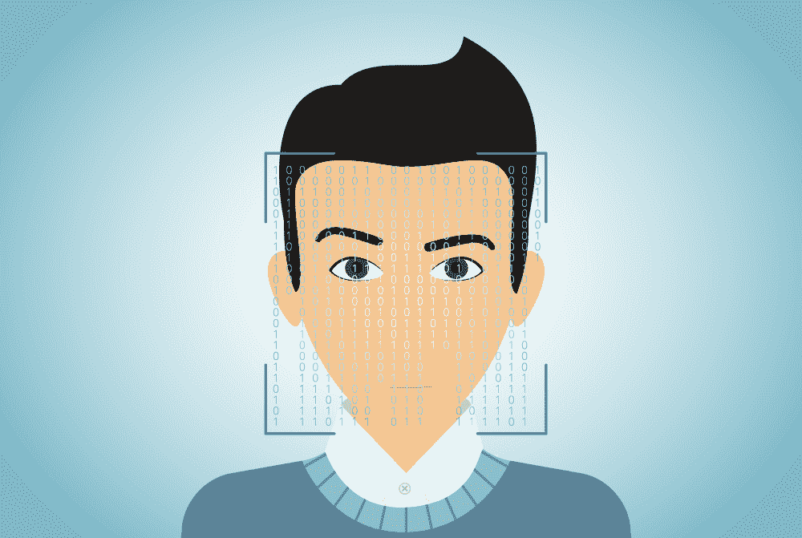
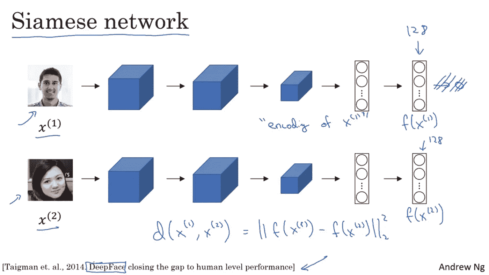

# 人脸识别

> 原文：<https://medium.datadriveninvestor.com/face-recognition-929464856b86?source=collection_archive---------5----------------------->

## 人工智能正在彻底改变世界。人脸识别就是其中之一。几乎每个人都在使用人脸识别系统——在我们的手机、脸书、照片库应用程序或高级安全摄像头上。了解这些系统是如何识别我们的脸的。本文灵感来源于 [FaceNet](https://arxiv.org/abs/1503.03832) 上的 [deeplearning.ai](https://www.coursera.org/specializations/deep-learning?utm_source=deeplearningai&utm_medium=institutions&utm_campaign=WebsiteCoursesDLSTopButton) 课程。



# 人脸验证与人脸识别

*人脸验证* 检查“这是认领的人吗？”。比如在学校，你带着身份证去，监考老师用身份证验证你的脸。这是人脸验证。一个用我们的人脸解锁的手机，也是在用人脸验证。是 1:1 的匹配问题。

现在假设监考老师知道每个人的名字。所以，你决定不带身份证去。监考老师识别你的脸，让你进去。这就是人脸识别。*人脸识别* 处理“这个人是谁？”问题。我们可以说是 1:K 的问题。

## 为什么逐像素比较图像不是一个好主意？

一种简单的人脸验证方法是逐个像素地比较两幅图像，如果图像之间的阈值小于阈值，那么我们可以说他们是同一个人。但是因为即使光、位置或方向有微小的变化，图像中的像素值也会显著变化。所以，这个方法不好用。

## 面部嵌入来拯救

嵌入的*用 d 维向量 f (x)表示。它将图像“x”编码到 d 维欧几里得空间中。同一个人的两幅图像的人脸嵌入是相似的，而不同的人的人脸嵌入是不同的。*

在 ConvNet 架构中，初始层学习识别基本模式，如直线、边、圆等。更深的层次学习识别更复杂的模式，如数字、面孔、汽车等。

为了进行嵌入，我们将图像输入预训练的模型，然后向前传播，并从更深的全连接层中提取矢量。你可以在这里学习 CNN [的基础知识](https://medium.com/@aniketmaurya/not-just-introduction-to-convolutional-neural-networks-part-2-a7ac2723e30d)。

## 如何微调这些嵌入？

[*三重损失*](https://en.wikipedia.org/wiki/Triplet_loss) 功能负责*将同一个人的两个图像(锚和正面)的嵌入*推得更近，而*将不同个人的两个图像(锚和负面)的嵌入*拉得更远。



Source: [Coursera](http://deeplearning.ai)

**∨f(X1)—f(X2)∨**是图像 X1 与 X2 的相似度。如果它小于一个选定的阈值，那么两个人就是同一个人。如果你想知道“这个**∩**一个**∩**怪异的符号是什么？”，这叫*弗罗贝纽斯范数*你不用担心。

*锚*和*正*像之间的距离应该小一些，而*锚*和*负*像之间的距离应该大一些。

即**∨f(锚)— f(正)∨≤∨f(锚)— f(负)∨**。

# 现在你已经知道了人脸识别的基本概念，我将告诉你如何创建一个人脸验证和识别系统。超级简单。

训练一个人脸识别模型计算量很大，所以我会推荐下载一个[预训练模型](https://github.com/iwantooxxoox/Keras-OpenFace)。首先创建一个人的数据库，其中包含每个人的嵌入向量。

```
*#create a dictionary database* db = dict()
*#encoding(image_path) converts image to embedding* db['person1'] = encoding('person1.jpg')
db['person2'] = encoding('person2.jpg')
db['person3'] = encoding('person3.jpg')
db['person4'] = encoding('person4.jpg')
db['person5'] = encoding('person5.jpg')
```

现在我们已经创建了我们的数据库，我们可以定义一个接受图像嵌入和人名作为参数的函数，它将验证它们是否是同一个人。

```
**def** verify(embedding, person_name):

 *# numpy.linalg.norm calculates the Frobenius Norm*    dist = np.linalg.norm(embedding - db[person_name])

 *# Chosen threshold is 0.7*    **if** dist < 0.7:
        print("Verified! Welcome " + person_name)
    **else**:
        print("Person name and face didn't match!")
```

加油😎！我们创建了我们的人脸验证系统。现在让我们创建人脸识别系统。如果你记得的话，人脸识别系统里一个人不需要任何 ID。他只需要在镜头前露脸。

在人脸识别中，将针对输入嵌入计算数据库中所有图像的距离，并且必须搜索最小距离。

```
**def** recognize_me(input_embedding): *# Set min_dist to infinity*    min_dist = np.inf

    *# Iterate over the database to calulate distance for each person*
    **for** (name, emb) **in** db.items():

        *# Compute the distance*
        curr_dist = np.linalg.norm(input_embedding - emb)

 *# identity is set to the name of the person from the database whose distance is smallest against the input encoding*        **if** curr_dist < min_dist:
            min_dist = curr_dist
            identity = name

    **if** min_dist > 0.7:
        print("Sorry! You’re not in the database.")
    **else**:
        print ("Hi! Welcome " + identity)
```

> 恭喜你！！👏👏你已经创建了自己的人脸识别系统。

# 如果你已经学到了一些东西，那么请随意按下👏你想待多久就待多久😃。

# 如果你发现有什么不对的地方，请在评论中提出来。我希望❤️有所改进。

**你可以通过**[**twitter.com/aniketmaurya**](http://twitter.com/iamaniketmaurya)**联系我或者把你的📧在**[**aniketmaurya@outlook.com**](http://aniketmaurya@outlook.com)