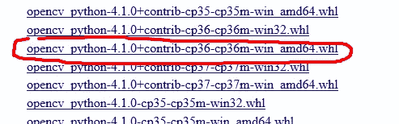
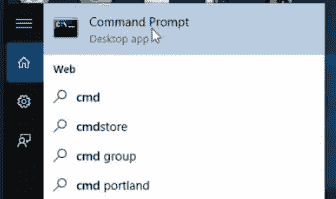
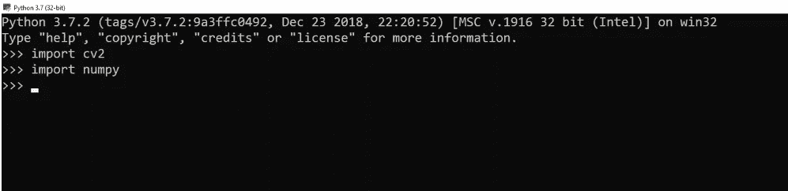
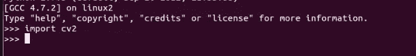

# 使用 Opencv 和 Python 从头开始进行人脸识别(第 1 部分)

> 原文：<https://medium.datadriveninvestor.com/face-recognition-from-scratch-using-opencv-and-python-part-1-c61e13e553dc?source=collection_archive---------3----------------------->


## 用 Opencv 和 Python 构建自己的人脸检测器

在过去的二十年中，人脸识别一直是最有趣和最重要的研究领域之一。其原因来自于自动识别和监控系统的需要、人类视觉系统对人脸识别的兴趣以及人机界面的设计等。这些研究涉及神经科学、心理学、计算机视觉、模式识别、图像处理和机器学习等学科的知识和研究人员。

在这篇文章中，我们将工作分为 4 个部分，以更好地理解人脸识别的内部工作。在这一部分，我们将重点放在设置环境和下载依赖项上。

# **目录:**

*   安装 Python 3
*   安装 Opencv 3
*   做一些代码

在开始之前，我假设你已经掌握了很好的 python 知识，如果你不自信的话[这里](https://www.linkedin.com/posts/yassine-hamdaoui_python-stackabroverflow-python-activity-6612219098589986816-pTdN)一些专业的笔记来先建立你的 python 背景，这将帮助你理解后面的事情。

所以不要再浪费时间了，让我们进入正题吧。

# **我正在安装 Python 3 :**

在 Windows 10 上安装和使用 Python 非常简单。安装程序只包括三个步骤:

1.  下载二进制文件
2.  运行可执行安装程序
3.  将 Python 添加到 PATH 环境变量中

要安装 Python，需要下载官方的 Python 可执行安装程序。接下来，您需要运行这个安装程序并完成安装步骤。最后，您可以从命令行配置 PATH 变量来使用 python。

[](https://www.datadriveninvestor.com/2019/01/23/deep-learning-explained-in-7-steps/) [## 深度学习用 7 个步骤解释-更新|数据驱动的投资者

### 在深度学习的帮助下，自动驾驶汽车、Alexa、医学成像-小工具正在我们周围变得超级智能…

www.datadriveninvestor.com](https://www.datadriveninvestor.com/2019/01/23/deep-learning-explained-in-7-steps/) 

您可以选择想要安装的 Python 版本。建议安装 Python 的最新版本，写这篇文章的时候是 3.7.3。在网络浏览器中打开[官方 Python 网站](https://www.python.org/downloads/windows/)。导航到 Windows 的下载选项卡。

1.  在网络浏览器中打开[官方 Python 网站](https://www.python.org/downloads/windows/)。导航到 Windows 的下载选项卡。
2.  选择最新的 Python 3 版本。在我们的例子中，我们选择最新的 Python 版本。
3.  如果您使用的是 32 位安装程序，请点击链接下载 **Windows x86 可执行安装程序**。如果您的 Windows 安装是 64 位系统，那么下载**Windows x86–64 可执行安装程序**。

在 Linux 机器上安装 Python 更简单，只需要两个命令行，打开命令提示符并运行:

```
 $ sudo apt-get update
$ sudo apt-get install python3 
```

仅此而已，Python 来了！

现在你可以选择你最喜欢的编辑器，我推荐来自 Jetbrains 的 [Pycharm](https://www.jetbrains.com/pycharm/download/#section=windows) 。

让我们移动并下载 Opencv:

# II-安装 Opencv:

Opencv 是最受欢迎的计算机视觉库，今天我们将学习如何设置 opencv，如何访问您的网络摄像头，以及如何轻松地用几行代码编写人脸检测程序。

## **1-在 Windows 平台上:**

下面是一个完整安装的必要步骤列表。

**安装 Opencv:在这里:[https://www.lfd.uci.edu/~gohlke/pythonlibs/#opencv](https://www.lfd.uci.edu/~gohlke/pythonlibs/#opencv)下载 Opencv** 二进制文件

**选择**与你的 Python 兼容的**版本的 Opencv** 。我们将为 Python 3.6.8 下载最新版本的 Opencv (4.1)。
*如何理解正确的版本？
-cp37m-win32.whl 表示 Opencv 适用于 python 3.7 (32 位版本)
-cp36m-win_amd64.whl 表示 Opencv 适用于 python 3.6 (64 位版本)*



**运行 Windows 的【命令提示符】**。你可以在搜索栏上输入“CMD”来找到它。



进入你下载的 Opencv 二进制文件所在的目录。

以我的情况为例:

cd C:\Users\Yassine\Downloads

现在让我们使用 PIP 安装 Opencv 模块。

python pip -m 安装 opencv _ python 4 . 0 . 1+contrib cp37 cp36m win _ amd64 . whl

现在让我们使用 PIP 安装 Numpy

python pip -m 安装编号

**安装完成**现在我们可以通过运行 python 并导入库 cv2(用于 opencv)和 numpy 来测试它。如果我们没有得到任何错误，这意味着它已经安装成功。



**2-在 Linux 平台上:**

在 linux 平台上，它需要一些额外的库来与 Linux 内核兼容，在本[指南](https://www.learnopencv.com/install-opencv3-on-ubuntu/)中，您将找到帮助您成功安装 python/c++ opencv 的详细描述。

要测试 opencv 安装，只需打开终端:

类型:

```
$ python3
```

然后:



现在一切都设置好并运行了，让我们写一个代码来从网络摄像头中检测人脸。这是 opencv 的 hello world 程序

# III-做一些代码:

我们将在这个程序中使用的方法是一个级联分类器，它可以加载一个预训练的 xml 文件，这些 xml 文件很难训练，但幸运的是，我们不必担心 opencv 已经为人脸检测准备好了许多这些预训练的分类器

要使用人脸检测分类器，我们需要从[***【opencv 解压文件夹】*/sources/data/haarcascades/**](https://github.com/opencv/opencv/tree/master/data/haarcascades)中复制分类器 xml 文件

然后将文件***Haar cascode _ frontal face _ default . XML***复制到您的项目文件夹中(与保存 python 程序的位置相同)

我们现在可以加载分类器了

```
detector=cv2.CascadeClassifier('haarcascade_frontalface_default.xml')
cap=cv2.VideoCapture(0) #   add the video capture object now
```

在上面一行中，VideoCapture 有一个参数是设备 id，对于内置的网络摄像头，它通常是“0 ”,如果您有其他网络摄像头，您可以更改该数字，因此这是您的网络摄像头的 Id

现在让我们测试一下相机

```
ret,img=cap.read()
cv2.imshow('windowname',img)
cv2.waitKey(0) 
```

看起来工作正常

在上面的代码中，我们使用 ***cap.read()*** 方法从视频捕获对象中读取图像，它返回一个状态变量，这个变量就是 ***True/False*** 和捕获的帧，然后我们使用 ***imshow()*** 方法显示图像，这里第一个参数是窗口名称，第二个参数是我们要显示的图像，第三行我们使用了 ***waitKey(10)***

在使用人脸检测器之前，我们需要将捕获的图像转换成灰度

```
gray = cv2.cvtColor(img, cv2.COLOR_BGR2GRAY)
faces = detector.detectMultiScale(gray, 1.3, 5) # apply the face detector to detect faces in our captured image 
```

上面的代码行将获取列表中捕捉到的图像中所有人脸的 x，y 和高度，宽度，所以现在我们必须遍历所有人脸并在那里绘制矩形

```
for (x,y,w,h) in faces:
    cv2.rectangle(img,(x,y),(x+w,y+h),(255,0,0),2) 
```

我想很清楚这段代码在做什么，让我解释一下 rectangle()第一个参数是我们要在其中绘制矩形的输入图像，第二个是面部的 x，y 坐标，然后是身高和体重，之后我们以(蓝，绿，红)的形式指定线条的颜色，你可以调整每种颜色的值，范围是 0-255，在这种情况下是一条绿线， 最后一个参数是线条粗细
现在我们已经用绿色矩形标记了面，我们可以显示它们了

```
cv2.imshow('frame',img)
cv2.waitKey(0)
```

现在，要从网络摄像头实时检测人脸，我们需要创建一个循环，该循环将从网络摄像头逐帧获取图像，并检测人脸，并将它们显示在一个窗口中。因此，如果我们将上面的代码安排在一个循环中，它将看起来像这样

```
while(True):
    ret, img = cap.read()
    gray = cv2.cvtColor(img, cv2.COLOR_BGR2GRAY)
    faces = detector.detectMultiScale(gray, 1.3, 5)
    for (x,y,w,h) in faces:
        cv2.rectangle(img,(x,y),(x+w,y+h),(255,0,0),2)

    cv2.imshow('frame',img)
    if cv2.waitKey(1) & 0xFF == ord('q'):
        break
```

你可以看到我改变了***【wait key】***，因为它也返回了在键盘上按下的键的值，所以我们将它与键‘q’进行比较，如果它为真，我们就打破了循环

程序结束后，我们需要释放视频捕获对象，并销毁所有的窗口

```
cap.release()
cv2.destroyAllWindows()
```

# 总结:

在这篇文章中，你发现了如何在 python 中设置 opencv，并编写了自己的人脸检测程序
，具体来说，你学习了 opencv 中最基本的步骤，包括:

*   如何使用分类器？
*   如何从相机读取图像
*   如何在图像上绘画
*   如何显示图像
*   主要是你学会了实时人脸检测

记住你可以在我的 github 库[这里](http://github.com/Yassine-Hamdaoui/Face-Detection-Frem-Scratch)找到完整的工作代码。

**感谢**阅读，我将很高兴讨论您可能有的任何问题或更正:)如果您想讨论机器学习或其他任何问题，请在 [LinkedIn](https://www.linkedin.com/in/yassine-hamdaoui/) 上找到我。