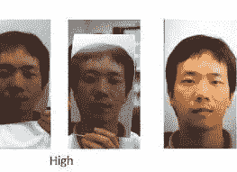
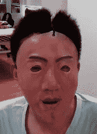
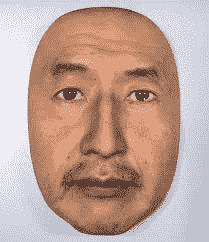
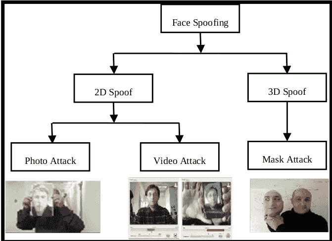

# 人脸欺骗检测

> 原文：<https://medium.datadriveninvestor.com/face-spoof-detection-e0d08fb246ea?source=collection_archive---------0----------------------->

io-metrics 是利用生理特征(如指纹、面部和虹膜)或行为特征(如打字节奏和步态)来唯一识别或验证个人身份的巨头。随着生物测定系统广泛用于包括移动电话认证和访问控制的现实世界应用中，生物测定欺骗攻击正成为更大的威胁，其中欺骗的生物测定样本被呈现给生物测定系统并试图被认证。

***面部欺骗攻击是指欺诈用户通过伪装成注册用户来颠覆或攻击人脸识别系统，从而获得非法访问和优势的过程。***

**人脸欺骗手段**

欺骗攻击是指试图通过使用照片、视频或不同的替代物来获得他人的特权或访问权限。下面列出了一些面部欺骗攻击[1]。

*   **打印攻击:**攻击者使用某人的照片。图像被打印或显示在数字设备上。这是最常见的攻击类型，因为大多数人在互联网上有面部照片，或者照片可以在没有任何许可的情况下获得。
*   **眼睛切割照片攻击:**一张打印照片的眼睛区域被切掉，以展示冒名顶替者的眨眼行为。
*   **扭曲照片攻击:**向任何方向弯曲打印的照片，以模拟面部运动。

Photo attacks

*   **重放/视频攻击:**一种更复杂的欺骗系统的方式，通常需要受害者面部的循环视频。与拿着某人的照片相比，这种方法可以确保行为和面部动作看起来更“自然”。这种类型具有照片中没有呈现的生命生理特征，例如眨眼、面部表情以及头部和嘴部的运动，并且可以使用平板电脑或大型智能手机轻松进行。
*   **3D 面具攻击:**在这种类型的攻击中，面具被用作欺骗的首选工具。这是一种比播放面部视频更复杂的攻击。除了自然的面部运动，它还可以欺骗一些额外的保护层，如深度传感器。

这些攻击针对分析 3D 人脸结构的反欺骗系统，是要检测的最复杂的攻击之一。这已被分类为真人大小的可佩戴面具和剪纸面具。

life-size wearable mask

paper cut mask

Face spoofing basic methods

更一般地说，分类可以表示如下，如研究人员所提出的。

Face spoofing methods classification[5]

## **人脸反欺骗？**

**人脸欺骗检测方法**

很明显，基于 2D 和 3D 图像的人脸识别系统可能会受到欺骗攻击。研究证明，他们正在根据描述符和分类器来分析这些攻击。描述符被分类为纹理、运动、频率、颜色、形状或反射率，分类器被组织为判别式、回归、距离度量或启发式[1]。

**描述符概述**

*   **纹理**:从人脸图像中提取文本特征，假设打印的人脸产生某些真实人脸中不存在的纹理图案。

例如:-局部二元模式(LBP)，梯度方向直方图(HOG)，深度神经网络(DNN)

*   **动作** :-研究中描述的方法主要有两种。

1.  检测和描述面部变化，如眨眼、面部表情、嘴部发育、头部转动等。
2.  评估环境中用户交互的一致性

*   **频率** :-利用欺骗攻击中出现的某些图像伪像。
*   **颜色** :-虽然由于光照变化，颜色不会保持不变，但某些主要特征是区分骗子和真正人脸的重要线索。
*   **形状**:形状信息对于处理印刷照片攻击非常有用，因为面部几何形状不能在平面表面上再现。
*   **反射** :-考虑到真实人脸和冒名顶替者人脸在相同的光照条件下表现不同，可以使用人脸反射图像的信息来区分它们。

**分类器概述**

*   **判别式**:这里通过最小化类内变化和/或最大化类间变化来区分不同的类。以下是欺骗检测中的一些常用分类器。

1.  支持向量机(SVM)
2.  线性判别分析(LDA)
3.  多层感知器(MLP)
4.  贝叶斯网络

*   **回归** :-基于回归的分类图考虑从已知的描述符和标签对获得的预测模型，将输入描述符直接用于它们的类别标签。

1.  线性逻辑回归(LLR)
2.  核判别分析(KDA)

*   距离度量 :-距离度量的使用被认为是为了提高人脸欺骗检测系统的性能，目标是测量样本之间的差异。

1.  卡方检验(χ 2)
2.  IDIAP
3.  余弦距离

*   试探法 :-不同的试探法被用来决定一张脸是真是假。一个缺点是当使用自己收集的数据时，试探法可能导致过度拟合。例子有，

1.  眨眼次数
2.  运动测量阈值
3.  平均像素比阈值
4.  运动测量的加权和

从现有的方法中决定一个完美的欺骗机制需要研究每种方法的特征、优点和缺点。简单的研究经历并阐明了以下发现。

Simple overview of existing face spoof detection methods[2][3][4]

**参考文献:**

[1]https://arxiv.org/pdf/1710.09868.pdf

[2]http://citeseerx.ist.psu.edu/viewdoc/download?[doi = 10 . 1 . 1 . 646 . 2807&rep = re P1&type = pdf](http://citeseerx.ist.psu.edu/viewdoc/download?doi=10.1.1.646.2807&rep=rep1&type=pdf)

[3][http://vipl . ICT . AC . cn/upload file/upload/2017 02 07 11092984 . pdf](http://vipl.ict.ac.cn/uploadfile/upload/2017020711092984.pdf)

[4][https://medium . com/swlh/anti-spoofing-mechanisms-in-face-recognition-based-on-dnn-586011 CCC 416](https://medium.com/swlh/anti-spoofing-mechanisms-in-face-recognition-based-on-dnn-586011ccc416)

[https://ieeexplore.ieee.org/document/6990726](https://ieeexplore.ieee.org/document/6990726)

## 来自 DDI 的相关故事:

 [## 用 7 个步骤解释深度学习

### 和猫一起

medium.com](https://medium.com/datadriveninvestor/deep-learning-explained-in-7-steps-9ae09471721a)  [## 数据科学和软件工程哪个更有前途？

### 大约一个月前，当我坐在咖啡馆里为一个客户开发网站时，我发现了这个女人…

medium.com](https://medium.com/datadriveninvestor/which-is-more-promising-data-science-or-software-engineering-7e425e9ec4f4)