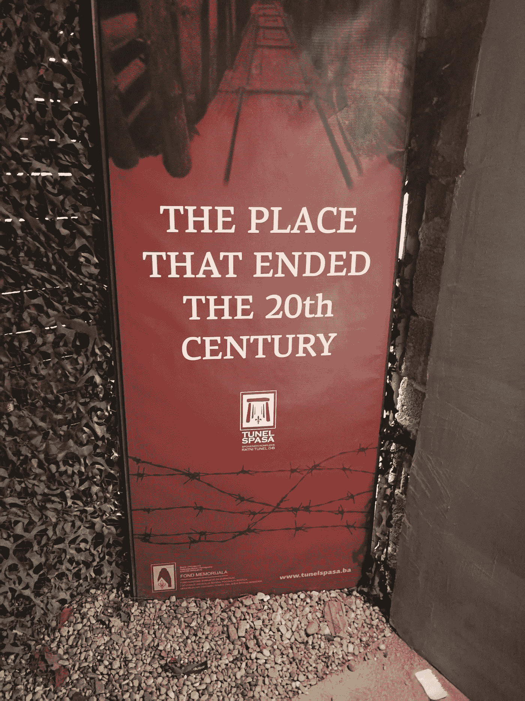

# 脸书:不要害怕未来会是什么样子；已经到了。

> 原文：<https://medium.datadriveninvestor.com/facebook-dont-be-afraid-of-what-the-future-will-be-like-it-s-already-here-12dae30bcba4?source=collection_archive---------10----------------------->

***塞拉热窝，2017 年 10 月***

我躲在最后一根木梁下，谢天谢地，当我走出希望隧道时，我站了起来，这个地方结束了 20 世纪。萨拉热窝被围期间，这里曾用来运送救援物资，是一个潮湿、令人不安的地方，在我们 20 多岁的导游愉快的解说下，这里变得更加不和谐。一场灰色的毛毛雨落在这个城市。

萨拉热窝是塞尔维亚人、克罗地亚人和波斯尼亚人的家园，他们在动荡的历史长河中相互通婚、相互关联、交织在一起。我们的导游言辞激烈——在 T4 的塞拉热窝，你就是不能谈论政治。冲突的根源是深刻、复杂和模糊的。就是没法解决。

我记得，十几岁的时候，看着粗糙的天空新闻画面，火箭无情地落在城市里。二十年过去了，被炸毁的建筑仍然静静地排列在狙击手的走廊上，这是波斯尼亚塞族军队猛攻的主要干道。

这座城市向游客展示了未来的样子。如果我们所有人都失去了一年的集体关注，那么一场低级别的灾难会有什么后果。如果我们给特朗普、普京、祖马、马莱马以及最近的南非最新腐败的战争和乱搞者安迪勒·姆希塔马(Andile Mngxitama)适当数量的绳子，会发生什么。

这是一场城市中很少有人想要的战争。这是一场没有解决任何问题的战争。直到今天，附近的莫斯塔尔镇仍是中国米埃维尔的《城市与城市》的现实世界版，有两套基础设施——用于一切——以满足穆斯林波什尼亚克人和天主教克罗地亚人的各自需求。

在像莫斯塔尔这样的地方，缺乏群体间的对话似乎是有形的。应该很奇怪。但事实并非如此。

*鉴于公共辩论的空间不断缩小，围绕移民的社会僵局，以及世界各地的生态敌对民族主义和性别权利问题，正是这种缺乏参与的阴沉让这个小镇与我有关联。*

***

不同领域的思想家一致认为，共产主义的垮台预示着历史的终结。萨拉热窝的那条隧道结束了上个世纪。结局曾经很重要:事情发生了，然后结束，然后消失在封闭和被遗忘的朦胧中。

但是脸书的到来不可逆转地改变了这一切。

我们是第一代无法永久忘记事情的人。

与某人失去联系，然后忘记他们的名字，然后忘记他们曾经存在过的日子已经一去不复返了。这似乎是一个微不足道的结果，但它已经以我们几十年后才会真正理解的方式极大地改变了我们的社会交往。

Mark, stop looking at me. Image credit: ZDNET.

# 老大哥不再需要被监视，我们主动展示给他看。

由于各种原因，我早就不在脸书工作了。但是有几年，就像这个星球上的 20 亿人一样，我勤奋地记录了我的考验、欢乐和苦难。现在，即使我真的离开了这个平台，这些内容也是不断重复的自发脸书记忆的一部分，主要是提醒我那些没有持续的美好时光，就像谷歌照片一样，在我最不需要的时候阻止我的悲伤和遗忘过程。

> **在没有要求的情况下，我们开始不得不断断续续地、持续地、侵入性地穿越到一种数字缓存状态中去。**

*你知道我们做了什么吗？我们什么也没做。我们允许了。*

但这真的只是开始。通过一系列多巴胺触发 UX 把戏，该平台随后在 20 亿人中培育了一种[成瘾等同依赖](https://adage.com/article/digital/sean-parker-worries-facebook-rotting-children-s-brains/311238/)。

其次是优先播放有争议的内容，从而将我们的恐惧、仇恨和道德愤怒货币化。

然后把我们的数据卖给最高的政治竞标者，有效地操纵了美国选举，并给了新兴的右翼民族主义者工具来让国家对抗国家，让公民对抗公民。

随后，给用户提供工具，从情感上惩罚任何观点不符合回音室共识的人，有效地实现了现在被称为“召唤文化”的东西。

在这一点上，最后，我们意识到真正糟糕的事情正在发生。

但此时，已经太晚了。

许多批评家和评论家已经预测了脸书的衰落，假定它会步 Tumbler、Mxit 和 MySpace 的后尘……但是这些预测表明了对脸书实际上是什么的根本性误解。

# **了解你的特洛伊木马**

几年前，我在一家全球风险情报公司工作，在那里相同的情报数据库可以重新打包用于不同的目的——今天了解您的客户解决方案，明天进行反洗钱合规检查。

毫无疑问，脸书是一个社交网络。但它也是 T2，一个可武器化的、人工智能驱动的系统，非常适合治理和思想控制。它已经知道你生活的一切，如果不是通过你，那么通过你朋友的数据推断，可以告诉并影响你的想法。众所周知，它已经对生活的方方面面产生了影响。

> **贴宝宝照片？干得好，这就给了脸书一个关于未来受众库存的提示，引发了对你孩子的终身剖析，** [**甚至是非平台**](https://techcrunch.com/2016/05/26/facebook-starts-selling-offsite-ads-targeting-non-users-too/) **。**

全世界只有大约 3 . 5 亿人使用美元作为他们的主要货币，然而美元被广泛认为是世界贸易货币。

当——不是[如果](https://www.sovereignman.com/trends/meet-the-worlds-next-central-banker-mark-zuckerberg-22921/)——脸书推出他们自己的加密货币或脸书币时，他们将能够以比特币的创始人只能梦想的规模推动采用。即使采用 10%的比率，我们也在谈论一种被 2 亿人使用的货币。

几年之内，用户将依靠它进行点对点交易、汇款和支付从优步便车到麦当劳的所有东西，这将使马克·扎克伯格成为这个星球上很大一部分地区的央行行长。这是在脸书成为世界数字投票平台之前…

这不是什么反面乌托邦式的未来愿景:正如我们所说的，脸书正在投入大量资金来研究如何让区块链的技术为其服务。那么时间表是什么？一年，两年？

所以…

2021 年 12 月，如果我是 36 岁的扎克伯格，我可以控制人们如何思考，他们买什么，他们用什么钱买，我为什么要止步于此？在我的虚拟王国里，有 20 亿人在所有事情上都依赖我，从信息访问到支付，再到社区意识，我下一步该怎么办？

我会收工去我的游艇上喝马提尼吗？

你会吗？

事情变得越来越强大，就越来越黑暗。值得一提的是，谷歌剧组出发的时候，曾经有一条放线——不作恶。如果他们今天重新推出这个戒指，它会有多空洞？

# **世界上最大的国家正在形成**

实际上，脸书已经成为一个虚拟的国家。我打算假设并说，想象一下，如果作为一个脸书用户，就像作为一个爱沙尼亚电子居民，给你提供某些权利、工具和服务。才意识到这已经是事实:**20 亿用户已经享受互联网接入、灾难报告、市场营销、二手销售、按需通信以及很快日常交易能力，作为交换，他们每天在平台上花费数小时，每天让他们的大脑重新连接以换取免费访问。**

> **问题是重新布线是为了什么。我害怕答案是奴隶制。**

# 我们到底能在多大程度上依赖脸书..？

我觉得答案是“非常”。想象一下脸书在未来十年可能成为的无孔不入的平台……然后想象一下，根据他们的使用条款，因为有“异常想法或”[做错了事情](https://medium.com/@jacksoncunningham/digital-exile-how-i-got-banned-for-life-from-airbnb-615434c6eeba)”而被锁在平台之外——但从未被告知你是如何违规的。

你能想象在丢失驾照、护照和身份证的同一天被锁在网上银行和 Gmail 之外吗？

想象一下，如果整个国家永远被封锁会发生什么？这会摧毁他们的点对点经济吗？剩下的独立媒体会称之为社会战争吗..？如果有的话，脸书会选择支持谁呢？

就目前的情况来看，我们唯一确信这种情况不会发生的是马克·扎克伯格这样告诉我们:

显然，脸书的存在理由仍然是，它们是一个寻求连接人们的平台。

而这实际上可能不是谎言。

但是，如果想要连接我们的原因，在一个黑暗的系统动力的驱动下，已经演变成一种更加邪恶的东西呢？难道现在是因为颠覆和控制一个想法相似、恐惧相似、共同上瘾的群体，一个虚拟的跨国国家，比独立的、自由思考、自由结社的个人更容易吗？

*为了你自己的智力清晰，只要知道这一点:*

尽管有扎克的证词，国会和整个世界都不知道脸书幕后进行的黑暗艺术数据挖掘的程度和性质。

冒着听起来像一个尖锐的危言耸听者的风险，我要说，我们已经为这一切担心得太晚了。

**2021 更新:** [**也看这个。**](https://medium.com/the-atlantic/the-largest-autocracy-on-earth-66eec39d2ce1)