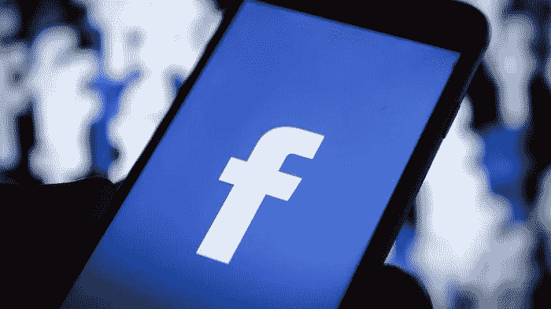

# 脸书感受到种族歧视民事指控的痛苦

> 原文：<https://medium.datadriveninvestor.com/facebook-feeling-the-pain-in-civil-charge-for-racial-discrimination-e00f4602eaea?source=collection_archive---------25----------------------->

## 这对脸书来说也是一件大事。

一般来说，脸书会是最后一个被指控种族或歧视的实体。但是你猜怎么着:*任何事情*都可能发生，尤其是在这个数据隐私泄露和全球恐怖主义盛行的时代。曾经是像素化形式的天堂，现在可能是非裔美国人民权运动时代生活的分段网络版本:

# 美国住房和城市发展部(HUD)实际上指控脸书歧视

当涉及到房地产，没有懈怠或宽大处理。见鬼，你可能是总统，这是弹劾的理由。无论如何，根据 HUD 的说法，脸书违反了公平住房法案，因为平台上有针对性的广告迎合了特定的种族和肤色

 [## 我们屏蔽了社交媒体，这引起了公愤。-数据驱动型投资者

### 上瘾，我们看不出来。在最近的一项研究中，基于以前的研究成果，我们想…

www.datadriveninvestor.com](https://www.datadriveninvestor.com/2018/12/01/we-blocked-access-to-social-media-it-caused-an-outrage/) 

由于脸书的算法和定位功能，这使得平台可以向特定群体提供这些广告，因此*歧视*其他不同国籍、宗教、家庭地位、性别和残疾的群体。当然，HUD 正在寻求损害赔偿和救济，尽管扎克伯格试图纠正 HUD 的问题，并阻止这些广告的播放，这让我们想到了一个重要的问题—

# 歧视性广告出现在他们的平台上真的是脸书的错吗？

记住是谁在经营这些广告；这是*不是*脸书。公司在《脸书日报》上刊登广告，包括房地产经纪人和物业管理公司。脸书上的定位功能真的不是为了*区别对待*，而是为了*提炼*在线营销活动，为最高质量的线索发现尽可能好的受众。

你可能会认为负责任的应该是运营广告的企业，而不是托管广告的平台。唉，这是责任所在的标志——不在广告商身上。当然，这些广告商为这些广告支付了费用，所以脸书自然从中受益。

眼下的问题是，脸书*心甘情愿地*让广告商有能力排除某些人口统计数据和特征——这与房地产经纪人因人们的肤色而拒绝他们找房子没有什么不同。潜在的焦点是，由于广告客户是支付这笔钱的人，脸书当然希望为他们提供尽可能多的在线营销功能和能力。

毫无疑问，限制他们的新广告门户迎合住房和就业将特别禁止某些目标选择；但显然，这对社交媒体巨头来说似乎太少，太晚了，因为 HUD 在他们身后打了一巴掌，脸书再次成为焦点。

# 遗憾的是，这不是脸书目前想要的关注点

当技术处于领先地位时，许多实体可以努力工作，迅速将其拉下来。尽管我们愿意打赌脸书可能不会受此拖累，但考虑到他们必须处理的其他事情，老实说，我们并没有看到广告金额减少，也没有看到平台上的流量和会员减少！你觉得脸书怎么样？ [**注册一个免费的 VIGYAA 账户，开始自己写一些有影响力的文章**](https://vigyaa.com/accounts/login/) ，一定要去 [**看看《数据驱动投资者》了解更多技术见解**](http://datadriveninvestor.com) **！**