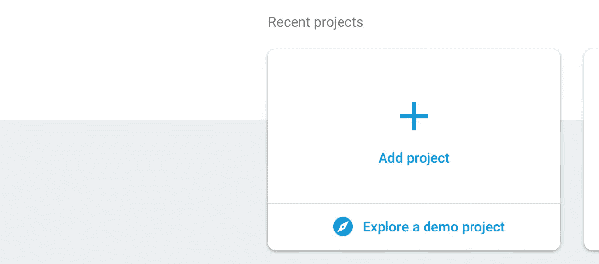
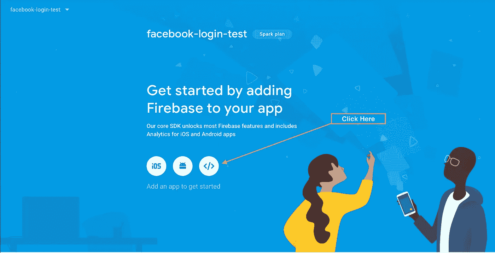
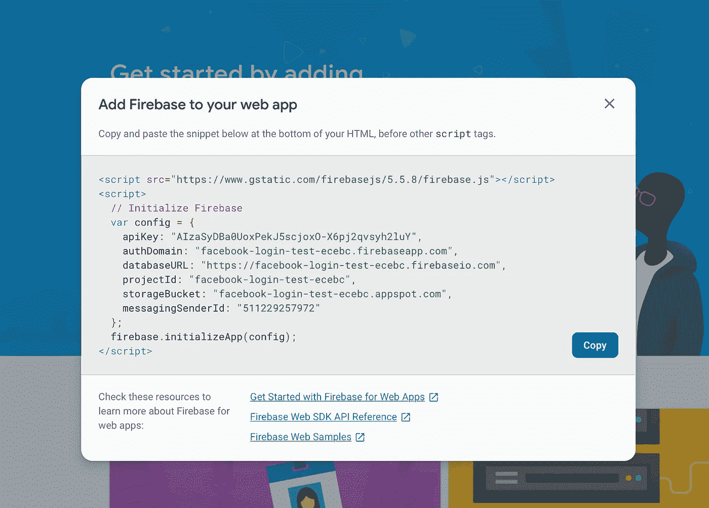
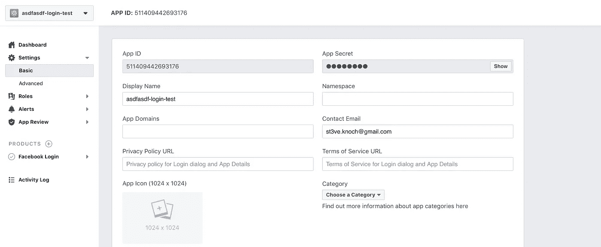
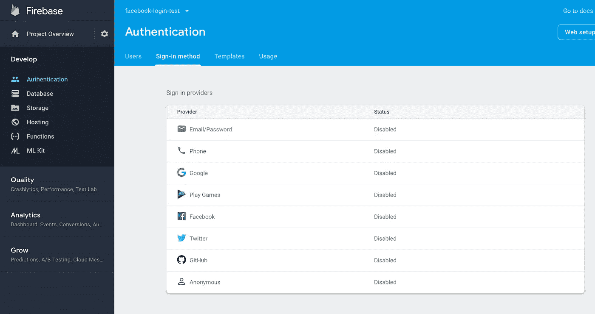

# 如何使用 Expo、Firebase 和 Typescript 将脸书登录添加到 React-Native 应用程序中

> 原文：<https://medium.datadriveninvestor.com/facebook-login-with-react-native-expo-firebase-and-typescript-56df4ed6099a?source=collection_archive---------2----------------------->

在本文中，我将向您展示使用 Firebase 向 Expo React-Native 应用程序添加脸书登录是多么容易。世博会让我们更容易做普通的事情。如果你把 Expo 和 Firebase 结合起来，开发移动应用的速度会比部署到应用商店更快；)

*如果你不想使用 Typescript，你仍然可以阅读这篇文章，并通过删除任何类型语法来使用代码片段。*

# 1.准备一个项目

对于这篇文章，我们需要一个由 expo 创建的支持 typescript 的应用程序。你可以查看我的[关于如何设置](https://medium.com/@ch1ll0ut1/how-to-setup-react-native-with-typescript-the-new-way-6c1f1cce6ed3)或[克隆我的样板](https://github.com/ch1ll0ut1/react-native-expo-typescript-boilerplate)的文章。

除了基本的设置，样板文件还包含 react-native-dotenv 来加载。环境文件。我们将用它来为 Firebase 和脸书存储重要的 api 秘密。中的一个条目。gitignore 确保。env 不会提交给 git。

**安装依赖关系**

运行`yarn`安装所有依赖项。

**创建。环境文件**

运行`cp .env.example .env`来创建一个. env 文件。

# 2.设置 Firebase 帐户

**报名**

现在去 https://console.firebase.google.com 报名吧。之后，您应该会看到一个显示您最近项目的页面。

**创建项目**

点击“添加项目”，选择您的项目名称，然后点击“创建项目”。

**将凭证从 Firebase 复制到您的。环境**

单击 Web 应用程序集成按钮，查看 Firebase Api 凭据。

并将值复制到您的。环境文件:

# 3.设置脸书应用程序

**报名**

如果你还没有注册，请到 https://developers.facebook.com/apps/[网站](https://developers.facebook.com/apps/)注册。

**创建新应用**

点击“添加新应用”，填写所需信息并提交。

**将此脸书应用程序的凭据复制到您的。环境文件**

点击左侧导航菜单中的“设置”。

然后在右边的“App Secret”中点击“show ”,就可以看到你的 App Secret 了。现在将“应用 ID”和“应用密码”复制到您的。环境文件。

**连接脸书和 Firebase**

*为了让 Firebase 了解脸书登录，我们必须使用我们刚刚创建的脸书应用程序的凭据在 Firebase 上设置登录方法“脸书登录”。*

前往[https://console.firebase.google.com](https://console.firebase.google.com)，点击“认证”

点击“设置登录方式”

点击“脸书”。

填写“应用 ID”和“应用密码”，然后点击保存！

*现在我们可以使用 Firebase 和脸书 API 了！*

# 4.实现脸书按钮

**安装 Firebase API SDK**

运行`yarn add firebase`安装 SDK。

**为 Firebase** 创建一个配置文件

在/src/config/firebase.ts 中创建一个新文件，复制并粘贴以下代码:

*注意:样板文件中已经有一个脸书的配置文件！*

并将导出添加到/src/config/index.ts

*这允许我们在任何文件中开始编写* `*config*` *，它将自动导入“config/index.ts”并显示所有可用选项。*

**配置一个 Firebase API 实例**

在/src/integrations/firebase.ts 中创建新文件

*在 ES6+和 Typescript 中，模块是单例的。在这种情况下，我们利用这一点。Firebase 只有在模块被实际导入时才会被初始化，随后的每次导入都会重用同一个实例。*

**创建一个认证服务类**

为了将认证之类的逻辑排除在视图之外，我喜欢创建名为“服务”的类来处理我的应用程序中的任何业务逻辑。因此，继续在/src/services/Auth.ts 中创建一个新文件

**在 App.tsx 中添加登录按钮**

现在，通过复制并粘贴以下代码片段来修改您的/src/App.tsx:

这些变化是:

*   添加一个按钮，按下该按钮将触发 AuthService.loginWithFacebook
*   创建一个状态变量来存储当前用户
*   如果当前用户已登录，则显示不同的视图，让您知道登录正在进行

# 5.实施注销按钮

将注销方法添加到您的/src/services/Auth.ts

向 authenticated 视图添加一个按钮，在按下按钮时调用 AuthService.logout()方法

**试试看！**

运行`yarn start`，用你的手机或模拟器打开应用程序。

你现在应该可以看到登录按钮了。如果你点击它，用脸书登录，你会看到注销按钮。你可以点击它回到第一个屏幕。

# 6.在 Firebase 中存储头像、电子邮件和姓名

糟糕，这是 Firebase 自动完成的。所以这里没事做:)

让我们在注销按钮上方显示个人资料头像。App.tsx 将如下所示:

这个用户对象让您可以访问存储在 Firebase 中的通用配置文件，还可以访问每个身份验证提供者的数据。Firebase 非常智能，当用户第一次使用授权提供者时，它会自动填充通用配置文件。

**试试看**

现在你应该看到你的脸书头像登录后！

**就是这样！你可以在这里找到** [**的全部源代码**](https://github.com/ch1ll0ut1/react-native-expo-typescript-firebase-facebook-login) **。**

请随时留下反馈。我渴望在未来写更多，如果你想让我写任何话题，请在评论中告诉我！