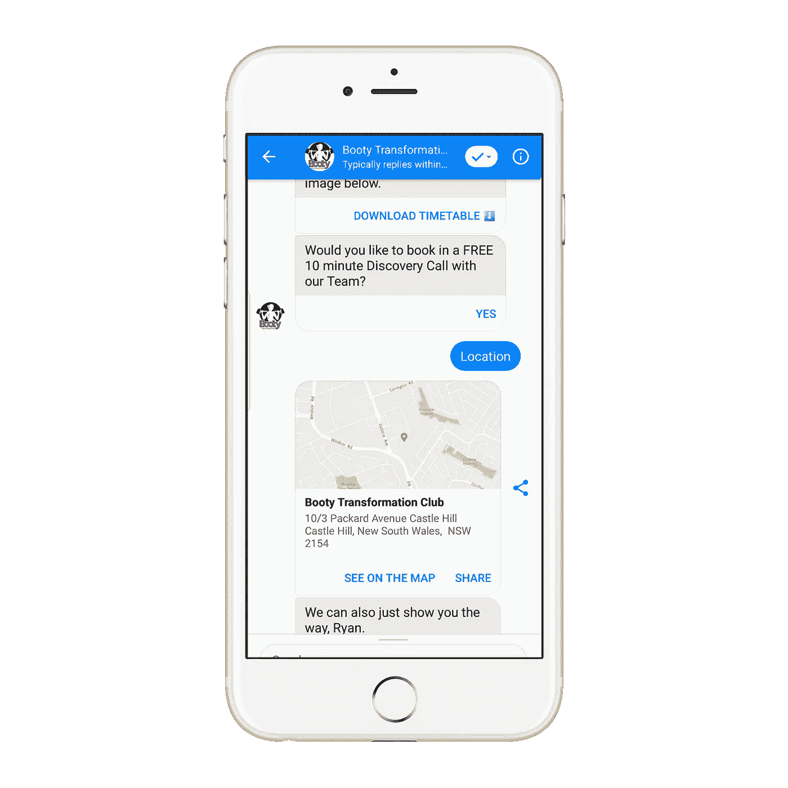

# Facebook Messenger 营销:今天你可以尝试的 4 个点子

> 原文：<https://medium.datadriveninvestor.com/facebook-messenger-marketing-4-ideas-you-can-try-today-73958481e491?source=collection_archive---------15----------------------->

你知道吗，Facebook Messenger 现在每个月有超过 13 亿用户在使用它？是的，你没看错——13 亿用户。很神奇，对吧？

Facebook Messenger 是四大即时通讯应用之一。根据发表在 Business Insider Intelligence 上的[报告，四大即时通讯应用程序(微信、Whatsapp、FB Messenger 和 Viber)的使用量超过了四大社交媒体网络(LinkedIn、Twitter、脸书和 Instagram)。](https://www.businessinsider.com/the-messaging-app-report-2015-11/?IR=T)

 [## 对话式营销是文字数据驱动的投资者

### 在购买之前，先谈一谈。这样做的营销人员将走在游戏的前面。这是保罗·因斯的前提…

www.datadriveninvestor.com](https://www.datadriveninvestor.com/2019/01/31/conversational-marketing-is-the-word/) 

同样值得注意的是，这两种媒介之间的差距每个月都在变大！

脸书智商公司进行的一项研究也支持这一趋势。来自世界不同地区的 2200 多人参与了这项研究。根据[的调查结果](https://web.facebook.com/business/news/insights/why-messaging-businesses-is-the-new-normal?ref=fbiq_series):

%的人更喜欢从他们可以发送信息的商家那里购买商品和服务。

%的人表示，他们宁愿发信息，也不愿给商家的客服打电话。

%的人表示，在过去的两年里，他们向企业发送了更多的信息。

%的人更有可能相信他们可以向其发送信息的企业。

现在，你明白为什么你应该在你的营销活动中使用 Facebook Messenger 营销了。

渠道只是一个工具，等待着帮助您的业务更上一层楼。但是，你如何利用 Facebook Messenger 呢？

好吧，我们已经列出了 5 个惊人的方法，你可以用它来进行营销。

**1。** **用它来传递你的内容**

时事通讯、促销优惠、新产品促销和其他内容通常通过电子邮件进行推广。许多营销人员知道如何做到这一点，许多人甚至认为这是最好的方法。

但是如果我们告诉你使用 Facebook Messenger 是一种更好的方式呢？你将获得更高的打开率和更高的点击率。

Hubspot 是一个很好的用例。他们决定试用 FB messenger 聊天机器人一个月。他们不是通过电子邮件发送内容，而是通过 Facebook Messenger 发送内容。

经过一个月的测试，他们意识到他们的[打开率增加了 242%](https://blog.hubspot.com/marketing/facebook-messenger-marketing-experiments) ，点击率达到了惊人的 619%。

你也可以通过利用信使机器人的力量来实现这一点。

**2。** **为您的客户找到相关内容**

您可以使用 Facebook Messenger 来帮助您的客户、读者或关注者找到与他们最相关的内容。

无论是你商店里的产品还是你网站上的文章，Facebook Messenger 聊天机器人都可以帮助你简化搜索过程。

一旦你的客户插入相关的搜索词，聊天机器人就会浏览你的目录，为他们提供符合他们描述的产品或内容。

**3。** **惊人的客户支持**

客户支持是任何业务的支柱。而 FB Messenger 可以让这个骨干强很多。

我们前面提到的脸书调查结果指出，56%的人会给企业发信息，而不是给他们的客户服务代表打电话

此外，通过客户的首选渠道为他们提供支持表明您关心他们，也能建立信任。

根据 Sprout 进行的[调查，社交媒体上的消费者希望商家在四小时内对他们的问题做出回应。](https://sproutsocial.com/insights/data/q2-2016/)

平均来说，大多数品牌需要十个小时来回复消费者的投诉。这项对 1000 多人的调查还指出，如果他们喜欢的品牌没有回复，30%的消费者将从竞争对手那里购买产品。

所以，你看，用 Facebook Messenger 建立一个快速、简单、高效的客户支持系统将为你节省很多压力和金钱。

**4。** **优质销售线索**

您可以使用 Facebook Messenger 渠道来产生高质量的销售线索。

这种营销策略相对较新。因此，它一定会抓住人们的注意力，这有助于你产生高质量的线索。

您可以设置您的 Messenger 广告，以便在用户点击了解更多信息时将他们引向您的 messenger bot。

一旦他们进入你的 Messenger bot，机器人就会开始与他们对话，询问他们想要什么的相关问题。你甚至可以让他们选择与真正的销售代表交谈。

> 您可以使用信使机器人根据对话创建线索得分，然后根据线索得分指导人们进行下一步。对于高质量和紧急的销售线索，您可以让他们尽快与销售代表联系。
> 
> **Elizabeth Knight**,[Chit Chat 机构的业务发展经理。](https://www.chitchatagency.com/)

有了你的机器人收集的信息，你就能够向顾客提供他们真正想要的东西，或者向他们提供更好的东西。你甚至可以使用机器人为他们提供向上销售和向下销售。

您的聊天机器人收集的信息可以被分析并用于增强您的营销活动。