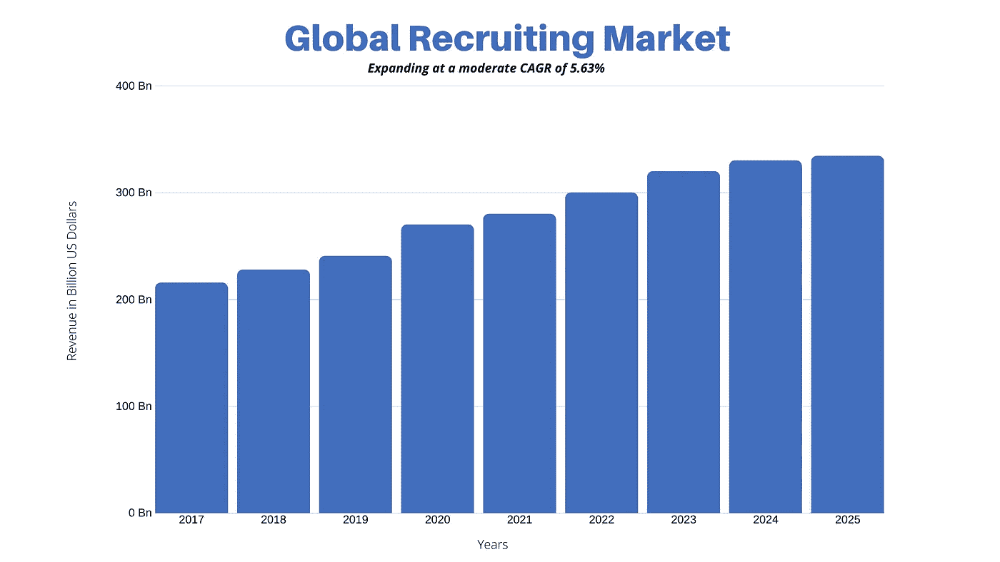

# 脸书与 Recooty 合作，帮助企业轻松招聘。

> 原文：<https://medium.datadriveninvestor.com/facebook-partners-with-recooty-to-help-businesses-hire-easily-3c6b9fd67bf6?source=collection_archive---------3----------------------->

Facebook Job Board partners with Recooty ATS

世界头号社交网络平台脸书 公司在近一年前推出了“求职板”，帮助求职者找到最适合自己的工作。现在，脸书正准备与全球最简单的求职者跟踪系统[**Recooty**](https://recooty.com/)**合作，在整个招聘行业实现飞跃，该系统因帮助中小型企业轻松招聘而闻名于世。**

**Recooty 在招聘过程的每个阶段帮助招聘团队，帮助他们建立充满激情的团队。这确保了企业雇佣最优秀的员工，并使他们有别于竞争相同人才的公司。**

** [## 社交媒体收听让您随时了解|数据驱动型投资者

### 虽然社交媒体倾听是一种顶级趋势，但它应该是每个现代营销策略的一部分。保持和谐…

www.datadriveninvestor.com](https://www.datadriveninvestor.com/2019/02/26/social-media-listening-keeps-you-plugged-in/) 

# 脸书-雷克脱伙伴关系是如何运作的？

这种合作关系使企业能够通过[**recoy ATS**](https://recooty.com/)轻松地在 [**脸书的**](https://www.facebook.com/jobs) 工作选项卡上发布职位空缺。与此同时，求职者可以发现空缺职位，用他们的脸书个人资料信息自动填写申请，编辑和提交他们的申请，并且所有申请都可以在 Recooty 的仪表板下轻松地进行审查、入围和面试。

在最近的一项调查中，发现 40%的美国小企业报告说，填补工作岗位比他们预期的更困难，当你考虑到这些小企业还雇用了全国近一半的劳动力时，这是令人惊讶的。

这种新的体验将帮助求职者从他们已经花费时间的地方——脸书和移动设备上——快速找到并申请合适的职位。

# 如何使用 Recooty 在脸书求职网上发布职位的分步指南:

1.  在**报名。**
2.  **点击**添加职位空缺****
3.  **输入**职位名称**T26【职位描述】。**
4.  **添加“**工作地点**”、“**经验要求**”、&、**工作行业**”。**
5.  **选择记录下的**脸书工作板**，点击**完成**。(您也可以在“记录”下选择多个职务公告板)。**

**获得批准后，您的职位将在脸书就业委员会上发布，符合条件的候选人可以轻松申请。一旦你开始获得方便的应用程序，你可以在[recoooty 的仪表板](https://dash.recooty.com/)上查看和过滤它们。**

# **全球招聘市场规模:**

****全球招聘市场【2019 年的价值为 2556.8 亿美元，预计到 2025 年将超过 3342.8 亿美元。****

****

**Global Recruiting Market Size (In US Dollars)**

# **一些最近的招聘数据:**

**1.填补一个空缺职位平均需要 42 天。()
2。小企业平均花费 1872 美元来雇佣新人。([怪物](https://www.monster.com/) )
3。75%的招聘和人才经理在招聘时使用招聘软件和/或求职者跟踪软件。( [Capterra](https://www.capterra.com/) )**

# **对招聘行业有什么好处？**

**这种合作将大大减少雇用合格候选人的时间和平均成本，因为候选人可以从脸书快速申请，而无需离开平台或前往不同的平台寻找工作。**

**另一方面，Recooty 以其简单性和可负担性而闻名。企业可以根据自己的需求选择每月/每年的招聘自动化计划，无缝地发现、吸引和聘用优秀人才。****