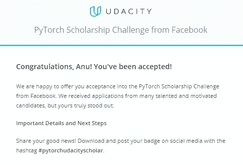
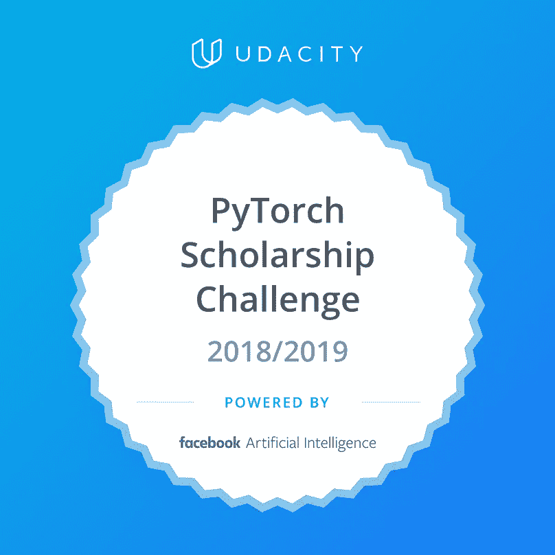
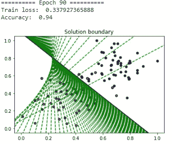
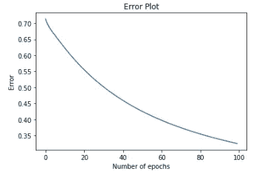
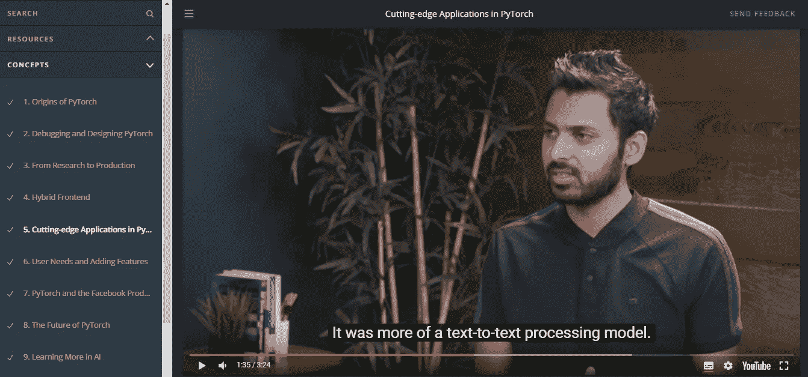
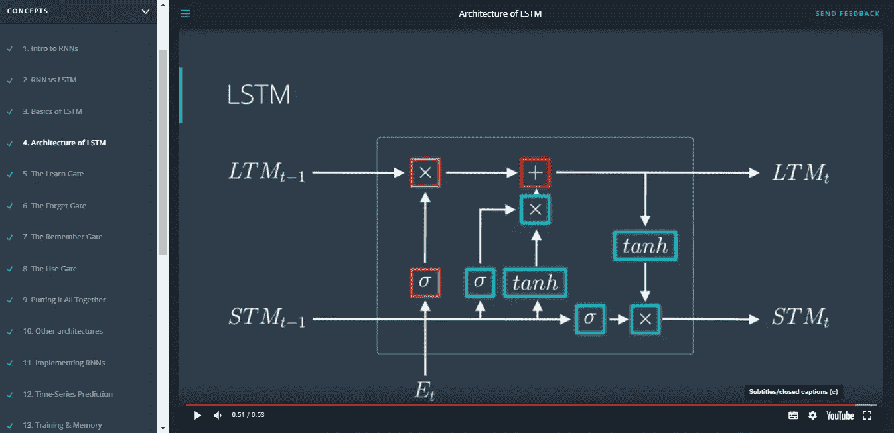
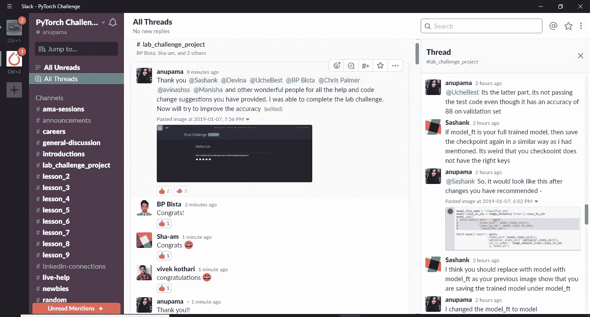
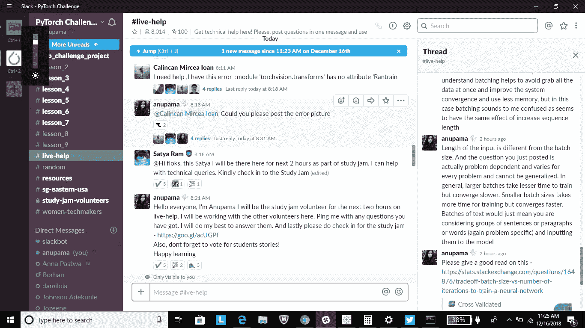
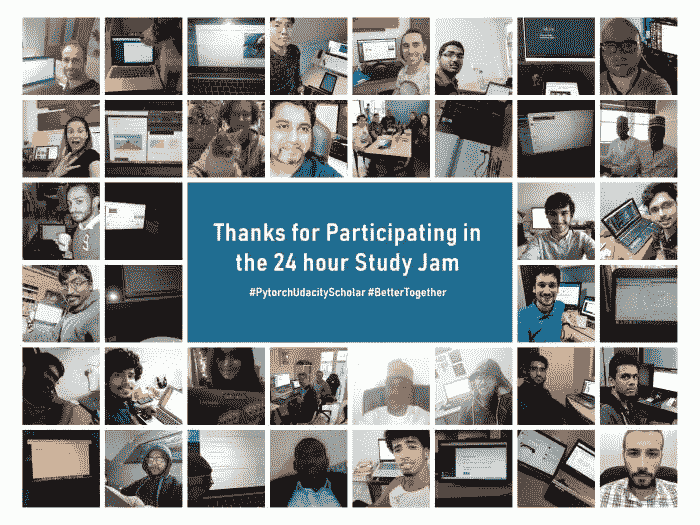

# 脸书·皮托尔奇·乌达城奖学金挑战

> 原文：<https://medium.datadriveninvestor.com/facebook-pytorch-udacity-scholarship-challenge-a269fe682805?source=collection_archive---------7----------------------->

这篇博客文章是关于我从脸书和 [Udacity](https://www.udacity.com/facebook-pytorch-scholarship) 获得第二份奖学金的旅程，以学习神经网络的基础知识，并使用脸书的 [PyTorch](https://pytorch.org/) 框架建立深度学习项目。

每个人都知道，当你和一群和你学习相同课程的同龄人一起学习时，那种感觉是多么有效和有益。但是我不得不承认，我从来没有想到电子学习也会这么有趣。都是拜 Udacity 所赐！Udacity 拥有最好的社区管理人员和 slack 团队，能够在不妨碍任何学生的情况下完成课程。

但是，首先你可能会问我是怎么被选中参加奖学金挑战的！因此，在一个晴朗的下雪天(我呆在纽约，是的，斗争是真实的),我在收件箱里偶然发现了这封邮件，宣布脸书和 Udacity 为全世界的数据书呆子提供奖学金，我知道这是我使用 PyTorch 尝试人工智能结构化学习的机会。(互联网一开始就是这么铺天盖地)。是的，我成功参加了奖学金挑战赛..就像全世界一万个了不起的人中的一个。

Yay, made it into the first Phase!

嗯，还不算太糟，直到 Slack 论坛被成千上万的人发来的消息搞得人满为患。我应该说，它看起来被很多渠道滥用了——激励、现场帮助、学习伙伴、地区团体、LinkedIn-connections、fun torch 等等！Slack 是您进行任何讨论和询问的最佳场所。根据我的观察和经验，对于任何问题，您回复的平均估计等待时间将接近 0.5 分钟。

让我们开门见山，直入主题吧。因此，这门课程为用户提供了一种非常系统化和有组织的方式来吸收人工智能和深度学习的概念，因为它背后的数学在短时间内掌握是极其痛苦的。它的结构如下。

## **神经网络简介**

介绍神经网络的概念及其存在的目的(复杂的分类)以及构成神经网络的部分，如*感知器算法、梯度下降算法、熵、下降、正则化和消失梯度问题、局部和全局最小值。这是迄今为止同行和我访问最多的章节，以便掌握高级神经网络的术语。哦，是的，我们还得从头开始编写 2 层神经网络和梯度下降算法。*

Gradient Descent Algorithm

## PyTorch 框架的创建和未来

创建者亲自向我们详细介绍了 PyTorch 是如何从研究实验室发展到部署的，以及它是如何在神经网络建模和框架的主要改进方面取得成功的。

Discussion with Soumith Chintala

## 卷积神经网络

这是课程中我最喜欢的部分，因为它处理了大量的图像数据集，用它们来创造一些有创意的东西真是太酷了。神经网络有能力识别你扔给它的图像，不仅如此，它还可以检测图像的边缘，photoshop，设计你的图像，最棒的是，它可以创建最惊人的图像！我写的一些程序在 Github 上。[https://github . com/anusky 95/PytorchPrograms/blob/master/readme . MD](https://github.com/anusky95/PytorchPrograms/blob/master/README.md)和[https://github.com/anusky95/Convolutional-Neural-Network](https://github.com/anusky95/Convolutional-Neural-Network)(承诺很快在 git 上推送它们。)

## 风格转移

这是一个非常有趣的 CNN 实现，其中一个图像的样式可以应用到另一个内容图像，结果图像包含第一个图像上的第二个图像的样式。这是通过提取第一图像的特征图和整体内容表示，并在内容图像上应用第二图像的纹理、颜色和风格来实现的。下面的样式转换中显示了一个这样的例子。这项活动非常有趣(尽管在 Google Colab 上训练模型需要时间)

Style image: My canvas poster paintings

Content Image (View from RIT shuttle stop) & Result Image: Looks like an art work

## 递归神经网络

CNN 用于图像，而 rnn 用于从非结构化数据序列中学习复杂模式，如自然语言处理。LSTM 氏症(长短期记忆)是 RNN 的一种高级形式，因为它可以从长期记忆和短期记忆中转换记忆，因此表现优于 RNN。考虑到各种门的作用，学习 LSTM 花了相当长的时间。

And this is how the architecture of LSTM looks like

## 最终方案

最终的项目是为 102 种不同的花卉建立一个图像分类器，可以从[这里](http://www.robots.ox.ac.uk/~vgg/data/flowers/102/index.html)下载。由于数据集很大，在 CPU 上建模需要很多时间，并在 Google Colab 上训练模型。一个[教程](https://medium.com/deep-learning-turkey/google-colab-free-gpu-tutorial-e113627b9f5d)值得一试，以避免在设置上浪费大量时间。Udacity 只为我们提供了*培训和验证*集，并让我们在工作区上传模型，然后在隐藏的测试花图像上测试图像。如果准确度至少为 20%，则认为项目模型是完整的。然而，我们中的许多人努力实现非常好的准确性，slack 上的 10k 同行的非常有用的社区在这方面发挥了巨大的作用。以下是最终项目的 github 链接—[https://github . com/anusky 95/uda city-py torch-Challenge-Scholarship-Project/](https://github.com/anusky95/Udacity-PyTorch-Challenge-Scholarship-Project/blob/master/README.md)

以下是我们在 slack 上的一些精彩瞬间！

**This is how the final project submission day looks like!**

**We had Study Jams to help us rock and roll!**

**Announcements for side projects and fun activities**

Spot me!!!! ;)

## 辅助项目(印象分)

好了，这最后一点完全是我们使用 PyTorch 框架要做的事情。所以，我决定和 RNN 玩一玩。我构建了一个名字忍者生成器，它使用基于字符的 RNN，根据你提供给模型的数千个名字生成随机的名字。关于这个项目的更多信息请见下一篇文章:)

感谢阅读长文！❤ :)

关注我，获取更多关于数据科学的帖子和文章。

LinkedIn—[https://www.linkedin.com/in/anupama-garani/](https://www.linkedin.com/in/anupama-garani/)

推特—[https://twitter.com/agarani95](https://twitter.com/agarani95)