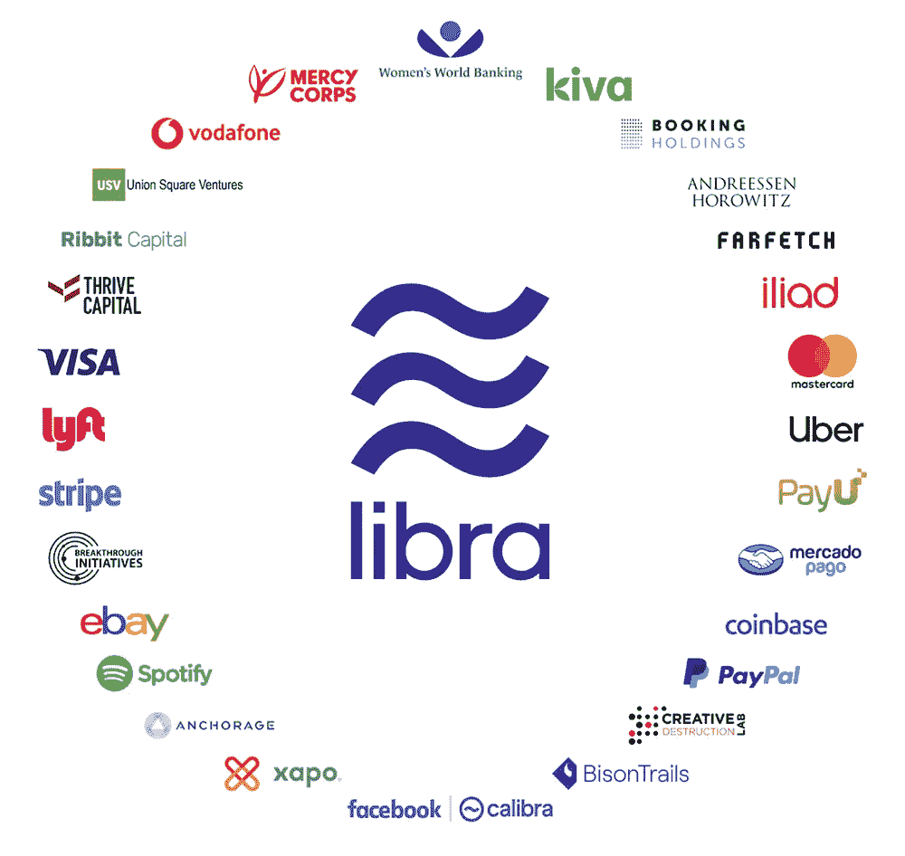
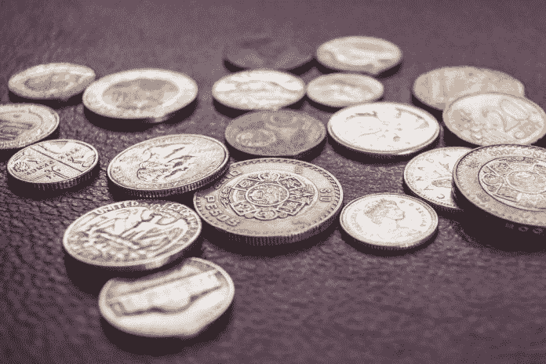

# 脸书的加密货币将挑战全球金融机构

> 原文：<https://medium.datadriveninvestor.com/facebooks-cryptocurrency-will-challenge-the-global-financial-establishment-data-driven-investor-85d19d6a50da?source=collection_archive---------0----------------------->

关于脸书被称为天秤座[硬币](https://www.datadriveninvestor.com/glossary/coin/)的[加密货币](https://www.datadriveninvestor.com/glossary/cryptocurrency/)的消息引起了很多热议。故事喜忧参半，有人说这是加密货币采用的门户。其他人担心，因为脸书在隐私和数据安全问题上名声不佳。脸书是世界上最大的社交网络，也是最大的加密货币广告平台，这一事实将产生巨大的影响，影响到每个人。也就是说，即使他们不使用脸书，因为它会影响整个社会。

## **什么是天秤座** [**币**](https://www.datadriveninvestor.com/glossary/coin/) ？

天秤座硬币是一个[令牌](https://www.datadriveninvestor.com/glossary/token/)，将在脸书自己的[区块链](https://www.datadriveninvestor.com/glossary/blockchain/)上运行。它应该是一种由各种有价证券和受法律监管的资产支持的稳定货币。如果你计划购买尽可能多的天秤座硬币，希望它的价值会上升，不要再投机了。代币与更稳定的资产挂钩，如法定货币和政府证券，因此它们不会像比特币和 T21 那样出现价格波动。还有第二个令牌是用于投资的。天秤座硬币将遵循通货膨胀模型，因为它将与法定货币挂钩，所以它几乎只是数字现金。

 [## Azbit 旨在连接传统金融和加密货币-数据驱动的投资者

### Azbit 是下一个提供交易平台的加密项目，该平台提供保证金和算法交易。一样多…

www.datadriveninvestor.com](https://www.datadriveninvestor.com/2019/03/20/azbit-aims-to-connect-traditional-finance-and-cryptocurrency/) 

天秤座硬币将有自己的钱包来记录用户拥有的数量。由另一家名为 Calibra 的公司开发的数字钱包将与脸书生态系统相集成。这将包括它在 WhatsApp 和 Messenger 等应用程序中的可用性。用户需要做的只是访问 Calibra 钱包，并通过 [KYC](https://www.datadriveninvestor.com/glossary/know-your-customer/) / [反洗钱](https://www.datadriveninvestor.com/glossary/anti-money-laundering/)流程，提交个人信息用于监管目的。然后，用户将使用[支付](https://www.datadriveninvestor.com/glossary/payment/)处理器[将他们的菲亚特兑换成天秤座硬币。这些支付处理商是一个协会的成员，该协会由建立了信誉的大型商业公司组成。一旦用户交换了他们的菲亚特，他们的天秤座硬币将在他们的钱包里，他们现在可以从脸书的应用程序中使用。](https://www.datadriveninvestor.com/glossary/exchange/)

天秤座硬币由天秤座协会支持，该协会将从 28 个创始成员开始，计划扩大到 100 个。他们将成为天秤座区块链上的[区块](https://www.datadriveninvestor.com/glossary/block/)验证者，所以他们有激励的利益。要成为验证者，会员需要投入 1000 万美元成为区块链的节点，在 Libra 协会理事会获得一票，并从 Libra reserve 获得利息分红。这个协会的成员在业内非常有名。会员包括贝宝、优步、Stripe、万事达和 Visa 等等。如果你看看天秤座协会的[成员](https://libra.org/en-US/partners/)，没有一家银行。他们还称该协会为“非营利组织”。这让我产生了疑问，如果你不是非营利的，那么验证者是如何被激励的？

(Source Libra Association)

根据 Investopedia，非营利组织的定义是:

….*不为所有者赚取利润的组织类型。所有由非营利组织赚取或捐赠给该组织的钱都用于追求该组织的目标并保持其运转。*

因此，进入 Libra 储备的资金似乎是为了维持组织的运转。这样，他们可以向会员提供股份，这是一大笔钱。

## 这是真的区块链吗？

如果你读过[白皮书](https://libra.org/en-US/white-paper/)，那么你就会知道它的区块链是如何运作的。然而，如果你了解一个“真正的”区块链(由区块链福音传道者安德里亚斯·安东诺普洛斯负责)的[属性，你就会开始质疑它。所以它基本上只是另一个代币，或者是与脸书的生态系统紧密结合的另一个版本的 PayPal。该项目遵循了区块链的设计，因为它使用](https://www.ccn.com/crypto/bitcoin-evangelist-andreas-antonopoulos-says-facebooks-libra-isnt-real-blockchain/2019/06/18/)[密码术](https://www.datadriveninvestor.com/glossary/cryptography/)来保护记录在数字[分类账](https://www.datadriveninvestor.com/glossary/ledger/)上的交易，但是有一个特殊的特征，许多人可能会认为这是它不能成为真正的区块链的原因。这是因为这个系统是有权限的，而区块链是没有权限的。区块链的设计意图是在一个分散的网络中向所有人开放。Libra 有些分散，因为它是由一个协会而不仅仅是一个单独的实体运营的，但它是许可的，因为它运行在脸书生态系统之上。为了使用它，你必须有一个脸书帐户，否则，你不能真正使用天秤座的令牌。

区块链的另一个特点应该是不可信。天秤座，你有一个信任的环境，其中包括一个协会。当该协会要求由规则和政策而不是由选民投票决定成员资格时，它怎么会不可信呢？在一个不可信的系统中，任何人都可以进入网络来验证区块，而 Libra 是一个由 28 个创始成员组成的网络。除非你承诺 1000 万美元，否则你不能成为会员。协会还可以决定谁可以成为会员，谁不可以。例如，由于贸易和金融法律，来自黑名单国家的组织将不被允许加入。

这个系统也是高度集中的，与区块链的分散化相反。根据天秤座协会的说法，他们计划转向 DPoS(授权[利害关系证明](https://www.datadriveninvestor.com/glossary/proof-of-stake/) ) [共识机制](https://www.datadriveninvestor.com/glossary/consensus-mechanism/)，变得更加分散和没有权限。也为了减少对谁控制了天秤座区块链的恐惧，他们将不在脸书的控制之下，因为有一个协会。

## 使用天秤座有什么好处？

现在让我们来认真考虑一下为什么天秤座会如此重要。已经有这么多加密货币了，为什么我们还需要一个？嗯，如果它有价值，那它就有用。Libra 的价值在于它解决了许多加密货币项目面临的可扩展性、可用性和分发问题。让我们来看看它是如何比较的。

[***可扩展性***](https://www.datadriveninvestor.com/glossary/scalability/)

它可以扩展，因为通过使用每秒可以处理 1，000 TPS(事务)的验证器节点，它将变得很快。与 3–5 TPS 的比特币和 15–30 TPS 的以太坊相比(在撰写本文时)，Libra 的交易速度要快得多。毫无疑问，脸书正在开发这种区块链，以提高处理微纳交易的速度。这可以支付从一杯咖啡到使用物联网设备的费用。

*由于 Libra coin 将在脸书的生态系统上运行，它将被 20 多亿用户广泛使用。这是一个大规模的登机，但通过协会成员提供的入口匝道变得更加容易。Libra 的愿景是为“[无银行账户的人](https://www.datadriveninvestor.com/glossary/unbanked/)”提供进入全球金融系统的渠道，这些人包括全球数十亿人。使用智能手机的人比使用实际银行账户的人多([阅读本文](https://qz.com/66061/were-heading-for-a-world-with-more-smartphones-than-bank-accounts/))。许多人没有银行账户，因为他们或者没有资格，或者由于缺乏文件而不被允许。在大多数国家，拥有一个银行账户意味着有一个稳定的流动资金来源和适当的文件。在欠发达国家，许多人无法获得银行服务，要么是因为他们没有适当的文件，要么是因为他们无法获得银行服务。有了天秤座，你需要的只是 Calibra 钱包和去脸书的通行证。让没有银行账户的人上车是可能的，因为他们的上车将通过他们的智能手机进行，智能手机上有允许他们使用 Libra 硬币的应用程序。*

****分布****

*这不会是一个问题，因为你有一个支持它的协会。金融业的两大巨头，万事达和维萨都在支持 Libra，并且是该协会的成员。这将允许用户从菲亚特交换使用这两个巨人作为他们的入口处理器。像比特币一样，代币的分发不需要[挖掘](https://www.datadriveninvestor.com/glossary/mining/)。与菲亚特挂钩意味着它将具有更低的波动性，这使得 Libra 可以被用作交易的数字货币。它也是可替换的，因此可以在不同的事务中互换使用。*

## ***消费者和零售商的利益***

*我认为天秤座硬币将极大地有利于消费者和零售商。当你把这样的系统和社交网络整合在一起，你就有了一个固定的用户群。这相当于数十亿人在使用脸书的 WhatsApp 和 Messenger。你还有 Instagram，它将允许消费者直接从该平台上的品牌和有影响力的人那里购买产品。通过使用拥有庞大用户群的平台，Libra 拥有巨大的市场。*

*你可能听说过脸书专门为 WhatsApp 开发加密货币的故事。这是因为他们意识到这里有巨大的汇款市场，尽管印度可能会改变其加密货币政策。尽管如此，海外汇款市场还是有利可图的，因为数百万海外外籍工人需要将钱汇回本国的家中。问题在于，这个市场被少数几家支付处理商所控制，这些支付处理商运营着汇款中心，从支付中抽取佣金。进入 Libra，他们提供了一种无摩擦的跨境支付方式，不涉及第三方，如银行和支付处理器。用户可以使用 Libra 直接向家人汇款，比如使用 WhatsApp。它不仅比去支付处理器更快更方便，而且花费也少得多。*

*Libra 也可能会让整个加密货币领域受益，而不是与之竞争。脸书为更多用户进入加密货币提供了一种简单的方式。这是因为用户可以使用 Libra 兑换像比特币、以太坊这样的热门加密货币。当你提供更简单的方式和更友好的界面时，使用新的服务会更受欢迎。*

## ***隐私和数据保护问题***

*使用 Libra 就像使用 PayPal 或 Venmo 付款一样。事实上，当我们使用信用卡甚至借记卡交易时，我们总是会提供自己的信息。这是因为我们的身份与我们的交易联系在一起，所以使用 Libra 不会有什么不同。由于 PayPal 也是该协会的成员，它与 Libra 的整合不需要比您已经提供给他们的信息更多的信息。*

**

*它可能仍然令人担忧，但这是数字和信息时代的现实。您的交易可以与您购买的服务和商品相关联。脸书不会再为定向广告收集任何用户数据，但这就像说一个渔民不会收集自愿进入渔网的鱼。脸书已经通过使用其应用程序获得了您的数据，此外，他们还将从 Calibra 钱包所需的文档中获得更多数据。*

*如果你对隐私和数据有偏执，简单的解决办法就是不要用天秤币。它不是强迫任何人使用的。仍然有其他方式进行支付，这应该让那些不想使用他们不信任的系统的人放心。*

## ***谁应该害怕天秤座？***

*我对此的想法是基于我收集到的信息。在我看来，银行和金融机构最终将成为脸书的竞争对手。你看，通过建立法定储备，脸书基本上变成了一家银行。你甚至可以称他们为全球或中央世界银行。现在想象一下使用脸书来满足你的财务需求。银行会因此受到威胁，因为它们可能会失去客户。如果有一天脸书将成为借贷、支付和价值储存的首选平台，那么银行当然将不得不为未来制定新的战略。*

*天秤座可能导致的结果是迫使银行适应新的系统。银行将不得不升级他们过时的商业模式，采用金融科技领域最新的创新。如果这意味着开发一个区块链或使用一个类似 Libra 的区块链平台，可能会有阻力，因为银行系统使用不同的原则。如果银行想参与竞争，它们可能不得不做出改变，否则，将由政府监管机构利用政策来决定结果。*

*亚马逊和其他在线零售商可能会有些担心。世界上最大的在线零售商，不属于该协会，将与 Libra 的网络竞争。亚马逊有很大的领先优势，但如果更多的零售商接受 Libra 令牌，那么这将改变在线零售游戏。虽然亚马逊以销售从服装到电子产品的零售商品而闻名，但 Libra 网络上零售的可能性可能更大。这是因为由于它使用脸书作为平台，它可以导致 WhatsApp，Messenger 甚至 Instagram 的用户之间直接的[点对点](https://www.datadriveninvestor.com/glossary/peer-to-peer/)交易。Instagram 上 Libra tokens 的潜力具有商业意义。脸书希望将零售与社交媒体网络相结合，让品牌能够直接接触到平台上的数十亿用户。例如，如果你可以在 Instagram 上直接使用 Libra coin 购买品牌 X，这对亚马逊这样的零售商来说将是一个损失。这仍有待观察，但它肯定会对零售领域产生巨大影响。*

*担心的不仅仅是银行，还有支付汇款中心、债权人和贷款人、保险公司甚至政府。在这一点上，已经有政客想要挑战天秤座，并质疑脸书进入加密货币的意图是什么。政策制定者将考虑对此进行监管，因为脸书是一个在社会上有相当大影响力的巨人。这里的含义是脸书的加密货币将影响谁，以及它是否会对竞争产生负面影响。*

## ***关于天秤座的最终想法***

*关于天秤座的反应太多了。一些人认为这总体上对加密货币有利。总的来说，批评者对加密货币持怀疑态度的一个原因是，除了转移或储存价值之外，没有人真正使用它。当你可以每天使用加密货币进行支付时，情况就完全不同了。如果你能立即付款，零售商也会更高兴。当我们使用信用卡付款时，零售商不会马上拿到钱。区块链的电子支付系统将实现立即出现的即时支付。不再有经过这么多层次的结算过程。*

*该协会似乎是一个新的寡头政治，将从脸书的数十亿用户中受益匪浅。虽然一个真正去中心化的区块链意味着没有人控制平台，但天秤座的情况正好相反。谁敢说该协会不会阻止用户使用已经在 YouTube 和 Twitter 等平台上发生的事情。资金来源也可能拒绝交易，因为它可能是非法的或违反了公司政策。Libra 试图为用户消除所有这些障碍，但我们不能肯定地说他们不会阻止交易，因为我们不能忘记它是由一个协会控制的。在此类系统中，如果交易存在利益冲突，则很可能会被拒绝。*

**

*同样令人不安的是，脸书在用户隐私和数据方面存在问题。在保护我们的数据方面，他们并不诚实，也不道德。对于加密货币，我们还能期待什么？问题是，加密货币本应是自我保护和自主的，所以它确实记录了无法修改或更改的交易，并在区块链上公开可见。如果他们是真正的区块链人，脸书不应该对此有任何控制。无论如何，数据是公开的，所以这里没有太多的问题。问题更多的是如何防篡改或倾向于影响天秤座区块链。*

*对那些不买脸书的天秤座硬币的人来说，最简单的解决办法是…不要用它。如果你偏执于隐私和数据问题，那么就不要使用它。加密货币领域的好处是我们可以选择使用其他代币。这对我们消费者来说是好事，因为这意味着我们还有其他支付方式。如果脸书想要限制这些选择，那么它显然是垄断性的，对一个公平竞争的自由市场没有任何好处。*

*我认为，银行和其他金融机构将需要更加担心 Libra coin。这是因为脸书将是他们的竞争对手，由于脸书的社交网络拥有庞大的用户群，所以很难与之竞争。现在的问题是，Libra coin 是否会得到政府监管机构的许可。如果它会以多种方式影响我们的生活，那么我们有权知道这些信息。我们需要知道所有协会成员的既得利益，而不仅仅是脸书，以及他们“统治世界”的计划，可以说是双关语。*

*注:这是一篇基于作者观点的观点文章。请做你自己的研究来核实事实。*

**原载于 2019 年 6 月 28 日*[*【https://www.datadriveninvestor.com】*](https://www.datadriveninvestor.com/2019/06/28/facebooks-cryptocurrency-will-challenge-the-global-financial-establishment/)*。**