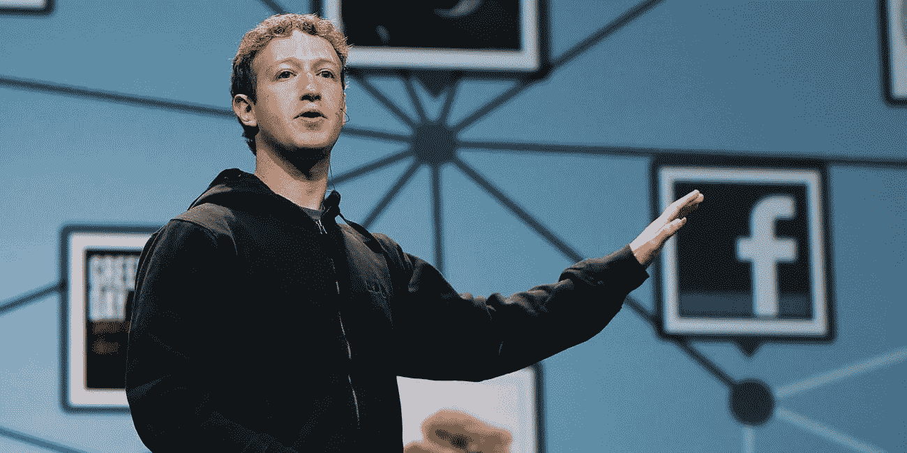
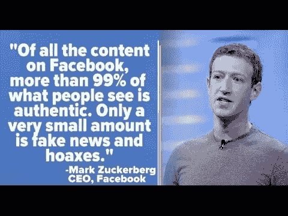

# 脸书的假新闻战

> 原文：<https://medium.datadriveninvestor.com/facebooks-fake-news-battle-847edd9a0f7c?source=collection_archive---------34----------------------->

“隐私不再是一种社会规范。”—马克·扎克伯格

马克·扎克伯格创建了脸书来连接大学，他最终连接了世界。然而，随着公司的发展及其对日常生活的影响，平台管理规则和法规并坚持下去至关重要。众所周知，2016 年美国总统大选后，脸书被指控通过在其平台上发布假新闻和虚假简介来误导选举。脸书正在努力重建用户的信任，并致力于解决假新闻现象。

Facebooks 监管“假新闻”的计划主要集中在监控内容的新人工智能工具上。该公司正专注于监控内容和壮大审查团队。该平台正在投资人工智能工具，这些工具将识别和删除虚假账户，并对恐怖主义内容发出警报。脸书不会删除所有假新闻内容，而是会减少其传播。从扎克伯格的角度来看，必须在让人们表达意见和保持社区安全之间建立平衡。

策略是确保正在传播或被脸书大规模分享的内容是准确的，并由一组事实审查员进行审查。如果它看起来是假的，那么脸书会在新闻提要中将其下移，但不会从平台上删除，除非它造成身体伤害或攻击个人。

*“我们现在每天阻止数百万试图注册的虚假账户，”脸书产品经理泰莎·莱昂斯写道。*

*“如果垃圾邮件发送者可以让足够多的人点击假新闻并访问他们的网站，他们就可以从他们展示的广告中赚钱，”莱昂斯写道。她说，脸书正在采取措施，比如惩罚点击诱饵、低质量网页链接和广告农场，让这类骗局无利可图，从而消除传播假新闻的动机。脸书还禁止这些出版商投放广告，从而剥夺了他们通过网页赚钱的能力。”*

假新闻一直是媒体的一部分，但是现在有了互联网，假新闻曝光更多，传播更快。社交媒体平台需要尽其所能过滤假新闻，销毁虚假个人资料。社会在任何时候都有可靠的信息来源是很重要的。

参考资料:

菲尔德海登。“马克·扎克伯格解释了为什么脸书不删除‘假新闻’和他最近采访中的其他三点。”*企业家*，企业家，2018 年 7 月 18 日，[www.entrepreneur.com/article/316994.](http://www.entrepreneur.com/article/316994.)

"脸书关于假新闻、错误信息和用户隐私的最新报道."*营销之地*，营销之地，2018 年 5 月 24 日，Marketing Land . com/Facebook-最新-假新闻-错误信息-活动-用户-隐私-240891。