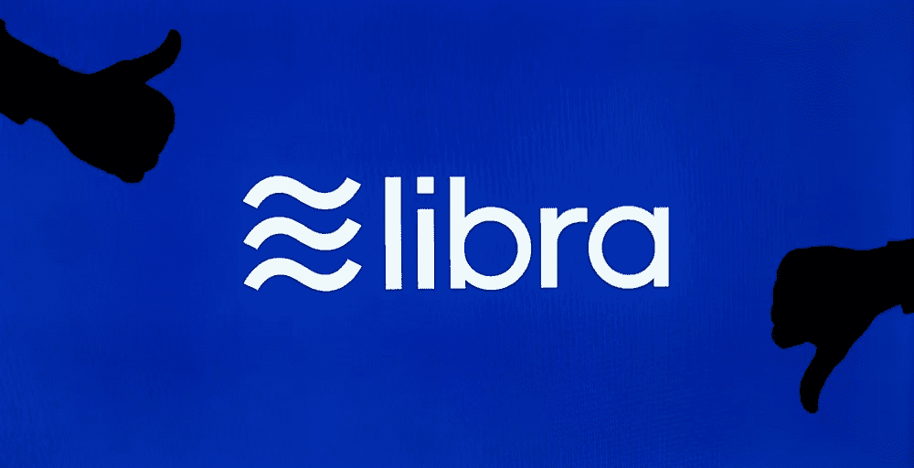

# 脸书的天秤座引起了骚动。这可能是 Starter Tech 迫切需要的对话

> 原文：<https://medium.datadriveninvestor.com/facebooks-libra-is-causing-a-commotion-d4816fd09829?source=collection_archive---------15----------------------->

早在 6 月，脸书宣布将加入名为 Libra 的货币加密游戏。

这一声明引起了立法者和 T2 科技观察家的迅速怀疑。不难看出为什么。脸书最近并不完全是[隐私的典范](https://www.theguardian.com/technology/ng-interactive/2018/dec/24/facebook-2018-timeline-year-in-review-privacy-scandals)，他们与 Libra 的目标很难说是无私的——这是一家寻求扩大他们对消费者了解的公司。脸书实际上已经了解了用户的一切，从地理位置到音乐品味。他们唯一不知道的是用户把钱花在了哪里。天秤座是他们的解决方案。

 [## Azbit 旨在连接传统金融和加密货币|数据驱动的投资者

### Azbit 是下一个提供交易平台的加密项目，该平台提供保证金和算法交易。一样多…

www.datadriveninvestor.com](https://www.datadriveninvestor.com/2019/03/20/azbit-aims-to-connect-traditional-finance-and-cryptocurrency/) 

但是，尽管我可能对脸书的加密计划持怀疑态度，围绕 Libra 的噪音实际上暴露了政府，特别是美国政府，在应对加密和区块链技术的崛起方面存在的一些关键问题。

美国对这些技术没有一套一致的法规或规则，在加密货币方面，美国积极反对采用加密货币。

# 这是一个问题，因为尽管对天秤座的谨慎是理所应当的，但区块链和加密货币在世界其他地方正蓬勃发展。

美国一直因创新和进步而繁荣——无论是在商业、科技、娱乐还是艺术领域。但现在，我们正处于一个创新被扼杀的时期。

欧洲和亚洲的国家正在疯狂地研究这些技术，超前思考，建设未来。这就是为什么这个领域的许多公司决定离开美国去瑞士和马耳他这样的地方——他们需要稳定的规章制度。

在美国，没有人知道接下来会发生什么。旧的法律法规正被用来指导新技术。人们不知道他们正在做的事情是否会在一两年后被宣布为非法。环境不稳定[东拼西凑](https://www.investopedia.com/news/majority-us-states-are-still-acknowledge-cryptocurrencies/)。

# **这里的风险显而易见——如果美国的科技公司被太多不透明的法规所扼杀，它们将会落后。**

听着，我绝不是反监管。

我们需要规章制度为公司提供一个公平的竞争环境，并在允许和不允许之间划出清晰的界限。但目前，任何从事新的尖端技术工作的人都有点紧张。

美国的立法者并没有缓解这种焦虑，他们主要关注的是加密货币被用于购买毒品和逃税。事实是，不管有没有加密，我们都会遇到这些问题。

美国人每年在非法毒品上花费数十亿美元，其中大部分是用旧美元支付的。的确，过去人们在 crypto 上支付的费用很少，但这也是事实，这是一种新兴的财富形式，对绝大多数纳税公民来说还没有正常化。大多数人，不管他们有多不喜欢纳税季，都明白奥利弗·温德尔·霍姆斯说的“我喜欢纳税”是什么意思。我用它们购买文明。”

有一种方法可以保护我们的社会，同时允许创新和进步。

# **通过建立明确的框架，我们可以缓解恐惧的心态。**

如果你给人们和公司一个框架，他们中的大多数都会在这个框架内运作。

人们*想要*明确规定什么是允许的，什么是不允许的。当公司被迫在不确定性和恐惧中运营时，想法不会茁壮成长。

这就是为什么我们需要摆脱对这些新技术的恐惧心态，并开始寻找机会。是的，脸书将推出加密货币的想法在很多方面都令人担忧。是的，人们可能会继续购买毒品，一如既往。

但我们需要一个明确定义的监管框架，让公司有机会与技术合作，而不用担心在他们花了无数时间建立自己的公司后，联邦政府会敲门。我们需要在美国创造一个更欢迎创新的环境。

世界的其他地方不会等着我们。我们可能没有紧急行动，但许多其他国家都在这样做。现在是时候停止担心加密货币，开始担心如果我们不采取行动会发生什么。