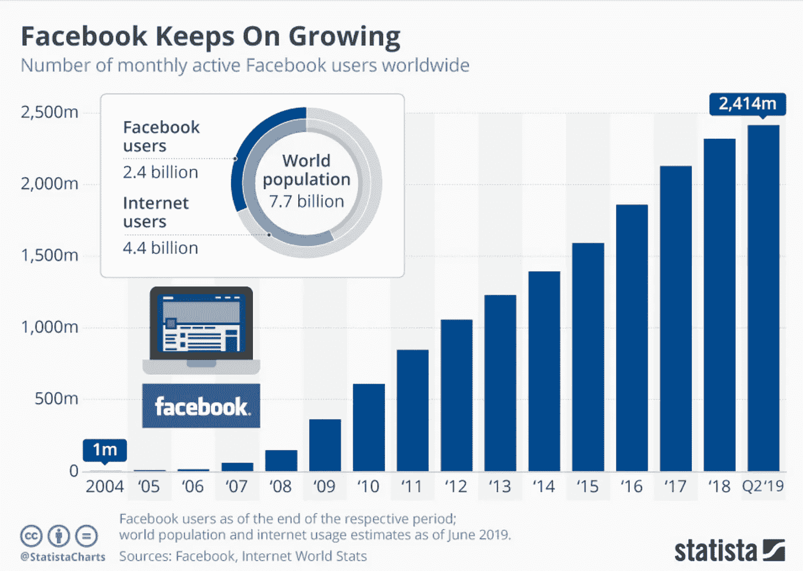
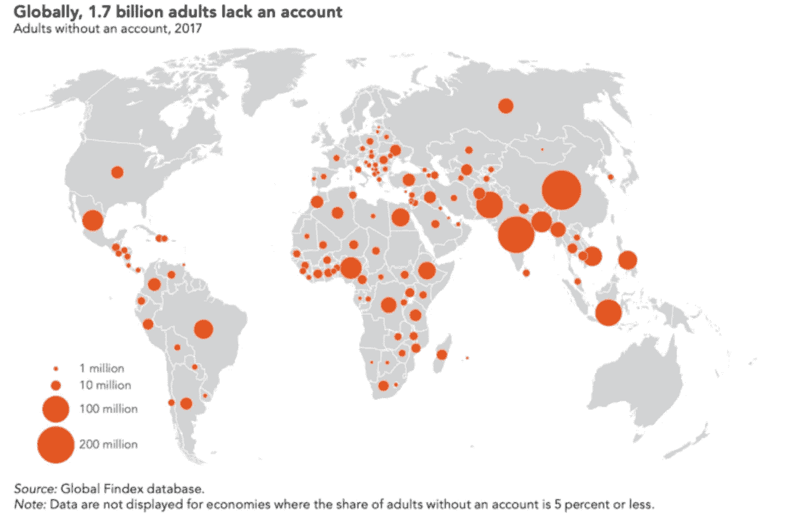

# 脸书的天秤座带来了风险，但新兴市场将遭受最大的损失。

> 原文：<https://medium.datadriveninvestor.com/facebooks-libra-poses-risks-but-emerging-markets-will-suffer-the-most-554ad8cb0712?source=collection_archive---------6----------------------->

 [## 为什么包容性财富指数比 GDP 更能衡量社会进步？|数据驱动…

### 你不需要成为一个经济奇才或金融大师就能知道 GDP 的定义。即使你从未拿过 ECON 奖…

www.datadriveninvestor.com](https://www.datadriveninvestor.com/2019/03/08/why-inclusive-wealth-index-is-a-better-measure-of-societal-progress-than-gdp/) 

**脸书的天秤座带来了新的挑战，但新兴市场将受到最大的冲击**

全球社交媒体巨头脸书决定创造一种数字货币，绕过立法者，并与金融监管机构讨论监管制度，以增加比特币、Ripple 和莱特币等货币。非洲有 1.39 亿用户，其中 98%通过电话连接。这种货币将以一篮子货币为基础，在防止恐怖主义融资、网络安全威胁和市场占领方面作用甚微。此外，全球仍有 17 亿人没有银行账户，其中喀麦隆有 100 亿人，Libra 不太可能改善这一统计数据，因为它强调的是交易而不是访问。鉴于新兴国家的中小企业、初创企业和个人所面临的挑战，由金融技术驱动的替代信用评分方法是不可或缺的，菲律宾的最新经验证明了这一点。因此，基于互联网接入的新型数字货币在帮助世界上没有银行账户的人口方面会适得其反，并带来严重的金融稳定风险。

***脸书天秤不好，新兴市场央行将承担成本***

Facebooks 的数字货币本质上是不平等的，因为交易成本仅由消费者承担，从传统货币转移将影响汇款行业，减少西联汇款(Western Union)和 Money Gram 等公司的就业，阻碍竞争和创新，并加剧金融稳定风险。随着金融科技和金融化成为大多数发达经济体的常态，一种不稳定的虚拟货币会让央行的工作变得更加困难。对于新兴市场经济体来说，情况要微妙得多，经济成本也高得多。

Source: [World Economic Forum](https://www.weforum.org/agenda/2019/06/fintech-is-driving-financial-inclusion-in-southeast-asia/)

首先，发达经济体的大部分货币在过去十年中一直保持稳定，通货膨胀的传递进一步强调了这一点。其次，近年来出现了传统银行业务的几种替代方式，为跨境支付和交易提供了便利。从 Monzo，resolute 到 Transferwise，这样的例子不胜枚举。因此，脸书没有必要促进跨境支付，因为这将阻止很大一部分没有银行账户的个人或缺乏电力和互联网接入的人贡献或获得更具竞争力的产品或服务。这将为不平等现象的滋生创造完美的条件。

***天秤座不会创造新的工作岗位；这将摧毁他们，加剧不平等。***

其次，新兴市场的很大一部分人口受雇于汇款行业。尽管创造性破坏是 Facebooks 的有害和不稳定货币的基本原理，但其以技术为中心的项目几乎没有将劳动力从这些部门转移出去。如果新兴市场接受 Libra 或未能对本国的每笔交易征收比例数字税，那么高失业率将不会太远。天秤座不会进一步创新，它可能会阻碍大多数新兴市场已经摇摇欲坠的创新。在经济不平等的国家，Facebooks 的腐败值得失业率上升吗？我认为不是。

值得注意的是，根据国际货币基金组织的数据，60 个低收入国家中有 24 个处于债务困境或处于债务困境的高风险中；他们无力偿还债务可能会严重扰乱经济活动和就业。喀麦隆债务危机的风险很高( [IMF，2018](https://www.imf.org/external/pubs/ft/dsa/dsalist.pdf) )，随着国际贸易税收收入的下降，天秤座将对急需的财政改革和外部驱动的投资做出妥协。

***脸书【天秤座会造成财务不稳定***

脸书将辩称，这些经济体的企业——尤其是那些商业模式以脸书为中心的企业——将通过其电子货币进入新市场。然而，这将在银行账户中得到清算，这为可能导致资本流动大幅波动的数字货币提供了很少的理由。对于新兴市场而言，这一点尤为突出，因为它们的外汇相关债务仍在上升。因此，如果货币政策已经不得不考虑不确定的资金流动，那么为企业提供更大的全球化准入的论点充其量是被误导了。在一个饱受全球贸易和政策不确定性困扰的世界，新兴市场最不需要的就是另一个被称为创新的不稳定触发因素。此外，随着经济试图遏制通胀，Facebooks 的 Libra 将干扰输入型通胀和央行政策的传导，这对资本市场处于初级阶段的这些经济体的金融稳定至关重要。

***政策制定者应该利用金融技术和数字化将没有银行账户的人带入金融体系***

相反，政府应该效仿中国和韩国，利用金融科技吸引大量没有银行账户的人口，而不是将个人完全排除在金融体系之外。农村地区的个人最有可能出现这种情况。这在非洲尤其重要，尽管上网人数有所增加，但发电仍然是一个问题。

鉴于难以捉摸的全球监管为非法资本和金融流动提供了掩护，我们不应该专注于如何实施 Libra，而是应该阻止它进入新兴市场，以允许创新和移动支付，确保个人获得金融服务，并将企业从非正规经济中转移出去。不幸的是，后者占了劳动力市场就业人数的很大一部分。

***政府收入将遭受损失***

对于税收制度和全球税收规则不发达的新兴市场来说，Facebooks 的 Libra 将使对国内公司征税变得更加具有挑战性，这些政策制定者仍然无法理解。根据 T4 国际货币基金组织的数据，新兴市场每年损失超过 20 亿美元的税收。天秤座不太可能改善这个画面。几乎可以肯定的是，允许 Libra 在南非、坦桑尼亚和埃及自由支配不太可能有利于金融体系，更不用说政府的财政平衡了，政府的财政平衡仍然受到特殊大宗商品价格和令人担忧的高外债水平的巨大压力。

国际货币基金组织 2019 年 7 月公布的最新数据表明了一种令人担忧的趋势，由于税收收入下降，这种趋势肯定会因 Libra 而加剧。基金组织的调查结果显示，9 个国家陷入债务困境，25 个国家处于高风险，23 个国家处于中等风险，16 个国家处于低风险。因此，这些国家应该专注于提高税收基础的规模和质量，而不是支持一种数字货币，这种货币将通过逃税、避税和过早接受数字化带来的数字腐败而使政府的公共财政出血。几乎不可或缺的是，这些国家能够负担得起债务和/或通过有效的税收制度进行参与，在这种制度下，每笔交易而不是总利润都要征税。

*储备管理*

随着各国央行寻求确保金融稳定和重新平衡储备，天秤座的金融扭曲特征将损害这一紧迫目标。新兴市场经济体和中国之间不断增长的贸易强调了这一点。数字货币的近期性质、监管步兵和脸书在主要经济体的政治影响力使天平向天秤座倾斜；新兴市场的政策制定者必须阻止它！这将降低央行应对特殊资本流动、货币贬值和高粮价的成本。再加上税收损失，这不仅会中断任何经济或金融周期，还会损害一些社会发展目标的实现。金融化不是这里的问题，而是一个不小心的跨越，这将无意中加剧金融独立。

可以肯定的是，创新和更大的市场准入的商业案例将推动围绕 Libra 的大部分讨论。但政策制定者必须超越社交媒体的影响，充分把握天秤座的扭曲影响。如果没有什么能阻止 Facebooks 继续推动市场和金融主导地位，那么新兴市场的央行、政府和家庭的经济影响应该是一个重要的威慑。

***网络安全风险会让金融系统暴露***

此外，金融和支付系统必须避免网络安全风险，因为网络攻击似乎是比直接冲突更突出的国家侵略形式。这对货币和金融稳定的影响是广泛的，因为货币供应的突然增加可能会扰乱货币政策的运作，并因外汇波动而对消费者造成副产品干扰。在缺乏管理和执行网络安全问题的全球规则手册的情况下，支付系统和金融系统构成了必须防范外部代理的关键基础设施。

在剑桥分析公司的角色和俄罗斯可能干涉美国大选之后，我们能低估网络安全的重要性吗？这通常是低调的，但脸书为外国干涉西方选举提供了便利。如果脸书无法识别那些利用心理分析来影响选民行为的流氓公司，人们只能想象如果他们被允许进入金融系统会发生什么！

更重要的是，Libra 可能成为新兴市场外汇波动的对冲工具，加剧资本外流的通胀效应，导致商品和服务价格大幅波动。由于西非的 BEAC 等中央银行试图维持其通胀目标凭证，以安抚外国投资者并维持外国直接投资流动，其经济将因应税收入损失和由此产生的宏观经济影响而进一步收缩，消费者将首当其冲。

*政策含义。*

如果获得批准，新兴市场的政策制定者和监管者必须对每笔交易征税。这意味着 Libra 与法郎之间的转换必须征税，以纠正失业失衡，并先发制人地减轻数字货币带来的金融稳定风险。脸书的霸权可能会压垮美国监管机构，如果政策制定者未能阻止其使用，他们必须为此建立并实施有效的全球税收制度。