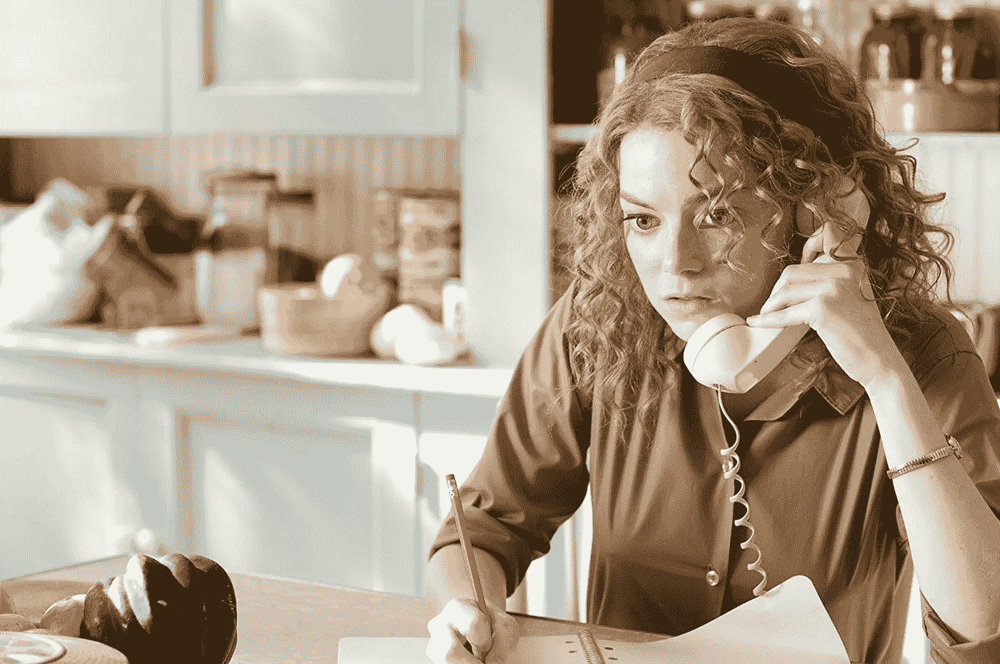
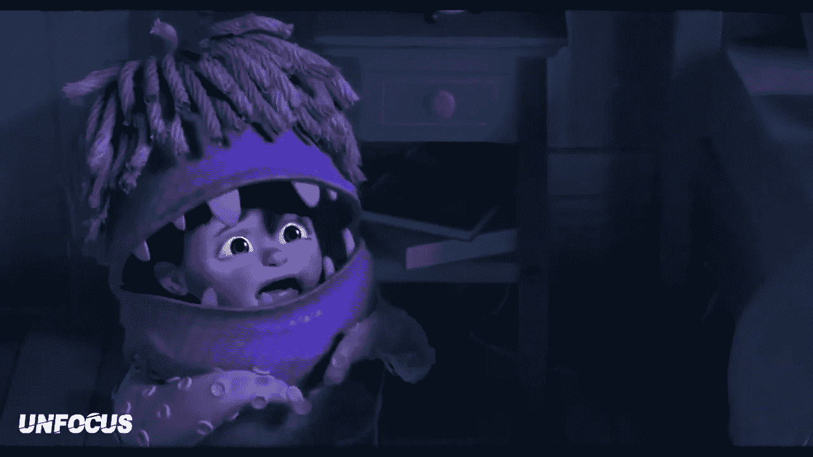

# 一劳永逸地对抗自由职业者的恐惧怪物

> 原文：<https://medium.datadriveninvestor.com/facedown-the-freelance-fear-monster-once-and-for-all-7774e4021df6?source=collection_archive---------11----------------------->

## 克服疑虑的步骤，这样你就可以做你最擅长的事情:你的工作。

所以在我的上一篇文章中，我试图向你们展示，我的自由职业者伙伴们，如何定义生产力来实现你们 T2 自己的目标。

The Swing of Writing (Credit: [Artem Bali](https://unsplash.com/@belart84))

但是，我觉得我没有真正提供一个替代方案。如果你真的无法投入写作，该怎么办？

你给了自己自怜，现在呢？

越来越荒谬了。

我自己知道，如果有人在互联网的另一端期待我的工作时，我有一个截止日期，我会完成它。

但是，我不是天使。当我知道我需要做更多的工作时，我会非常抗拒。我失去了行动力，找到了其他需要完成的“紧急”任务。

这是一个非常孩子气的，脆弱的我施加这种力量，猛踩刹车。如果我静下心来，倾听我突然需要从工作、媒体、电子邮件和空白文档等标签中切换出来的潜在需求，我会听到一些非常无辜的声音:

*如果这些新人不喜欢我的工作怎么办？*

对我来说太难了怎么办？

这是一种对判断的恐惧，既来自我自己，也来自这些不知名的客户。

作为一名自由职业者，你必须让自己经历每周甚至每天的面试过程。这让人精疲力尽，精神疲惫。

我们在上一篇文章中提到的自爱，你需要它来为你的幸福做一些非常具体的事情。

那就是为你建造一座堡垒。

即使被拒绝了，你也可以躲在后面继续工作，享受生活。

那将会是一堵很大的墙。那些投石器可以高高飞起，猛烈撞击。

是的，我很乐意告诉你保护你的心灵，剥去你的职业生活是衡量一个人价值的社会结构。但是你在问:

# 我该怎么做？？？

有些人会告诉你看看你已经取得的成就，相信你会继续前进。我希望一切都会顺利。

但这并不能解决我在标题中提到的恐惧怪物。这并不能让他不再烦你。

这就是。

听听他要说的一切。坐下来，让所有伤害和不安全的想法流走。

今天早上，就在我睁开眼睛开始新的一天之前，我的妈妈对我抱怨道:

最后一篇文章糟透了。连我都觉得很难读懂。我们编辑的时候差点睡着了。

你一点天赋都没有，我想我的委托人戴夫可能会意识到这一点。我们最好现在就放弃，甚至不要开始新的一天。

申请这份合同有什么意义，反正你也不是没有希望得到它。

Obviously on a direct line to the fear monster here ([Source](https://www.imdb.com/title/tt1454029/mediaviewer/rm469417728))

你很快就能看到我是如何被这个问题所拖累的。对我来说，把这些都打包是多么容易啊，但是我却在这里敲键盘。

这并不是因为我是一个了不起的自由职业者，或者我比你更有弹性。

每个人都有这些想法。不同的是，有些人被他们统治，而有些人接受他们在那里，但决定继续前进。

虽然听起来不像是你在听恐惧怪物的话而采取行动。难得给了它发言的讲台。大多数时候，你可能只是让它闭嘴，让你一个人呆着，同时继续做一个项目。

不幸的是，这只会让声音更大，就像一个蹒跚学步的孩子在发脾气一样。它最终会升级为一场伴随着哀号和尖叫的崩溃。

然而，通过让你的不安全感有一个公平的发言权，你正在用同情来对待这种情绪。在你写下或听完它要说的话后，有一件事你应该知道:

> 恐惧在提防着你。它不想让你受伤。它发现每一个可能造成威胁的可能性，并以绝对最好的意图发送这些可能的灾难的通知。

这里有一个脚本，无论你的恐惧怪物对你说什么，你都可以使用和改变:

[Source](https://www.youtube.com/watch?v=C0qG4QHbKKw)

“谢谢你，恐惧怪物[在此插入你的恐惧的适当名称]，非常感谢。我真的很感激你照顾我。然而，我发现比所有这些事情更可怕的是看到一个未来，当我回头看的时候，会后悔当初的退缩。

感谢你的提醒。我考虑过他们，认为他们要么:

*   事实上没有根据(戴夫只告诉我修复几个错误，并不认为我的工作是最糟糕的，因为他支付了我的最后一张发票)
*   不构成重大威胁(如果我的工作真的是最差的，谁在乎呢？人家还在买)。
*   比我现在可能遭受的潜在伤害更有可能损害我的职业前景(如果我现在停止，因为我被拒绝了，我的恐惧怪物不想让我再次经历被拒绝的痛苦，我永远不知道我能走多远)。"

我喜欢这样，因为这是我在不知所措时的具体计划。这并不是不切实际的接受，我只是不能进入一种足够禅的模式来为我工作。

这就是我如何坚持下去。

老实说，我很想听听你们是怎么安抚恐惧怪物的。我们可以利用评论区互相启发来解决这些问题。

但首先，我想深入挖掘一下恐惧怪物可能会说些什么。

这时候他就开始唠叨客户。自由职业要求你留意自己如何度过一天，以及谁填满了你的时间表。

你接待的客户会对你的一天、一年和心情产生巨大的影响。他们可以是好斗的，也可以是最好的朋友，我拒绝了报酬更高的工作，因为我必须保护自己。

如果恐惧怪物真的因为客户提出不合理的要求而大吵大闹，甚至公然欺负你，是时候摆脱他们了。

对于自由职业者来说，有时这是一个残酷、孤立的世界。这就是为什么自由职业者团结一致如此重要的原因:

1.  令人欣慰的是，知道还有其他人有类似的挣扎，并了解他们是如何茁壮成长的。这不仅仅是看一个 Youtube 视频，实际上与另一个自由职业者的交流教会了我很多如何管理期望和建立我的业务。
2.  人们通过与我们每个人的经历来学习如何对待所有的自由职业者。作为一个工人阶层，我们在制定标准方面做得越好，我们的集体职业生活就变得越积极和充实。
3.  它帮助我们提高技能，学习新的创造过程

正如我所说的，我真的很想听听你如何管理你的恐惧，所以请在下面留下评论，为社区建设做点贡献。

下次见，自由职业者！