# 面部关键点检测

> 原文：<https://medium.datadriveninvestor.com/facial-key-point-detection-88ccfaeaf9ee?source=collection_archive---------0----------------------->

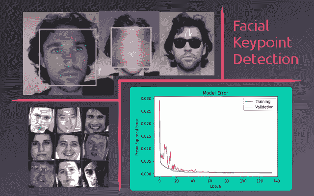

这篇文章概述了用于建立面部关键点检测模型的技术，作为 Udacity 的 AI 纳米学位计划的一部分。这个项目使用的代码可以看作是一个 Jupyter 笔记本。完整的项目提交可以在[这里](http://nbviewer.jupyter.org/github/macbrennan90/facial-keypoint-detection/blob/master/CV_project.ipynb)查看。如果你想访问实际的笔记本，可以在项目的 [GitHub 库](https://github.com/macbrennan90/facial-keypoint-detection)中找到它们。

# 概观

在 Udacity 的 AIND 的最后一个项目中，目标是创建一个面部关键点检测模型。该模型然后被集成到完整的管道中，该管道拍摄图像，识别图像中的任何人脸，然后检测这些人脸的关键点。

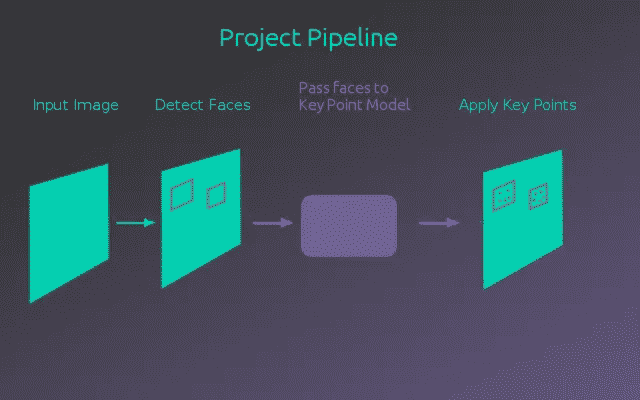

# 使用 OpenCV 进行预处理

这个项目的一部分是熟悉 OpenCV 库。特别是在预处理输入图像时使用它。在这个项目中，它用于将图像转换为灰度并检测图像中的人脸。OpenCV 的另一个有用的特性是高斯模糊，它可以用来隐藏检测到的人脸的身份。

下图显示了对图像应用人脸检测和高斯模糊的结果。

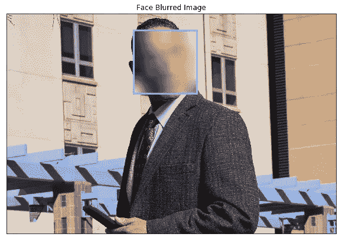

使用 OpenCV 库中的人脸检测器，图像中的人脸可以被裁剪以输入到关键点检测模型中。

# 资料组

为了训练关键点检测模型，使用了具有相应关键点标签的人脸数据集。这个[数据集来自 Kaggle](https://www.kaggle.com/c/facial-keypoints-detection/data) ，由 96×96 的人脸灰度图像组成，用 15 (x，y)坐标标注人脸关键点。原始数据集包含 7049 幅图像，然而并非所有图像都具有完整的 15 个关键点标签。为了处理这个问题，只使用了具有全部 15 个关键点的图像。这留下了 2140 幅图像，其中 500 幅被分成一个测试集。下图显示了数据集的一个示例。

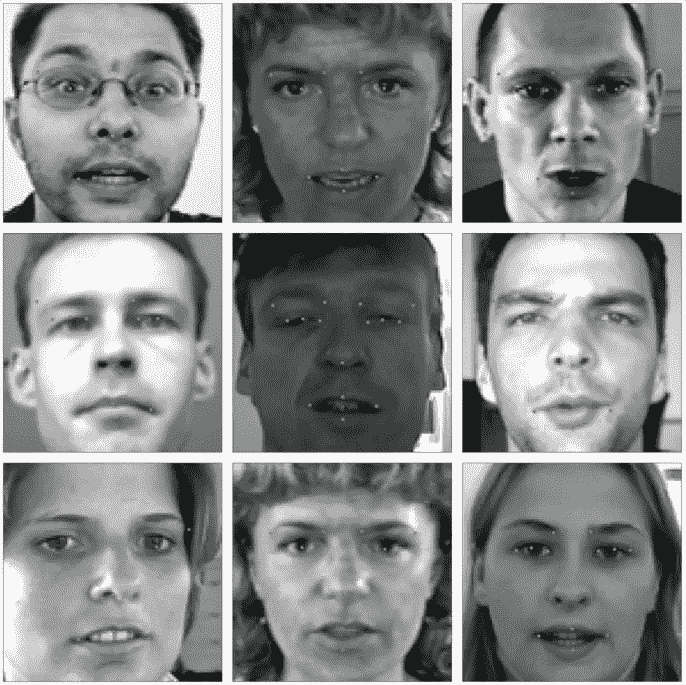

# 增大

对于相对较小的 1640 幅图像的训练集，数据以多种方式进行了扩充，以增加模型可以学习的示例图像的数量。由于不仅输入图像需要增强，而且关键点标签也必须增强，以便它们与新增强图像上的相同点相匹配，因此这变得稍微更具挑战性。应用了两种类型的增强，概述这个过程的代码可以在 projects Jupyter 笔记本中找到。

**水平翻转** —这是相对直接的。图像和关键点的 x 值反映在图像的中心。对应于面部左侧的关键点与对应的右侧关键点进行了交换。这使得训练数据翻倍。下面是一个水平翻转的例子。

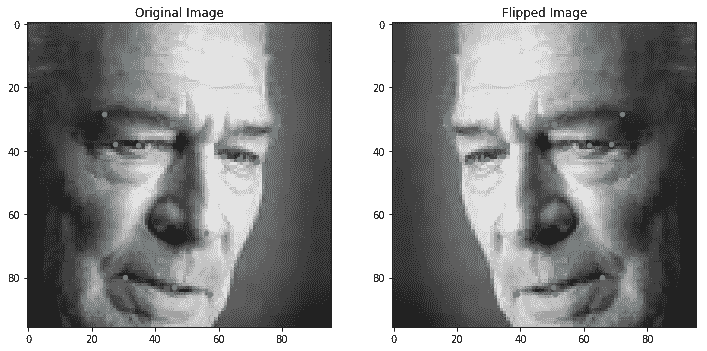

**旋转和缩放**——旋转和缩放有点困难，但是多亏了 OpenCV，构建一个应用于图像及其关键点的旋转/缩放矩阵变得很容易。将数据集的旋转/缩放版本添加到正常数据集上再次使训练示例加倍。下面是这种增强的一个例子。

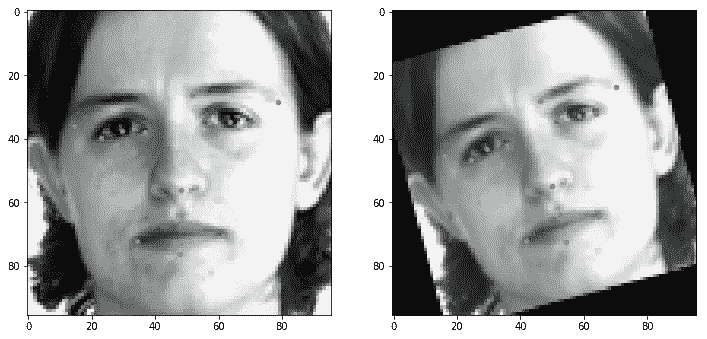

在扩充了原始数据集后，该模型现在有 6560 个样本可供训练。

# 构建模型

该模型使用的架构大致基于 VGG16 模型，这是一个为 ImageNet 分类而构建的卷积神经网络。VGG16 模型使用 5 个卷积块从图像中提取特征。这些块由几个卷积层组成，后面是一个最大池层，图像尺寸减半。在用于这个项目的模型中，每个卷积块只有一个卷积层。这是因为在数据有限的情况下，更简单的模型不太可能过度拟合。

除了使用较少的卷积层之外，在前 3 个卷积块中添加了丢失层，丢失率为 20%，并且在每个卷积层之后添加了批量归一化层。这两种较新的技术都是原始 VGG16 网络所没有的，有助于防止过度拟合。

使用这种架构来提取图像特征，卷积层的输出被馈送到全局平均汇集层，然后被馈送到 30 个节点的完全连接的输出层(15 个关键点中的每一个的 x，y 值)。下图说明了该模型的完整架构。

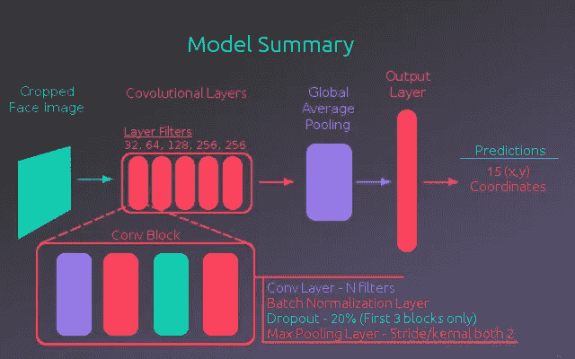

# 培养

为了训练模型，使用标记的关键点和预测的关键点的均方误差来计算损失。发现 Adam 优化器提供了最好的结果。我们还发现，通过提高批量大小和学习速率，可以实现最低的损失。从 0.001 的学习率开始，该模型在 32、64 和 128 批次大小上训练了 15 个时期。对于 0.0001 和 0.00001 的学习率重复这一过程。原因是批量越小，梯度下降步骤越随机(更随机),因为它是在更少的例子上平均的。当优化达到最小值时，参数步长应代表更一般的解决方案，通过在较大批量上取平均梯度来提供。

下图显示了训练曲线，后者显示了最终时期的更近视图。正如您在最后一个时期中看到的，训练损失的步骤是由每个学习率的批量增加产生的。

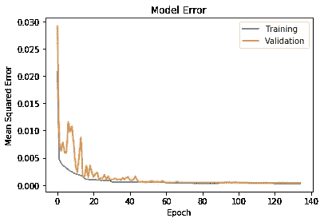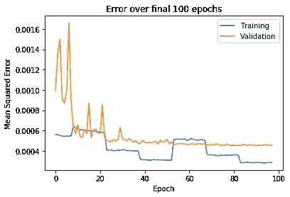

# 伪标记

经过第一轮训练，模型比较准确。为了利用原始数据集中的所有数据，已训练的模型用于预测缺失值的关键点，并将其用作标签。从本质上来说，数据集有大量不完整的例子被丢弃，但他们仍然有来自关键点的有用信息。为了从这些信息中学习，模型用它的最佳猜测来填充不完整的点。

采用伪标记的完整数据集并像以前一样扩充它，创建了具有 29520 个示例的新训练数据集。然后，该模型继续在该数据集上进行训练，随后是在原始全标记数据集上的另一轮训练。最终，模型误差被训练到 0.0005 以下。我对此非常满意，正如项目笔记本所说，“一个非常好的模型将实现大约 0.0015 的损失”。此外，当绘制在测试图像上时，关键点预测似乎位于您预期的位置。

# 摘要

通过训练关键点检测模型，面部检测器和模型被组合以将关键点应用于图像内的面部。下图给出了该过程的一个示例产品。

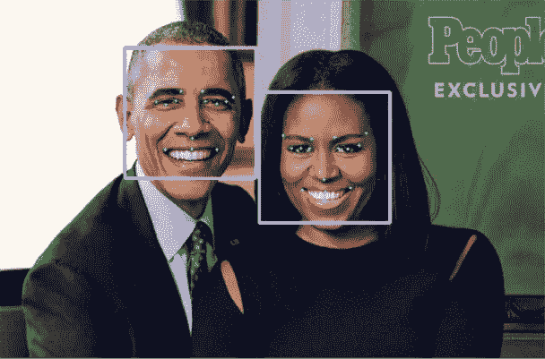

此外，该模型被扩展为与网络摄像头一起工作，并使用关键点功能来应用遮罩过滤器(在本例中为太阳镜)。

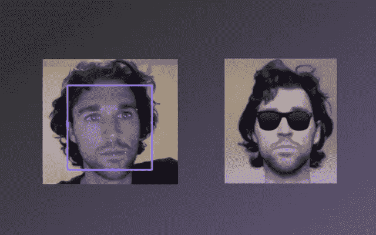

我对这个项目的成果感到兴奋。该模型使用简单的卷积架构和一些更新的技术、数据扩充和伪标记，能够在相对较小的数据集上产生有用的结果。

*原载于*[*macbrennan 90 . github . io*](https://macbrennan90.github.io/facial-key-point-detection.html)*。*