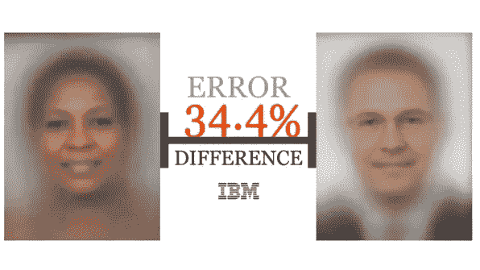
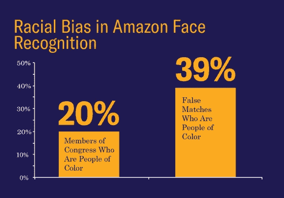

# 面部识别和偏见

> 原文：<https://medium.datadriveninvestor.com/facial-recognition-and-bias-5bd963d83813?source=collection_archive---------0----------------------->

正如你可能已经听说的那样， [IBM 即将发布一个漂亮的怪物数据集](https://www.ibm.com/blogs/research/2018/06/ai-facial-analytics/)——超过一百万张图片——以及工具，所有这些都是为了帮助消除面部分析中的偏见。对我来说，最酷的部分实际上是宣布了第二个*数据集——大约 36，000 张图像——这些图像“ [*平均分布在肤色、性别和年龄上*](https://www.ibm.com/blogs/research/2018/06/ai-facial-analytics/) ”。*

那么，这有什么关系呢？在回答这个之前，我们先来简单的转移一下话题。
假设你正在做一些涉及机器学习和面部识别的事情。您需要一个数据集来训练您的模型，考虑一下您将如何选择数据集。你可能会考虑任务的细节(“*我需要知道这张脸是不是在笑*”)，你正在研究的算法的细节(“*如果背景改变了，我还能分辨出这是微笑吗？*))及诸如此类。然后你会去一个[便利的面部识别数据库](http://www.face-rec.org/databases/)中，挑选一个最合适的。例如
对于简单、不受约束的面部识别，你可能会选择 [LFW-a](http://www.openu.ac.il/home/hassner/data/lfwa/) ，或者
对于名人的卡通版本，你可能会选择 [IIT-CFW](http://cvit.iiit.ac.in/research/projects/cvit-projects/cartoonfaces)
等等。

这个管用。
或者，我应该说，它“起作用了”(吓唬引号故意的！)，只要你不在乎结果中的偏差。这意味着当你开始考虑这些结果如何作用于女性或深色皮肤的人等等时，它实际上是非常失败的。因为，事实证明*这些数据库中使用的基础数据在性别、肤色等方面分布不均匀！这意味着你的算法是针对有偏见的数据进行训练的，这意味着它们本身就是有偏见的！*😡

我并不是凭空捏造的——在最近的一篇论文中，()Buolamwini 和 Gebru 研究了两个常见的面部分析基准(IJB-A 和阿迪内斯)，发现数据绝大多数是浅肤色受试者的数据(IJB-A 的数据为 79.6%，阿迪内斯的数据为 86.2%)。更糟糕的是，他们测试了 IBM、微软和 Face++的商业产品，并在分析深色皮肤的人时发现了*巨大的*差异。
事实上，深色皮肤的女性表现最差，*错误率接近 35%，相比之下，浅色皮肤的男性只有 1%！！！*()

看看下面的视频。是的，如果你不想耐着性子看完，浏览一下 GenderShades.org[的结果——它将花费你不到一分钟的时间，应该会让你相当震惊。*然后*看视频。](http://gendershades.org/overview.html)

关于这一切，需要记住的是" [*自动化系统并不是天生中立的。它们反映了那些有能力塑造人工智能的人的优先事项、偏好和偏见——编码的目光。*](http://gendershades.org/overview.html)

这就把我们带到了最近美国公民自由联盟对亚马逊面部识别系统的测试中，该系统愉快地识别出了一大群因犯罪而被捕的国会议员，其中有色人种的数量不成比例！
是的，如果你和亚马逊(或者，坦率地说，任何一个供应商)交谈，你可能会得到类似于“Y *你没有正确校准它*”、“*我们只是提供算法，由你来正确实现它*”和“*买者自负*”的回应。这并没有真正触及根本问题，那就是你不应该竭尽全力去做正确的事情！

这又把我们带回了 IBM 的数据集，36，000 张图片“ [*”平均分布在肤色、性别和年龄*](https://www.ibm.com/blogs/research/2018/06/ai-facial-analytics/) ”之间。至少，这将允许人们测试他们的算法对一个真正多样化的数据集的偏见，并看看它进展如何。如果他们没有，我们可以看到他们没有，并适当地把他们的脚放在火上。

在算法公正联盟 的 [*还有更多关于算法偏见的*。我强烈建议你去看看…**](https://www.ajlunited.org/)

*()" [*性别差异:商业性别分类的交叉准确性差异*](http://proceedings.mlr.press/v81/buolamwini18a/buolamwini18a.pdf)"——Joy Buolamwini 和 Timnit Gebru*

*()大多数相关人员都非常认真地对待这些结果。你可以在[这个 FAQ](https://www.media.mit.edu/projects/gender-shades/faq/) 看到 IBM 和微软的回应。也就是说，这不是一件“快速解决”的事情。正如我前面所说的，去看看算法正义联盟。*

**(* [*这篇文章也出现在我的博客上*](http://dieswaytoofast.blogspot.com/2018/07/facial-recognition-and-bias.html) *)**