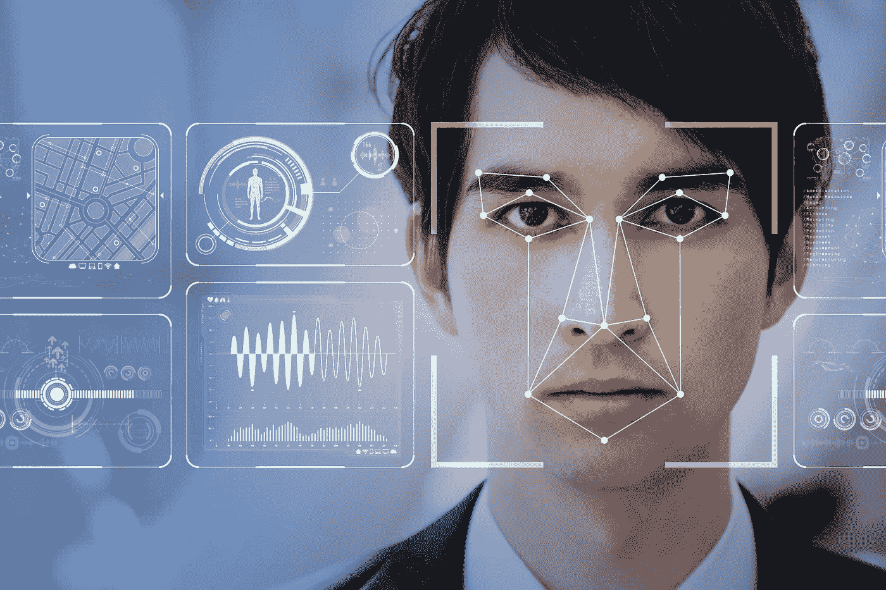
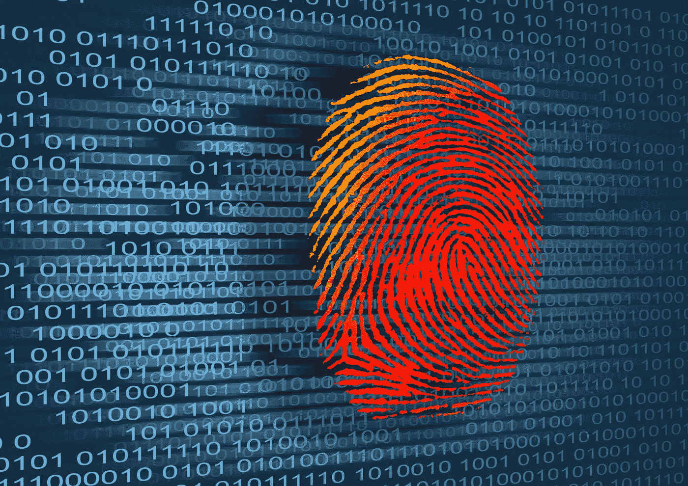

# 面部识别及其安全缺陷

> 原文：<https://medium.datadriveninvestor.com/facial-recognition-and-its-security-flaws-ba776ae06c?source=collection_archive---------8----------------------->

如今用于验证员工、乘客和其他任何人身份的技术仍在不断发展。在过去的日子里，纸质传单被手绘取代，然后是照片和视频图像。直到最近，把脸和它们的名字联系起来是一个漫长的过程，可能是从浏览面部照片日志到素描艺术家的任何事情。随着面部识别安全软件的领先，所使用的各种身份识别方法已经发展了几十年。如果这项技术得到合乎道德的准确使用，它确实可以增强公共安全，但也存在许多必须考虑的风险，如滥用数据、新的诈骗方法和隐私问题。

为了找出扩大面部识别安全技术使用的含义，让我们来看看一些安全缺陷。

# 1.身份盗窃

我们都将密码保密，并尽量选择不容易被猜到的密码。然而，我们不能以同样的方式保护我们的脸，从而使人脸识别安全成为骗子窃取人们身份的主要目标。在现实世界中，认证某人并不是什么大事，因为涉及到许多其他因素，使得现实生活中的人们能够认证某人。然而，在数字世界，这是一个完全不同的故事。黑客可以通过一张他们试图窃取的人的简单照片绕过面部锁定，甚至后来引入的“活性”检查也很容易被绕过。

iPhones 等设备中包含的最新人脸识别安全系统使用 3D 深度图来检测和验证拥有该设备的人的所有特征。这种新的安全措施很难被欺骗，需要潜在的骗子重新创建一些人的脸。这很难，但并非不可能。

# 2.数据保密

面部识别隐私问题是这项技术最有争议的问题之一。在使用之前，你要问我的人脸数据被存储在哪里？谁可以访问这些信息？这些信息还有其他用途吗？坦率地说，即使你是一个普通的互联网用户，你的脸很可能已经通过社交媒体在互联网上传播，几乎任何人都可以用智能手机上的高分辨率相机从远处拍摄你的照片。

然而，FaceID 技术始终处于开启状态，只要它检测到您的面部，就会自动激活。这不仅限于 iPhones，亚马逊 Echo 等设备一直通过前置摄像头盯着你，谁知道这些数据存储了多少，存放在什么位置。

# 3.签名欺诈

面部识别的有害影响之一是能够伪造人的签名。许多信用卡公司正在使用这项技术来验证他们客户的身份，虽然[计算机视觉软件](https://skywell.software/ar-vr-development/)可以作为一种快速认证方法，但它还没有完善。所有不同的面部识别系统都需要自己的照明条件，如果这些条件不完美，它们可能会接受错误的用户或拒绝真实的用户。

# 4.错误识别问题

如果面部识别系统的错误率很高，这可能会在执法和交通安全等领域产生巨大的影响。面部识别正被用于在机场验证乘客的身份，甚至一个错误都可能导致人们被错误指控或无法证明他们的身份。只要没有出错的余地，我们就不得不怀疑这项技术到底有多安全。

# 5.道德风险

每当一项新技术被广泛采用时，我们往往会忘记一些伦理问题。例如，在中国，面部识别被用来给每个公民分配一个社会信用分数，基于他们认为这个人有多值得信任。换句话说，这项技术被用来持续监视公民，以确保他们不会越线。在这种情况下，你越遵守规则，你的社交分数就会越好。

鉴于所有的安全风险和担忧，我们不得不怀疑面部识别的好处是否真的值得，因为这项技术很容易被滥用。一般来说，每当推出新的具有改进的面部识别技术的小工具时，你都必须记住公司甚至政府是如何利用这项技术达到他们的目的的。尽管面部识别技术的创造者是为了一个特定的目的而建造的，但可能有数百甚至数千种其他用途，其中一些可能并不太好。

*最初发表于*[*sky well . software*](https://skywell.software/blog/facial-recognition-and-its-security-flaws/)*。*

## 来自 DDI 的相关故事:

 [## 用 7 个步骤解释深度学习

### 和猫一起

medium.com](https://medium.com/datadriveninvestor/deep-learning-explained-in-7-steps-9ae09471721a)  [## 数据科学和软件工程哪个更有前途？

### 大约一个月前，当我坐在咖啡馆里为一个客户开发网站时，我发现了这个女人…

medium.com](https://medium.com/datadriveninvestor/which-is-more-promising-data-science-or-software-engineering-7e425e9ec4f4)