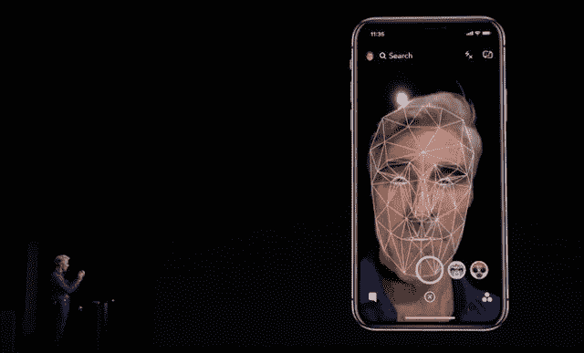

# 面部识别更上一层楼

> 原文：<https://medium.datadriveninvestor.com/facial-recognition-to-the-next-level-bf7556fb459f?source=collection_archive---------19----------------------->

人脸识别技术是当今社会众所周知的技术。随着 iPhone X 的推出，它变得更加流行。这是一种类似于指纹识别技术的生物计量认证。它分析面部的特征，如下颌线的长度，两眼之间的距离，鼻子的宽度，眼窝的深度和颧骨的形状。

早期阶段的面部识别是通过比较两个内插 2D 图像和要求具有更高清晰度和足够图像质量的图像来实现的，以便获得更高的精度。不过，只有严格控制的环境才能达到这种精度。作为后续研究的结果，3D 面部识别系统的到来减少了 2D 系统的弱点。

使用深度和不受光照影响的测量轴来捕捉人的面部表面的实时 3D 图像仍然是独特的。3D 面部识别经过一系列步骤。

*   *检测*
*   *对齐*
*   *测量*
*   *表示*
*   *匹配*
*   *验证或识别*

最新的趋势是将人工神经网络应用于面部识别。神经网络的典型过程类似于人脑的过程。该过程包括 3 个步骤:预处理、主成分分析和反向传播。在预处理阶段，捕获的人脸图像通过消除人脸上的变化而被归一化和增强。主成分分析(PCA)是一种高度基于数学的算法，它将一些可能相关的变量转换成较少数量的不相关变量。它包含几个步骤。

**步骤 1:将人脸图像分割成子图案。**

**步骤 2:计算每个子模式的预期贡献。**

**第三步:分类**

反向传播神经网络(BPNN)训练网络，以在正确响应用于训练的输入标准的能力和对类似输入提供良好响应的能力之间取得平衡。

人脸识别技术的发展导致了用你的脸付款，这可以用来授权支付和转账。它实际上是下一代 Face Plus Plus 技术。Face++是世界上最大的人脸识别技术平台，能够识别人脸特征并存储在数据库中。它还识别从不同角度拍摄的人的运动。这项技术已经以“支付宝”的形式投入运营，这是中国的一款移动支付应用。为了授权支付，它允许用户进行“活体测试”,使用户能够在扫描时做动作或说话。因此，在人口增长导致金融交易缺乏安全性的当代环境中，使用面部识别进行安全交易被证明是高度准确和安全的。它还有助于金融公司发现欺诈行为，并通过准确的证据追踪罪犯。然而，这项技术仅在中国大陆进行了商业实践。

还应该指出的是，中国最受欢迎的搜索引擎百度最近为北京国际机场提供了一种人工智能面部识别技术，以验证抵达乘客的身份。

最新和最受欢迎的面部识别技术的例子是在 iPhone X 中使用的，它由表面特征组成。它包括一个神经引擎；或者更确切地说，称为 A11 仿生处理器的集成神经处理单元(NPU ),其加速移动设备上基于人工智能的应用程序的性能，这些应用程序将在专用的远程服务器群中执行，如 Siri 和 Prisma 等流行应用程序所经历的。最近推出的手机华为 Mate 10 Pro 上浪费了一个专用的人工智能芯片。华为公司在其麒麟 970 chi 上嵌入了一个神经处理单元(NPU ),有助于以更低的功耗更快地运行人工智能任务。它应该知道自动激活肖像模式，它可以识别你的相机指向的东西。它真正展示了专用 NPU 的优势。

人脸识别技术并不是最新的技术，但它已经发展到 99%的准确率水平，这远远被证明是日常活动的可靠手段。它帮助世界在几毫秒内完成许多任务。所以，用面部识别面对未来会很棒。

*最初发表于*[*【technix360.blogspot.com】*](http://technix360.blogspot.com/2018/03/facial-recognition-to-next-level.html)*。*