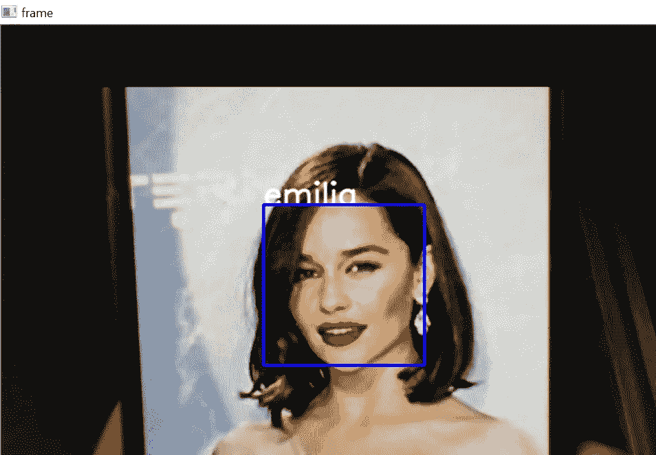
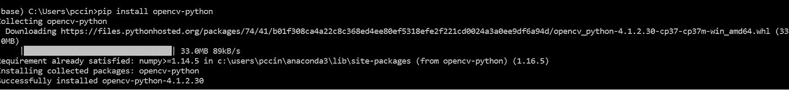
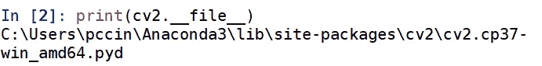
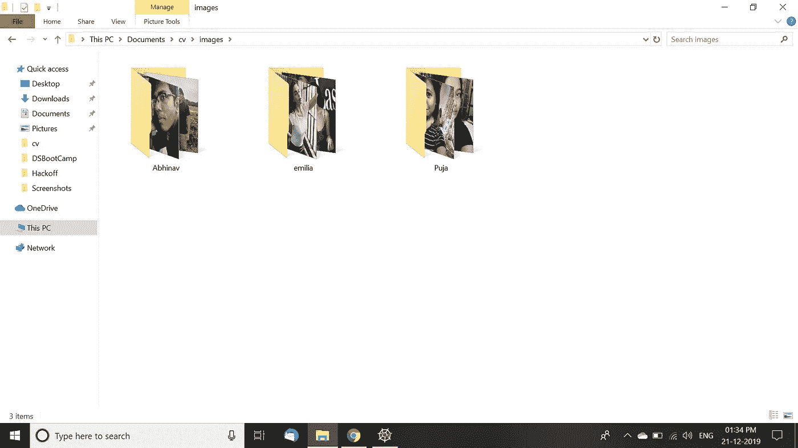
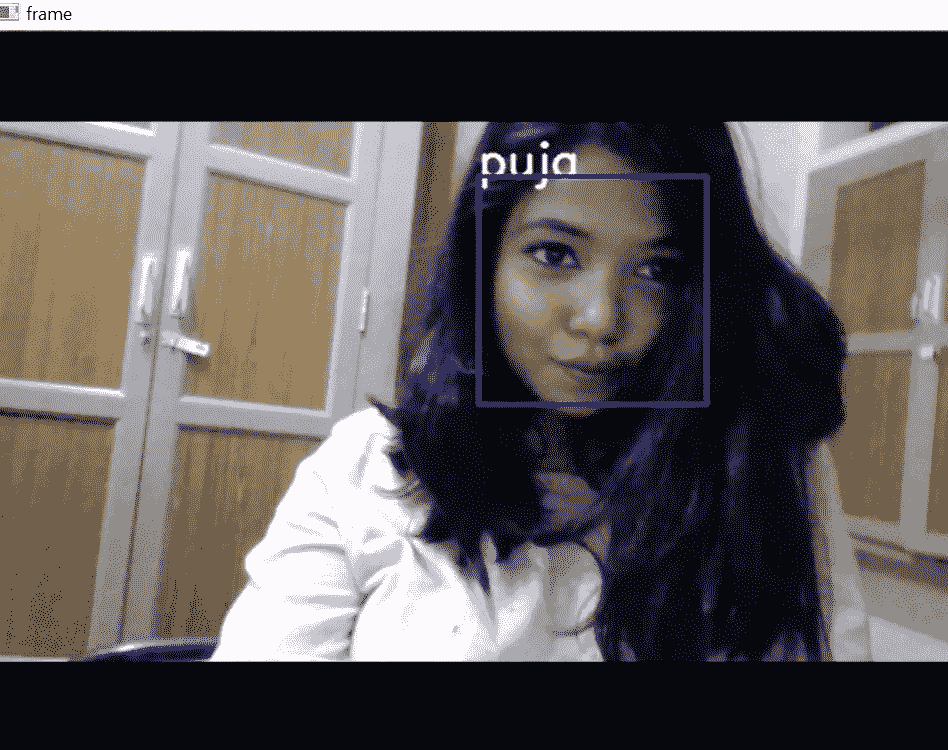

# 使用 OpenCV 进行面部识别

> 原文：<https://medium.datadriveninvestor.com/facial-recognition-using-opencv-18e751ad71d8?source=collection_archive---------2----------------------->



嘿，这是我关于 OpenCV 的两部分教程的第二部分。你可以阅读[第一部分](https://medium.com/@contact.pujachaudhury/facial-detection-using-opencv-a721becdf846)来更好的理解 openCV。在本教程中，我们将学习人脸的检测和识别。

这里有一些关于 OpenCV 的信息，它包括一个统计机器学习算法库，如*增强、决策树学习、梯度增强树、*等，由英特尔于 1999 年首次推出。

[](https://www.datadriveninvestor.com/2019/02/19/artificial-intelligence-trends-to-watch-this-year/) [## 今年值得关注的 5 大人工智能趋势|数据驱动的投资者

### 预计 2019 年人工智能将取得广泛的重大进展。从谷歌搜索到处理复杂的工作，如…

www.datadriveninvestor.com](https://www.datadriveninvestor.com/2019/02/19/artificial-intelligence-trends-to-watch-this-year/) 

现在，所有的问题都解决了，让我们开始吧！

**第一步:**安装 OpenCV 库: **pip 安装 opencv-python**

如果在运行程序时遇到错误，请尝试**pip install opencv-contrib-python**。



**第二步。**现在您已经安装了 OpenCV，找到。通过在命令 shell 中运行下面的命令，为各种 haarcascade 特性创建 xml 文件。将**数据**文件夹移动到您正确工作的目录。



**第三步。**下载您想要识别的人物的图像。我做了一个名为 images 的文件夹，分别下载了我、我男朋友和艾米莉亚·克拉克(因为卡丽熙)的 50 张照片。



**第三步。**训练模型。

我们从导入我们的库开始，我们将用它来创建和训练我们的模型。

```
import cv2
import os
import numpy as np
from PIL import Image
import pickle
```

接下来，我们定位 python 文件的目录，然后定位该目录中的“images”文件夹。这将给我文件夹的绝对路径，对于任何系统都是如此，不管它是什么操作系统。

```
BASE_DIR = os.path.dirname(os.path.abspath(__file__))
image_dir = os.path.join(BASE_DIR, "images")
```

现在，我们浏览整个文件夹并搜索图像，即以 jpg 或 png 结尾的文件。我们使用 root 定位文件的文件夹名，并将其存储在标签为的变量中。将显示在屏幕上的人的名字将成为他/她的标签。

```
for root, dirs, files in os.walk(image_dir):
 for file in files:
  if file.endswith("png") or file.endswith("jpg"):
   path = os.path.join(root, file)
   label = os.path.basename(root).replace(" ", "-").lower()
```

好了，这里有一点棘手，我们将把我们的图像转换成一个 numpy 数组，然后训练我们的模型。我们将使用 python 图像库来抓取图像，然后将其转换为灰度。我们调整图像的大小以保持一致性。然后，我们将图像转换成 numpy 数组，这是机器学习中的常见做法。基本上我们是把图像转换成数字，所以训练变得更容易。我们创建了一个字典，其中我们将为每个标签指定一个特定的 id，这将非常有用。然后，我们使用人脸级联来检测人脸。

```
if not label in label_ids:
    label_ids[label] = current_id
    current_id += 1
   id_ = label_ids[label]
   pil_image = Image.open(path).convert("L") # grayscale
   size = (550, 550)
   final_image = pil_image.resize(size, Image.ANTIALIAS)
   image_array = np.array(final_image, "uint8")
   faces = face_cascade.detectMultiScale(image_array, minNeighbors=5)
```

然后，我们在识别出的人脸周围创建基本矩形，并附上标签，即人名。

```
for (x,y,w,h) in faces:
    roi = image_array[y:y+h, x:x+w]
    x_train.append(roi)
    y_labels.append(id_)
```

现在是训练的时候了！我们将使用 LBPH 人脸识别算法，并将训练好的模型保存为 yml 文件。完整的培训代码可以在这里找到[。](https://github.com/Puja2402/OpenCV/blob/master/train.py)

```
recognizer = cv2.face.LBPHFaceRecognizer_create()
with open("pickles/face-labels.pickle", 'wb') as f:
 pickle.dump(label_ids, f)recognizer.train(x_train, np.array(y_labels))
recognizer.save("rec/face-trainner.yml")
```

**第四步。**实施模式。

为了使用我们的模型，我们将对 f [ace 检测](https://medium.com/@contact.pujachaudhury/facial-detection-using-opencv-a721becdf846)代码做一些细微的修改。我们加载训练好的模型，并将标签从 id 转换为人名。

```
recognizer = cv2.face.LBPHFaceRecognizer_create()
recognizer.read("face-trainner.yml")labels = {"person_name": 1}
with open("pickles/face-labels.pickle", 'rb') as f:
 og_labels = pickle.load(f)
 labels = {v:k for k,v in og_labels.items()}
```

如果我们模型的置信度大于 45 小于 85，我们就显示标签。除了一点格式化之外，代码的其余部分或多或少是相同的。你可以在这里找到它！

```
id_, conf = recognizer.predict(roi_gray)
     if conf>=45 and conf <= 85:
      #print(5: #id_)
      #print(labels[id_])
      font = cv2.FONT_HERSHEY_SIMPLEX
      name = labels[id_]
      color = (255, 255, 255)
      stroke = 2
      cv2.putText(frame, name, (x,y), font, 1, color, stroke, cv2.LINE_AA)
```

我们完了。测试结果看起来会像这样。



检测不是 100%准确，深度学习模型会给出更好的结果，但它仍然很好。希望你今天学到了一些东西！

> 感谢您的阅读！