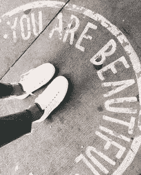

# 积极生活的因素

> 原文：<https://medium.datadriveninvestor.com/factors-for-a-positive-life-d939f8698f10?source=collection_archive---------5----------------------->

Photo by [Valentin Salja](https://unsplash.com/@valentinsalja?utm_source=medium&utm_medium=referral) on [Unsplash](https://unsplash.com?utm_source=medium&utm_medium=referral)

成为你想要吸引的能量…

## **典型的头脑**

这真的让我很困扰，就像整个心态和我们社会思考和谈论的方式。我们的社会确实会影响你，因为如果你在一个国家看一只猫头鹰，它就像是愚蠢的，但在另一个国家，它被认为是非常明智的。所以，这真的取决于你周围的故事是什么。所以，我有点想通过教育大众来给基层带来一些变化。因为农村地区的孩子没有机会接受高质量的教育。

## **做点更大的**

我害怕化妆、照相机和关注。我想如果我有更好的东西，我会把它用在更大的事情上，或者可能会有所作为，而不是仅仅谈论哦，我的上帝！我太酷了。我穿着昂贵的衣服，有这么好的东西。我不在乎那种生活。我的意思是我更想谈一些更相关的事情。

 [## 倦怠耗尽了简单的答案——数据驱动的投资者

### “大多数卫生专业人员知道如何照顾病人，但不知道如何照顾自己。”医疗保健…

www.datadriveninvestor.com](https://www.datadriveninvestor.com/2019/01/15/burnout-exhausts-easy-answers/) 

## **网络欺凌**

我们应该一致努力解决网络欺凌问题。因为人们，尤其是女孩，他们不能离开他们的房子，我的意思是他们确实离开他们的房子，但是一些父母不喜欢这样。人们对此非常怀疑，比如:你去了哪里，做了什么。所以，对于女性来说，她们表达自己的唯一方式是在社交媒体上，这是她们唯一的平台。没有足够多的女性站出来展示她们的才华，因为我们太害怕人们会说什么。这对人们来说是一件大事，因为他们非常害怕会有什么样的反应，人们会说什么，但是，你应该知道，你必须亲自经历一切才能站出来。那些人不会支持你，也不会支持你。你应该树立先例。

## **不要让人失望**

我们喜欢打击别人，伤害别人。但是请记住，任何想打倒你的人都在你之下，而你在他们之上。根据我的观察，有些人没有消极就无法工作，因为打倒别人会让他们感觉更好。我们不会像这样把人带大，这是很平常的事。如果我想说我很棒，我会说:“我很棒是因为 XYZ。”不管怎样，这是我的成就，我们应该鼓励自己！我这样做，也许我会更好。你要知道，你是幸福的仙女，你要把幸福的尘埃洒在每个人身上。现在微笑吧，因为悲伤是很昂贵的。

## **别出心裁**

我一直注意到一件事，所有拍照的人都在用应用程序让自己变得白皙、苗条或苗条，就像没有瑕疵一样……为什么？所有这些人得到所有这些程序和所有这些编辑应用程序，他们实际上让你看起来就像所有这些人一样。我觉得同样是个大问题。你要精彩，要耳目一新，最重要的原创。

## **重视自己**

为什么我们不能拥有自己呢？我就是我。我不知道这是不是男人的正餐。我是说我们应该做自己。为什么我们不能舒服地待在自己的皮囊里？因为到了最后，我们看起来都一样。我们总是谈论你应该是怎样的个人，你知道，试着做你自己的事，我认为在一天结束时，每个人都只是在从众，为什么我们不能有缺点；我的意思是我不介意有缺点。所以，很多人建议我不要应用这个，对你的帖子要非常小心——不要那样做，不要这样做，不要那样说话或坐着。我说“不”。我的意思是，好吧，我应该关闭我的大脑，或者只是开始假装成别人，成为我不是的人。我不想那么做。因为我知道人们现在正在关注我，但 10 天后他们可能就不会了。

## **不要让你的粗鲁影响你的名声**

很多人无法面对名声。他们可能会保持谦逊，但他们感觉不到失败，因为他们看不到失败的到来。我知道这不会永远持续下去。一切都是这样，但有些人开始认为他们拥有世界。这个世界上的一切都属于他们，他们拥有对一切的控制权。这与你有多富有或多有名无关，粗鲁是弱者对力量的模仿。

*如果事情比你现在好，那是因为你沉下去了，仅此而已。*

## ***成为你，***

## ***给你……***

毫无歉意地。

> 如以下内容所示:
> 
> [https://interact.pk/factors-for-a-positive-life](https://interact.pk/factors-for-a-positive-life)
> 
> [https://issuu . com/hamnaqasim 90/docs/factors _ for _ a _ _ ve _ life . docx _ DC 3270 d0e 2d 28d](https://issuu.com/hamnaqasim90/docs/factors_for_a__ve_life.docx_dc3270d0e2d28d)
> 
> [https://www.quora.com/profile/Hamna-Qasim](https://www.quora.com/profile/Hamna-Qasim)
> 
> [https://www . LinkedIn . com/pulse/factors-positive-life-hamna-QA sim/](https://www.linkedin.com/pulse/factors-positive-life-hamna-qasim/)