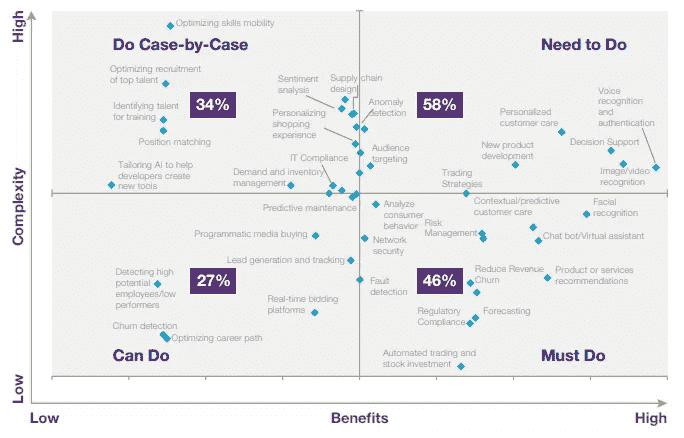
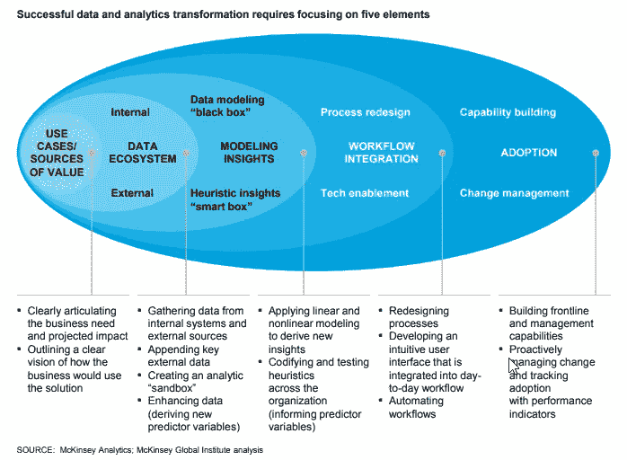

# 虚构之前的事实:为营销成功设置人工智能

> 原文：<https://medium.datadriveninvestor.com/facts-before-fiction-setting-up-ai-for-marketing-success-d78828d8eed8?source=collection_archive---------22----------------------->

**由** [**沙赫拉姆**](https://www.linkedin.com/in/shahramsabzevari/?originalSubdomain=my) **&** [**科斯塔坦**](https://www.linkedin.com/in/costa-tan-phd-23293470/)

将人工智能(AI)视为解决营销当前困境的灵丹妙药，注定会让这个仍在兴起的创新领域失望。在某种程度上，它已经发生了。

有许多文章讨论人工智能和更广泛的数据科学对 MarTech 和 AdTech 行业意味着什么。虽然大多数人关注的是将被释放的新机会，但有些人怀疑它的有用程度，这不利于在不久的将来真正实现的目标。

我们可以部分归功于围绕人工智能的炒作，如钢铁侠，西部世界或黑镜等科幻电影和电视剧，并感谢他们在人工智能项目和商业应用人工智能方面迷惑了非人工智能从业者。

 [## 今年值得关注的人工智能趋势——数据驱动的投资者

### 预计 2019 年人工智能将取得广泛的重大进展。从谷歌搜索到处理复杂的工作，如…

www.datadriveninvestor.com](https://www.datadriveninvestor.com/2019/02/19/artificial-intelligence-trends-to-watch-this-year/) 

研究公司 Gartner 已经强调，机器学习、深度学习和认知计算正处于膨胀预期的顶峰——这助长了这一银弹希望。

*Chart 1: Gartner Hype Cycle, 2017*

为了就人工智能驱动的应用程序的集成将如何影响营销人员做出明智的决定，我们必须首先认识到这个领域。

首先，让我们建立一个人工智能和数据科学的清晰定义。虽然，一般来说，人工智能和数据科学有时可以互换使用，但从技术角度来看，它们并不相同。数据科学是人工智能、机器学习、数据挖掘和许多其他功能的超集。

人工智能一词最早是由约翰·麦卡锡在 1956 年创造的。他聚集了不同领域的研究人员来开发“思维机器”的概念。据说，他选择人工智能这个名字是因为它是中性的。

一般来说，人工智能的定义会根据一个人试图实现的目标而变化。这些定义通常分为三类:

**1)人工通用智能(AGI)**

能够执行一项要求人类智力至少和人类一样好的任务。它也被称为强 AI 或全 AI，指的是机器，也可以体验意识。我们还没有看到这一类的真正样本，因为它很难解决。

**2)弱艾**

也被称为狭义人工智能或应用人工智能，这是人工智能的范畴，专注于特定领域的问题解决或推理，而不试图模仿人类的认知能力。一个很好的例子就是苹果的 Siri、亚马逊的 Alexa 和 IBM 的 Deep Blue。

**3)之间的一切**

这些系统受到人类智能和推理的启发和启发，但它们不是由完善模型以模拟人类认知能力的目标驱动的。IBM Watson 就是一个很好的例子。这一类别是当今大多数研究工作发生的地方。

**搜寻天网**

关于人工智能是否可以是没有感觉或意识的人工智能的持续辩论最好留到以后进行。简而言之，关于意识的构成及其与智力的关系，人们几乎没有一致的看法。

感兴趣的读者可以深入研究这一领域的许多有趣的出版物，包括帕特里克·格里姆的[心灵哲学](https://www.amazon.com/Philosophy-Mind-Consciousness-Thinking-Machines/dp/B00DTO5LQC/ref=sr_1_1?ie=UTF8&qid=1535960558&sr=1-1&keywords=Philosophy+Of+Mind)和约翰·布罗克曼编辑的[如何看待会思考的机器](https://www.brainpickings.org/2015/10/12/what-to-think-about-machines-that-think-brockman-edge-question/)。

但毫无疑问，人工智能社区正在稳步向 AGI 前进，追求能够推理、处理不可预见的情况和自主学习的计算机。

几个月前，谷歌 Deepmind 掀起了有机学习如何走路的浪潮，类似于儿童通过感知周围环境的方式。然后是来自东京创业公司 Araya 的团队，他们通过向机器人灌输好奇心来激励它们克服障碍。这些机器人学会了在它们能爬山之前需要跑，展示了推理和自我意识。

机器学习技术的进步也使机器能够在没有人类知识的情况下解决问题。例如，2015 年 10 月，AlphaGo 的早期版本成为第一个在没有差点的情况下击败职业围棋选手的计算机程序。两年后，谷歌 Deepmind 发布了 [AlphaGo Zero](https://www.theatlantic.com/technology/archive/2017/10/alphago-zero-the-ai-that-taught-itself-go/543450/) ，这是一个完全不研究人类数据的版本，但却优于其前身。

因此，问题不应该是计算机是否能够学习、推理或处理不可预见的情况。相反，我们认为更重要的问题是:

MarTech 和 AdTech 行业需要 AGI 从人工智能和分析中受益吗？

公司现在无法从分析和大数据中受益的主要原因是什么？

我们是否确定了人工智能要解决的正确的业务问题？

第一个问题的答案是否定的，没有必要为了从今天的人工智能和分析中受益而等待明天 AGI 的真正出现。

2018 年发表在 Forbes 上的一篇文章[声称，在他们的研究中，84%的营销组织在 2018 年采用或扩展人工智能。它还补充说，75%使用人工智能的人将客户满意度提高了 10%以上。](https://blog.hubspot.com/marketing/ai-marketing-use-cases)

咨询公司凯捷在 2017 年[进行的一项研究显示，58%的被研究企业正在通过人工智能解决最具挑战性的营销问题。](https://www.capgemini.com/wp-content/uploads/2017/09/dti-ai-report_final1.pdf)

*Chart 2: Distribution of use cases by benefits and complexity, Capgemini*

这项研究还表明，实施人工智能的好处因组织的数据和技能准备情况而异。他们还发现，文化问题是人工智能实施中的主要挑战。

这让我们找到了第二个问题的答案，即从人工智能解决方案中受益的障碍。

由 MITSloan 与 BCG 合作进行的一项研究指出，在大多数组织中，执行力和雄心之间存在巨大差距。尽管 85%的高管认为他们可以使用人工智能获得或保持他们的竞争优势，75%的高管认为人工智能将为他们的业务带来新的机遇，但只有约 20%的高管将人工智能融入了他们的一些业务流程和产品，其中只有 5%的高管广泛融入了人工智能。

银弹和不切实际的期望甚至会让最有希望的创新脱轨。我们坚信，当前的技术，如果使用得当，对营销人员是非常有益的。人工智能项目失败的原因很多，其中包括:以下是最关键的几个:

1.未能发现对业务影响最大的问题。

2.业务和数据科学团队之间的沟通中断。

3.缺少内部数据冠军。

4.向月球射击。

5.不完整的数据集。

6.错误的算法和技术堆栈。

这就给我们带来了最后一个问题:我们正在识别人工智能要解决的正确的商业问题吗？

拥有理解分歧双方的人是关键的第一步。咨询公司麦肯锡(McKinsey)指出，组织不仅应该吸引和聘用数据分析人才，还应该吸引和聘用商业翻译人才，即那些将数据知识与行业和职能专业知识相结合的人才。

Chart 3: Successful data and analytics transformation requires focusing on five elements

这些人充当数据科学家和业务问题的实际应用之间的代理。麦肯锡称，他们的角色至少与分析人才同等重要。他们声称分析可以外包，但业务翻译需要专有知识，因此应该深入到组织中。

数据科学家和人工智能专家不能在真空中工作。商业利益相关者和领域知识专家必须参与识别可以通过人工智能解决的问题，准备数据集并验证结果。

最终，如果我们不能将业务问题转化为数据问题，人工智能和机器学习的进步将不会转化为 ROI。营销人员需要认识到人工智能解决方案可以带来实际价值的具体用例，并接受可以获得最佳结果的条件。

但是，业务和数据科学之间的桥梁并不总是位于内部。这就是科技公司，如 CtrlShift、adGeek 和 Adgorithms 等，在将他们在人工智能和机器学习技术方面的知识转化为适用、有形的解决方案，特别是营销和广告方面发挥着至关重要的作用。

那么，适合人工智能解决的数据问题是什么样的呢？例如，如果你的品牌正在寻求用人工智能进行大规模定制内容创作，今天就有可能这样做。人工智能生成的内容可能不会赢得任何奥斯卡奖或普利策奖，但它将足够流畅和引人入胜。

然而，全自动的创造性创造仍然无法用当前的技术解决。一个好的创意包括一定程度的讲故事、直觉和创造力，这在当今可用的人工智能解决方案中很难找到。

或者引用百度前副总裁兼首席科学家吴恩达的话:“如果一个典型的人可以用不到一秒钟的思考完成一项脑力任务，我们可能会在现在或不久的将来使用人工智能实现自动化。”

我们必须记住，人工智能解决方案能够带来的价值取决于一种经过深思熟虑的方法，这种方法为了明天的结果而接受今天的限制。