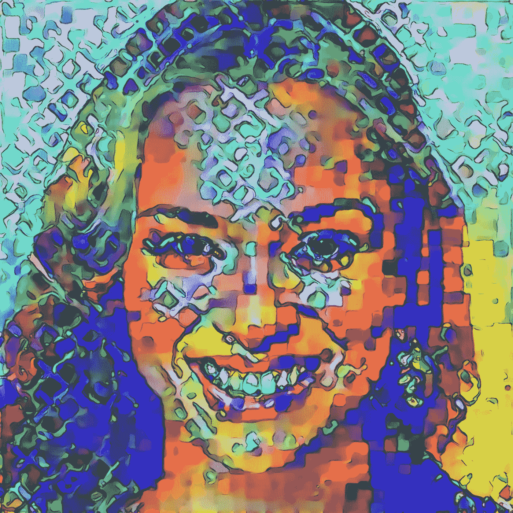
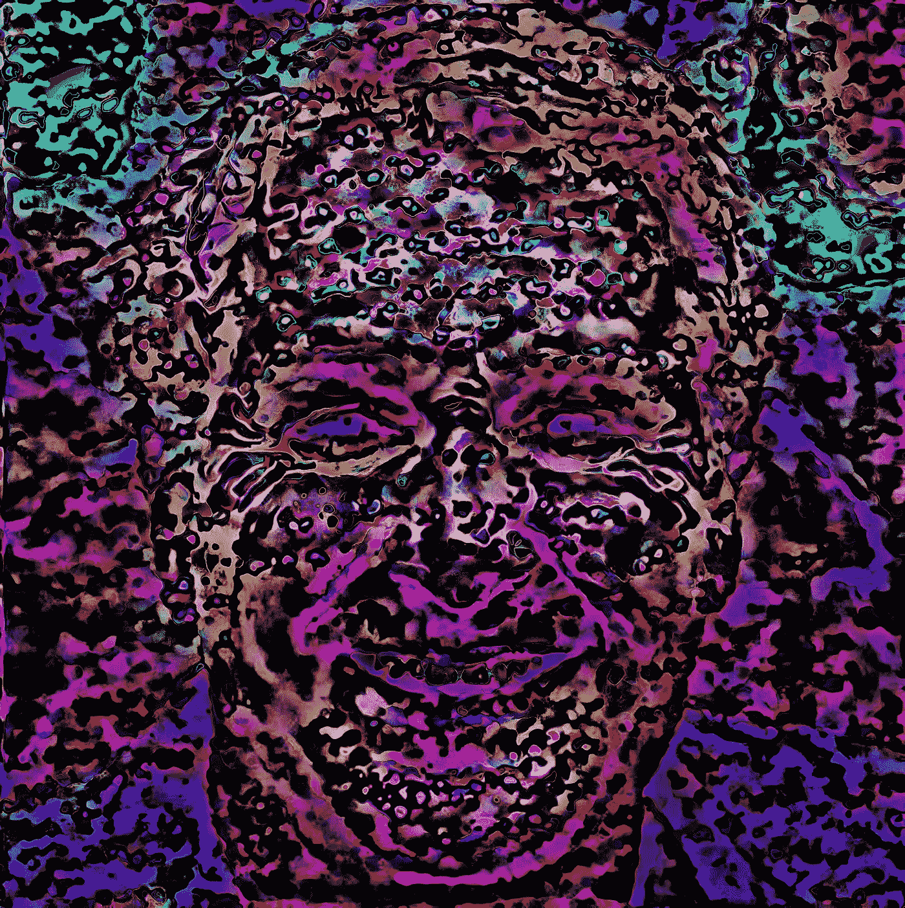
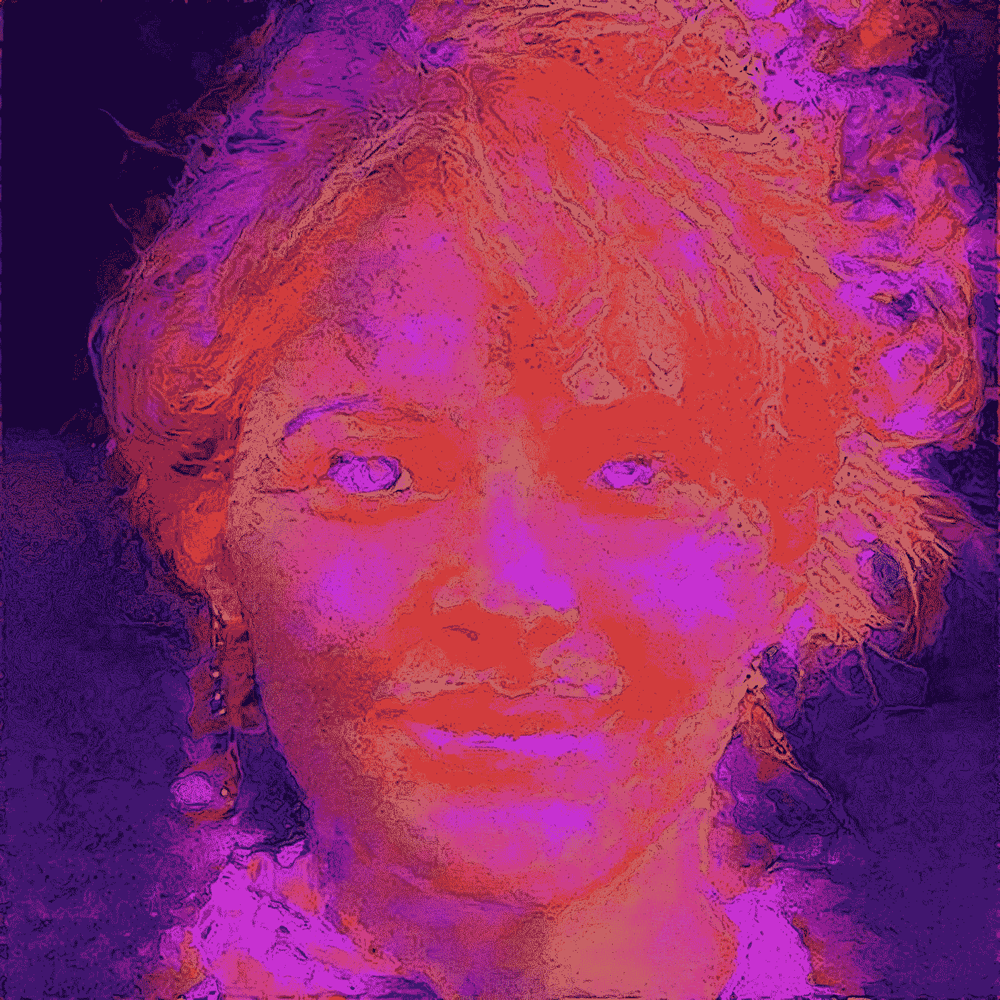

# 未来的事实？

> 原文：<https://medium.datadriveninvestor.com/faice-of-the-future-51ad6583b25e?source=collection_archive---------45----------------------->

英伟达的一组研究人员开发了一种人工智能过程来生成虚拟人物的照片般逼真的图像，他们的工作同样令人着迷和怪异。

我们已经看到了大量的 CGI 电影魔法，如《T2》中已故演员彼得·库欣的数字复活、《星球大战》中的 T3、《T4》中的星球大战外传：侠盗一号 T5，以及《银河护卫队 2》中的库尔特·拉塞尔和《创》中的杰夫·布里吉斯的 FX 时间扭曲，让他们回到了年轻时的自己。

但是，可能通过数字图灵测试(至少对于社交媒体或其他环境中的静态图像)的人造人是一种发展，即使像我这样具有前瞻性思维的人也会感到有点不安。同时又令人兴奋。

这也是我正在研究的新的神经网络增强艺术系列的极好素材。这项新的工作不仅在工作流程中采用了算法工具，而且[专注于人工智能、机器学习、神经网络、神经科学和意识研究](https://medium.com/datadriveninvestor/cogniverse-an-ai-enabled-interdimensionally-inspired-art-series-b0416eaaef61)作为主题和灵感。

人工智能研究彻底颠覆了人造人的主张。我使用神经网络处理和大量的手工处理和实验，将一些想象中的人变回更加超现实和奇妙的生物。

当然，由于认知科学越来越多地告诉我们[我们对自我意识和意志的体验可能是大脑功能的一种虚幻的副产品](https://www.scientificamerican.com/article/there-is-no-such-thing-as-conscious-thought/)，我们的思想、身体以及现实和体验的基本性质的巨大美丽的神秘仍然是敞开的。

为了纪念节日和冬至，这里有一些 Faice 系列的例子。

[***杰克·梅森***](https://www.linkedin.com/in/jackmason/) *毕业于布朗大学(文学学士，符号学)和哥伦比亚大学新闻学院*

**Faice.3**, from the [Cogniverse](https://www.cogniverse.art) collection

**Faice.8**, from the [Cogniverse](https://www.cogniverse.art) collection

**Faice.7**, from the [Cogniverse](https://www.cogniverse.art) collection