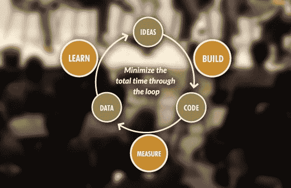

# 快速失败，经常失败，在未来许多年赢得今天

> 原文：<https://medium.datadriveninvestor.com/fail-fast-fail-often-and-win-c9067463b2cc?source=collection_archive---------41----------------------->

## 你的意图和奉献将决定你的成功

Photo by rawpixel on Unsplash

如果不以盈利为目的，那还有什么意义？很少有企业家能负担得起昂贵的爱好。

没有人会指责 [Mpho Mashita](https://twitter.com/Mpho_Mashita) 轻视她的职业——或者不以盈利为目的。她创立了 [#AfricaCareerChat](https://twitter.com/Afri_CareerChat) ，在[摩羯座调频](https://twitter.com/CapricornFM)电台发表演讲，写作，主持创业、商业和创新活动，策划艺术内容，并促进工作准备计划。

Mashita 已经成为将创意转化为利润的专家。

 [## 参与建立受众和利润

### 重要的是追随者的质量，而不是数量

blog.markgrowth.com](https://blog.markgrowth.com/engagement-builds-audience-and-profit-3849952ddbaf) 

那些做生意的人有很多想法要考虑，这使得选择哪些想法来采取行动变得很重要。

“这一切都归结于意图，”Mashita 说。“你试图通过这个想法达到什么目的。这个想法与你的个人目标或商业目标有多一致，以及这些目标有多紧迫？

“一旦你确定了这一点，它将驱动你选择追求哪个想法，”她说。“然后你就可以开始关注这个想法本身了。其他因素将决定你的想法是否有需求或市场。”

# 有价值的想法

最重要的是，不要强行配合。

“不要把你所有的精力都放在一个不能引起你共鸣的想法上，”Mashita 说。“这真的可以归结为意图和目标。”

看似好的想法需要通过测试，看它们是否值得采取行动或执行。

“我们都听说过这样一句话，‘快速失败，经常失败’，”Mashita 说。“它来自一种扰乱新想法执行方式的方法，即[精益创业方法](http://theleanstartup.com/principles)。它基于构建、衡量和学习这三大支柱。

“我的很多观点都是从这种方法中形成的，”她说。“当我有一个想法时，我会问自己，它能创造价值吗？这种想法有存在的必要吗？我能推出一个最小的可行产品吗？”

Mashita 解释说，精益创业方法提倡实验。这取代了提出充分证明的商业计划和花很长时间来制造产品或设计服务。

“当你有了一个想法，测试市场，获得输入，把它放在那里，边走边学习和修正，”Mashita 说。“这有点乱，但价值在于创造一些由你的市场决定的东西。”

 [## 成功的品牌通过了人们忠诚度的测试

### 在日益拥挤的网上市场，顾客永远是对的

medium.datadriveninvestor.com](/successful-brands-pass-the-test-for-peoples-loyalty-258e1a2bfb23) 

然后拿到市场上看看人们的反应。

“这总是很可怕，因为它可能向任何方向发展，”Mashita 说。"有时候，你认为是最好的想法可能会被你的市场践踏."

# 倒向善的敌人

从想法中赚钱的过程往往会导致错误。其中一个在等待最佳时机。

“有时，我们对自己的想法过于保护，从不公开，”Mashita 说。“如果你以前有过被窃取的想法，这种情况就会发生。”

无论奋斗，永远提升，多元化。

“始终让你的想法与你的个人目标或商业目标保持一致是很重要的，”Mashita 说。“那么就有增长和创造积极影响的空间——不仅仅是利润。”

Mpho Mashita

想法可以压倒一切。创业者需要知道什么时候停止考虑，继续前进。

“回到精益启动方法，*只需启动*，”Mashita 说。“让你的想法经受精益创业的考验:快速失败，经常失败。获取数据，继续或透视。

“有没有一种方法可以为你可以推向市场的原型融资？”她说。“那就这么办。你越早发现市场，你就越早知道你是否有重复销售和可行的产品。”

 [## 四位坚定的领袖挑战新世界

### 快速的变化考验着他们预测、适应和发展的能力

medium.com](https://medium.com/an-idea/four-determined-leaders-take-on-the-new-world-f98c32e66ca8) 

该指南适用于产品测试。

“有没有一种方法可以为你可以推向市场的原型融资？”马士塔说。“那就这么办。你越早发现市场的反应，你就越早知道你是否会获得重复销售和一个可行的产品。

“一旦你理清了一堆想法，并确定了你想要的想法，你就知道你该做什么，”她说。*跳！*失败得快，失败得勤。”

# 保护你自己的利益

如果出现问题，一定要把你的想法作为知识产权来保护。

“教育自己如何在你的行业中保护你的想法是非常重要的，”Mashita 说。“对于其他行业来说，这变得很棘手，但发现并做正确的事情总是很重要的。

“我不是知识产权和保护创意的专家，”她说。“然而，对你来说，考虑你的想法的复杂性以及它是否需要任何专利权或保护是有意义的。先做好自己的调研。咨询相关专家来协助你。”

为了确保一个想法是市场所需要的，Mashita 推荐了被称为 Pivot 或 Persevere 的精益创业阶段。

“旋转是当一个想法不起作用时，你进入下一步，”她说。“坚持就是不断尝试。你可以利用你得到的信息来尝试改进你的想法。转向或坚持是你的选择。”

Mashita 说，企业主应该问这些问题:

*   这个想法和我的目标有共鸣吗？
*   我能融资并把想法拿出来进行测试吗，即使它不是 100%的？
*   我是否愿意从调查结果中学习并保持灵活性？
*   当这个产品或服务成形时，我是否愿意塑造一个商业模式？
*   我在提供价值吗？
*   我得到了重复销售吗？
*   推这个产品或服务能有持续性和可持续性吗？

 [## “战略性社交倾听是真实的生活”

### 获得洞察力，抓住机会为有需要的人服务

medium.datadriveninvestor.com](/strategic-social-listening-is-real-life-90c8a07b7c3f) 

通过这一切，记住研究比什么都重要。

“对你来说，重要的是不仅要了解你的市场，还要对它了如指掌，”Mashita 说。

“当你打算将你的想法公之于众时，首先要确定你的性格类型，”她说，并给出了以下几点考虑:

*   你到底有没有创业精神？
*   你是否愿意实际学习更多关于企业家精神的知识？
*   你是对所有权斤斤计较，还是只想得到回报？
*   你是想积极地实现你的想法，还是愿意躲在幕后？

“这将有助于你确定自己在实现想法的过程中所扮演的角色，”Mashita 说。“其他人在组织内部进行创新。弄清楚你需要什么样的支持。

她说:“谷歌一下精益创业，开始研究这种方法。”"除了这本书本身，还有大量的资源。"

**关于作者**

吉姆·卡扎曼是[拉戈金融服务公司](http://largofinancialservices.com)的经理，曾在空军和联邦政府的公共事务部门工作。你可以在[推特](https://twitter.com/JKatzaman)、[脸书](https://www.facebook.com/jim.katzaman)和 [LinkedIn](https://www.linkedin.com/in/jim-katzaman-33641b21/) 上和他联系。

*原载于 2018 年 11 月 19 日*[*www.datadriveninvestor.com*](http://bit.ly/2qSUMKl)*。*