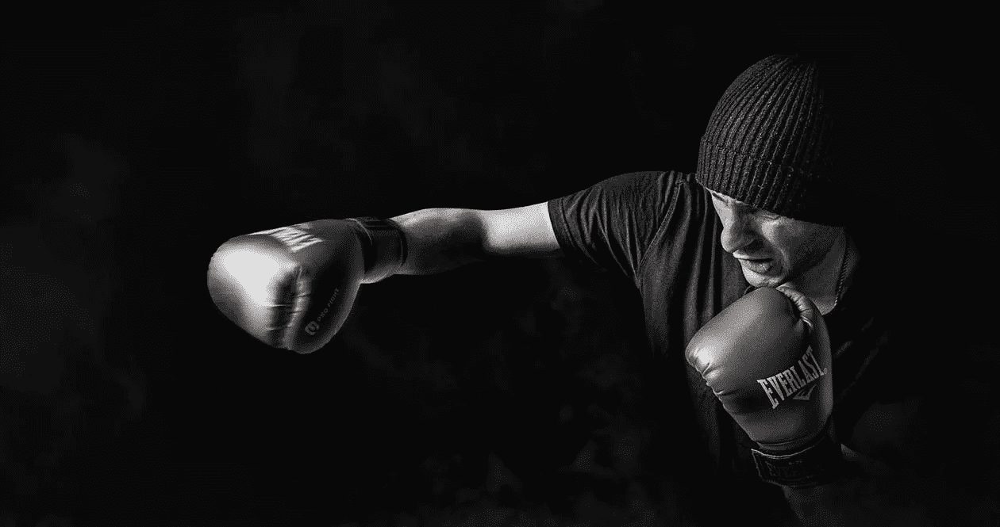

# 失败

> 原文：<https://medium.datadriveninvestor.com/fail-to-succeed-d9ab28772e8f?source=collection_archive---------31----------------------->

## 成功的代价是什么？

Credit @pixabay from pexels.com

这是我昨天题为“成功的必然性**”的帖子的延续。**

**我们经常会遇到许多一夜成名的故事…**

**人们成为他们行业的传奇，他们公司的领导者和他们领域的影响者。**

**他们让它看起来如此简单…**

**不清楚的是幕后的基础工作，通常是多年前的…**

**他们的奋斗、挑战、困难以及在他们成功之前的许许多多的失败。**

**失败是成功的先决条件…**

**为了成功，我们必须先失败——这是我们旅途中的必然。**

**它是先驱，它让我们变得更好、更聪明、更有效率。当我们知道如何利用它时，它是一个强大的杠杆。**

**那么，为什么很少有人接受它呢？相反，他们试图不惜一切代价避免它？**

**是因为我们的教育制度惩罚错误吗？还是我们的社会影响看不起失败，只崇拜成功——即使是肤浅的成功？是我们的教养和家庭的保护意识让我们在失败时不会被人看做怪人吗？**

**避免失败是一个“安全”的立场。因此，人们要么为了安全起见过早退出，继续呆在舒适区。**

**实际上，这是一种错误的“安全”观念。根本没有创造力，足智多谋，创新，成长！**

**当我们放弃时，我们就丢掉了我们每个人固有的成功潜力。我们独特的才能、远见和天赋——被浪费了。**

**这是一种鼓舞人心的生活方式吗？这是一种授权的工作方式，还是我们应该开始以不同的方式思考和行动？**

**托马斯·爱迪生曾经说过…**

> **“我没有失败。我刚刚发现了一万种行不通的方法。生活中的许多失败都是因为人们在放弃时没有意识到自己离成功有多近。”**

**如果我们有一个愿景，梦想或渴望，我们可以变得更好，那就是我们的召唤去做一些不同的事情，实现我们的潜力。**

**不要只是把它们扫到一边或地毯下。那将是对我们自己的巨大伤害。**

**尽管有恐惧、艰难、挫折、阻力和拖延，还是要鼓起勇气朝着我们的愿景前进。**

**一切都是有限的——失败和成功也有其有限的存在。失败不是永久的(成功也是如此),也不会定义我们。由我们自己来定义自己。**

**拥抱失败。它们是我们微调、重新调整和重新定位我们的战略和执行的机会。**

**成为最好的自己。**

**去选择成功吧——重新投入战斗。**

****你比你面临的任何失败都强大。****

**要伟大！**

**要牛逼！**

**做你自己！**

**• • •**

**谢谢你和我在一起。
周彼得#2**