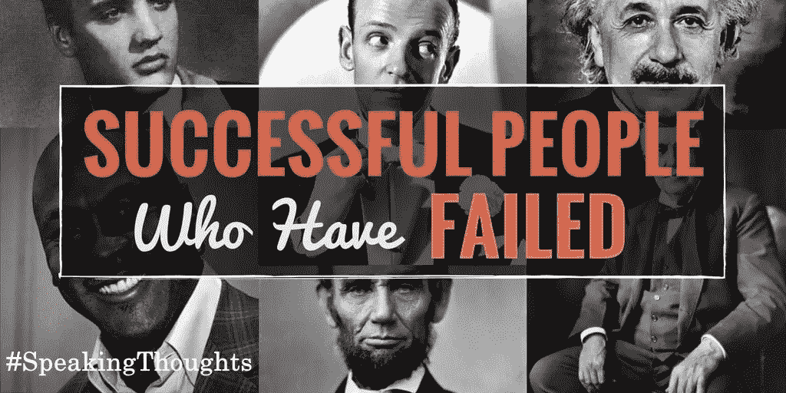

# 失败不是游戏的结束，而是一个过程

> 原文：<https://medium.datadriveninvestor.com/failure-is-not-end-game-but-its-a-process-46b803fdf4c1?source=collection_archive---------14----------------------->

我们接下来意识到的是失败。失败到底是什么？为什么成功需要失败？这个问题一直在我的脑海里漫游，它让我焦虑，因为我没有任何关于失败的答案给自己。所以我决定在这里反思一下。

无论我今天在哪里都是因为我的失败，无论我现在拥有什么都是我失败的结果。我很高兴我在许多事情上失败了，这使我变得坚强。是那些失败让我意识到我有多坚强，我有多大的勇气，我能做什么。所以我感谢我所有的失败和所有试图让我失败的人。

失败不是尴尬，而是骄傲，因为你尝试了一些事情，迈出了第一步。

我们经历过、了解过、听说过成功是暂时的，但失败是永久的。无论我们做什么，都无法避免。我们将不得不失败，事情就是这样。失败只是一次经历，它将伴随我们一生。作为一个婴儿，当我们开始学习说话或尝试走路时，我们面临着许多尝试的失败。我们第一次去学校学习生活的基本知识时，我们面临着失败。我们每个人都可能在生活、人际关系、家庭、工作、商业、学校、大学、创业中失败过，这样的例子不胜枚举。

我们不可能不失败就做新的或创新的事情。失败是一个学习的过程，是一系列寻找正确的方法来获得成功的步骤。我们尝试，我们失败，我们尝试，我们再次失败，这就是我们如何在失败中学习和建立这个美丽的世界。我们需要理解和认识到，如果不完成这个过程，我们就不可能成功，失败也是这个过程的一部分。

我们人类在面对成千上万的失败和几次创新失败的人后，建立了这个美丽的数字世界。无论是安德森、阿尔伯特·爱因斯坦还是史蒂夫·乔布斯，他们都面临过严重的失败，但他们在失败中不断学习，最终找到了正确的方法。

失败并不是游戏的结束，而是一个学习找到正确或隐藏的方法让它发生的过程。它将继续下去，并伴随着许多失败的实验。

这是人类的心理，我们被植入和训练精神上和情感上的胜利。所以我们总是觉得赢了就完事了。甚至我们的血液循环也是为了胜利。事实上，你不可能不失败就赢，因为失败是一个过程。我们每个人都想赢；我们为胜利而战，我们为胜利而玩，我们为胜利而学习，我们为胜利而工作。这就是我们试图避免失败的地方。实际上，我们失败了。胜利只不过是面对新挑战的一步。

然而，为了成功或尝试新事物，为了创新，我们需要拥抱失败，从失败中学习，不要放弃，因为失败是一个过程，而不是结果，失败是永久的，我们将在一生中面对失败，我们不能不失败就成功，所以做好准备，体验它，因为这是唯一的感觉，它会让你意识到你有多强，你可以走多长的路。接受失败是非常困难的，但是你必须接受，因为如果你不能接受失败，你也不能接受成功。成功没有捷径，你必须经历这个过程。

我想看到这样一个世界:我们依恋失败，准备好失败，并从别人的失败中吸取教训。不如，我们不读成功的故事，而是读失败的故事，来学习他们是如何克服的。我们不是为成功做准备，而是为失败做准备；我们不是为胜利做计划，而是为失败做计划。我们不是询问成功的秘诀，而是关注失败的秘诀。失败比成功更重要，因为它让我们更接近自己的欲望。

失败是走向成功的一步，所以为了成功，你需要失败，事情就是这样。