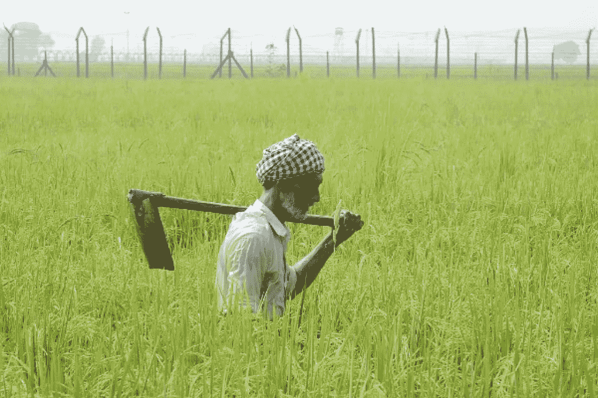

# 决策者未能解决印度农民的困境

> 原文：<https://medium.datadriveninvestor.com/failure-of-policy-makers-to-address-woes-of-indian-farmers-78e55a8497e9?source=collection_archive---------30----------------------->

近年来，为解决印度农民问题而采取的主要政策干预围绕着以下几个方面:

1.  **农业贷款豁免**
2.  **麻省理工学院**
3.  **现金转账**

> 这两项政策的问题在于，它们将整个农业社区(大/小，男/女)视为同质的，这在印度几乎是不可能的。这种非同质性基本来自于***收入、土地所有权和性别*** 。对于小农场主和富裕的大农场主来说，困境的故事是完全不同的，他们也不满意，但在政治上更有发言权。碰巧[自杀的主要部分](https://www.google.com/url?sa=t&rct=j&q=&esrc=s&source=web&cd=5&cad=rja&uact=8&ved=2ahUKEwjF1sXr2fXfAhUCWX0KHdfeAAQQFjAEegQIBhAC&url=https%3A%2F%2Fmpra.ub.uni-muenchen.de%2F35675%2F1%2FMPRA_paper_35675.pdf&usg=AOvVaw01sTmLovtp1EKoHdMYW5h2)是小而苦恼的农民

首先让我们谈谈农场贷款豁免。我们时代的大多数经济学家都认为这是个坏主意。此外，最近的一份报告显示，除了少数几个州，没有一个州有财政实力资助这些豁免。但是我们一次又一次地看到政府宣布这样的措施。但这不是主要问题，主要问题是这些豁免的范围，这只是 20-25%的农民可以获得机构信贷系统，因为该国大多数农民仍然主要通过非正式渠道获得贷款，或者根本没有获得信贷。当大多数人无法获得银行债务时，拥有银行债务本身并不是困境的标志。主要是小农户依赖私人借贷来源，他们的贷款不会被免除。

其次，提高最低支持价格将有助于生产过剩农产品的农民，而不是农产品的净购买者，如边际农民和农场工人。一份 IIM 报告显示，只有很小一部分销售的农作物(小麦，大米)被小农场主卖给了政府机构。因此，这无疑提出了提高价格来帮助小农户和边缘农户的有效性问题。

现在是以土地所有权为基础的直接现金转移。许多州，如 Telengana、Orrisa，根据每季拥有的土地公顷数提供直接转让，这对印度农民的平均土地所有权来说是一个讽刺。更大的问题是，提供的钱是按家庭而不是按人发放的，因此完全忽略了妇女。

> 事实上，政策制定者完全没有认识到目前存在的家庭内部不平等，并且忽视了很大一部分女性农民，她们为受男性移民影响的农场贡献了主要的劳动力。据发现，T2 的女农民自杀率一直在上升。

# 解决方案:

为了解决这种情况，政策制定者必须使用多维度的长期政策，而不是短期的民粹主义措施，如果情况需要长期改善，而不是单一的解决方案。

即使在 70 年后，只有不到一半的可灌溉土地通过可持续措施得到灌溉，如运河灌溉，而不是已经发生的是，国家已经促进了地下水的使用，这从长远来看是非常有害的。在主要的农业邦旁遮普，由于邦政府为灌溉提供免费电力，地下水指数下降了 2.3 英尺/年。

> “问题的核心仍然是，农民平均拥有的土地非常少，以至于他们几乎不可能为自己赚取任何可持续的利润”[。](https://www.google.com/url?sa=t&rct=j&q=&esrc=s&source=web&cd=2&cad=rja&uact=8&ved=2ahUKEwizqbu66fXfAhVUXisKHbBtAfQQFjABegQIChAC&url=https%3A%2F%2Fwww.theigc.org%2Fwp-content%2Fuploads%2F2014%2F08%2FAndrew-Foster-Farm-Sizes.pdf&usg=AOvVaw0NV26sYWOeoypLvkxKlcxp)

我们能做的是鼓励农民集中他们的土地和资源，我们看到政府在这方面采取了积极的措施。一直发现平均回报几乎翻倍。他们还能从正规贷款系统获得资金，而不是依赖收取极高利息的放债人。群体也可以减少农民孤立和自杀的机会