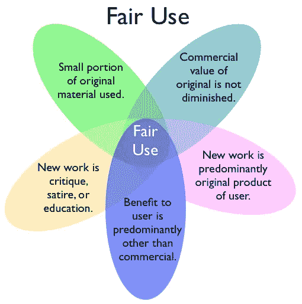
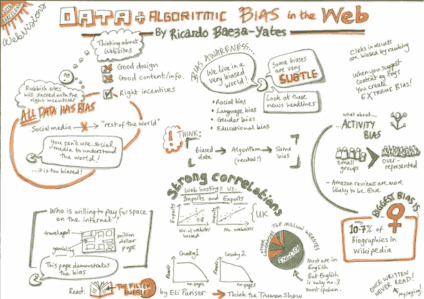

# 合理使用——为人工智能算法制定法律的迫切性

> 原文：<https://medium.datadriveninvestor.com/fair-use-and-ai-87f77721f1ea?source=collection_archive---------5----------------------->

## 合理使用和人工智能可能是美国法律体系在人工智能政策中最需要解决的紧迫问题——以下是 3 个原因

[https://www.resourcesforlife.com/docs/item6247](https://www.resourcesforlife.com/docs/item6247)

*(注意:我写这篇“第一次尝试”的文章，是为了在我浏览有关合理使用和人工智能的文献时表达我的想法)*

## 什么是合理使用和人工智能？

合理使用和人工智能涉及消费第三方版权数据的商业算法的法律性质。关于该主题的良好入门，请阅读 Engadget 文章“[现代版权法跟不上思维机器的步伐](https://www.engadget.com/2017/12/13/copyright-law-AI-robot-thinking-machines/)”和哈佛法律学者 Ben Sobel 在“[合理使用和表达性机器学习的困境](http://www.ip-watch.org/2017/08/23/dilemma-fair-use-expressive-machine-learning-interview-ben-sobel/)”中的采访。

**合理使用和 AI** **的核心问题是** **算法是否可以在未经版权作品作者许可的情况下合法使用这些作品——如图像、文本或音频。**这是一个需要解决的重要问题，因为:

1.  目前还不清楚在数以千计的创意作品上训练的 AI 算法如何从功能上请求数以千计的作者的许可。
2.  目前还不清楚如何定义和监管算法从作品中消耗的数据量。
3.  尚不清楚某些类型的数据是否比其他类型的数据更允许算法使用。
4.  什么定义了由人工智能算法产生的创造性作品在本质上是否是“变革性的”，因此有资格获得合理使用？

如果你在挠头问“*一个 AI 算法产生的创意作品是什么？*”，答案是它可能是任何使用数据制作的软件。因此，它的范围可以从 [Gmail 的垃圾邮件过滤器](https://techcrunch.com/2017/05/31/google-says-its-machine-learning-tech-now-blocks-99-9-of-gmail-spam-and-phishing-messages/)，到用于[识别人脸进行监控的软件](https://www.youtube.com/watch?v=K4u4Dpl6NKk)，到控制脸书和推特上危险内容分发的[算法](https://www.theguardian.com/technology/2014/aug/28/algorithms-google-facebook-censorship)，甚至是像“[深度人工树](https://www.engadget.com/2017/04/06/ai-on-joy-of-painting-on-lsd/)这样的可怕艺术项目。艺术家亚历山大·雷本利用画家鲍勃·罗斯的几十个版权视频制作了这幅作品。

希望这个视频没有吓到你…但问题的关键是，立法者现在迫切需要解决这些问题，因为从计算机视觉到自然语言处理，再到语音识别，人工智能算法的发展都依赖于越来越多的数据。令人不安的是，今天网络上大多数新的和可用的数据都是由谷歌和脸书管理的，它们根据自己的服务条款拥有不受限制的使用权。

因此，**在人工智能政策的话题中，**我认为**合理使用是当今美国法律体系最可解决和最紧迫的问题**。

以下是三个原因:

## 现有的法律判例可以指导合理使用和人工智能

今天，有几个法律先例指导法律如何解释第三方数据的使用。其中最著名的案例是[作家协会诉谷歌](https://en.wikipedia.org/wiki/Authors_Guild,_Inc._v._Google,_Inc.)和[凯利诉阿里巴软件公司](https://en.wikipedia.org/wiki/Kelly_v._Arriba_Soft_Corp.)，这两起案件帮助定义了搜索引擎的合理使用。为了将这种解释扩展到合理使用和人工智能，立法者只需要定义什么类型的数据是允许人工智能算法消费的，以及什么使人工智能算法产生的创造性作品具有“变革性”。

screenshot from Google Books

## 定义合理使用和人工智能没有定义算法偏差或责任复杂

与人工智能政策的其他主题相比，合理使用和人工智能的监管是一个更容易解决的问题。这是因为对于立法者来说，权衡算法偏差或责任等问题可能太复杂或太早。这是因为立法者和计算机科学家都无法就什么是“可接受的”与“令人反感的”算法偏差达成一致，也无法定义自我学习算法的责任。这一说法得到了 2018 年 11 月 FTC 关于人工智能的听证会的支持，来自戴维斯、赖特和特里梅因·LLP 的一名记者[写道](https://www.dwt.com/FTC-Hearings-Exploring-Algorithms-Artificial-Intelligence-and-Predictive-Analytics-Focus-on-Notions-of-Fairness-Transparency-and-Ethical-Uses-12-03-2018/):

> …在人工智能的背景下定义…[无偏见决策]是困难的，因为人类的行为经常是矛盾的。这提出了一个问题，即人工智能开发人员是否应该根据特定个人、个人子集或整个社会的期望和规范来校准结果……小组成员承认，一旦公平被定义，在机器学习环境中应用该定义可能会带来权衡。例如，为了公平而优化可能会以牺牲准确性为代价，反之亦然。鉴于这些固有的矛盾，专家组一致认为，目前不宜通过专门针对人工智能的法律和法规。

by Ricardo Baeza-Yates

## 不定义合理使用和人工智能可能会导致技术垄断的延续

如果不定义合理使用和人工智能，今天的科技巨头在未来将继续垄断。这是因为那些原本会使用谷歌图片或脸书对话等第三方数据的初创公司回避了这个机会，因为法律尚未定义什么样的数据和创意作品是合理使用。因此，**这将未来人工智能技术的发展留给了世界各地的谷歌和 Facebook，他们拥有自己的海量数据集，可以在这些数据集上合法地训练人工智能算法**——见下面**的脸书服务条款。因此，在立法者定义合理使用和人工智能之前，现有的垄断企业将继续受到保护，免受新市场进入者的影响。**

摘自[脸书的服务条款](https://www.facebook.com/terms.php):

> …当您在我们的产品上或与我们的产品相关的内容上共享、发布或上传受知识产权保护的内容(如照片或视频)时，您授予我们非排他性的、可转让的、可再许可的、免版税的和全球性的许可，以托管、使用、分发、修改、运行、复制、公开执行或展示、翻译和创作您的内容的衍生作品…

by [Crystal Gibson](https://mashable.com/2010/08/09/social-media-monopoly/#1uXauS3fHOqg)

# 界定合理使用的紧迫性，即“尽快”

由于这三个原因，立法者迫切需要定义什么是合理使用和人工智能。这不仅是人工智能政策中最容易解决的问题，也是确保人工智能技术未来市场自由竞争的最重要问题之一。

如果你对这篇文章有任何问题或反馈，请在下面的评论中分享。我期待着与所有写作的人积极接触。

谢谢，

亚当·沃克