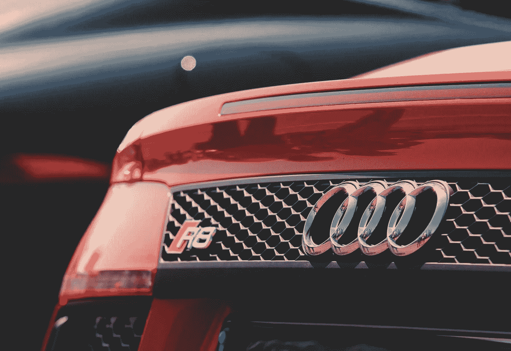
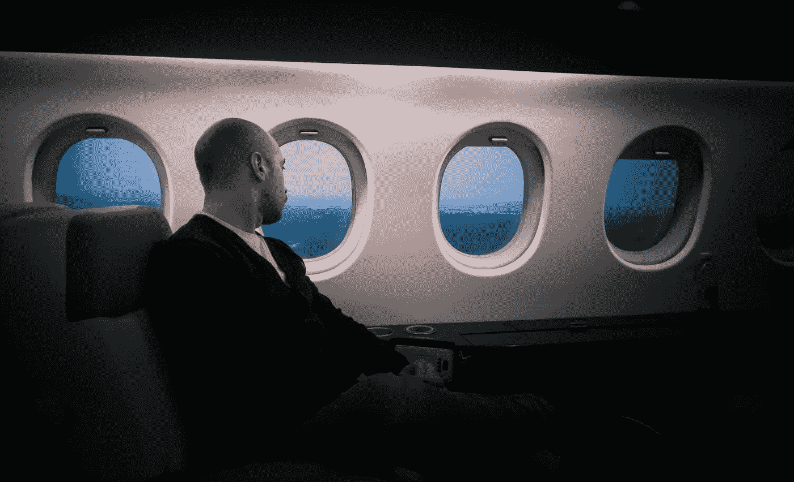

# 假装它直到你成功…它真的有用吗？

> 原文：<https://medium.datadriveninvestor.com/fake-it-till-you-make-it-does-it-actually-work-e716f542739a?source=collection_archive---------14----------------------->

韦斯·安东内尔。魅力蔻驰，老兵，电子游戏呆子。

**“假装直到你成功”真的有用吗？是…也不是。嗯，这很复杂。**

我最近认识了一位新朋友，他是一家非常成功的全国性营销战略公司的首席执行官。让我们叫他“乔”和我一样，Joe 是一名退伍军人，服完兵役后被创业所吸引，因为它的挑战和回报。

乔来找我，通过我的魅力教练来提高他的人际交往能力，在我们的咨询会议上，我想知道他的所有背景:他是如何在短短两年内建立起一个数百万美元的企业的？他是如何度过“死亡之谷”的，即早期 90%的初创公司倒闭的时期？

最重要的是，他是如何赢得那些至关重要的早期首批客户的？

他的回答令人震惊:在他创业的前 6 个月，他代表他的公司比实际要大得多。但他并没有就此止步。乔赊账给自己买了一辆 8 万美元的奥迪，花了毕生积蓄买了劳力士手表和 1000 美元的西装，坐头等舱，住最好的酒店。乔承认他喜欢从别人那里得到的关注，但在内心深处他感到空虚。

经过更深入的思考，Joe 承认他的第一批客户实际上并不是来自于他的公司正在蓬勃发展的感觉。他坦率地承认，这是 6 个月 80 小时的工作周，他花了大部分精力来确保他的业务基本面是健全的。

事实上，乔说他的第一个真正的大客户，那个让他出名的客户，完全是靠运气找到他的！

**“伪装”的正确方法**

多亏了社交媒体，我们中的许多人很容易就能创造出一个理想化的自己，让世界看到。想要变得更好绝对没有错，然而，当我们完全欺骗时，尤其是在商业环境中，我们会越过一条道德线。

那么，什么时候“假装”而不显得虚假或不真实才是合适的呢？

表现得“好像”是心理治疗中的常用药方。它基于这样一个想法，如果你的行为像你想成为的人，你就会在现实中变成这样。

在人际指导、自信和魅力的世界里，假装真的有用，我鼓励这样做。毕竟，2013 年《个性与社会心理学杂志》发表的一项研究表明，在群体动力学中，早期的自信会自我强化。

这样想:如果你在一个团体环境中缺乏自信，以一种显示权威的姿势站立或使用自信的肢体语言交流不仅会让你内心更加自信，还会在外表上表现出自信。

这就形成了某种积极的循环。我们的肢体语言支配着我们对自己的思考和感受。哈佛商学院社会心理学家 Amy Cuddy 在她广为宣传的 2012 年 TED 演讲中分享了她的发现，即采取有力的姿势可以影响你的身体化学。她发现，保持力量姿势的人表现出压力荷尔蒙皮质醇的减少和睾丸激素的增加，睾丸激素是一种与控制力和自信有关的荷尔蒙。

当我指导客户魅力和成为一个吸引陌生人的人时，我的处方有三个:每天三次自信、热情和谦逊，早上给我打电话。其中的两个，自信和热情，是可以伪装的，直到你开始用这些技能培养真正的才能。

可惜，谦逊是装不出来的，也不应该装出来。魅力和自恋之间的强烈重叠意味着魅力很容易变成傲慢和权利。谦逊是你抵消自信并防止它变成傲慢所需的平衡。幸运的是，谦虚很容易。总有一些人更强壮，更快，更有钱，床上功夫更好，等等。

无法假装谦卑，试试这个。据[卧底招聘人员](https://theundercoverrecruiter.com/turning-down-your-charisma/)称:

1.  关注他人:齐心协力认可团队成员和下属的成就。他们会因此而爱你…
2.  增强自我意识:积极尝试了解自己的局限性，并愿意承认自己的错误。
3.  虚心接受反馈:谦逊的标志是可以接受指导，这意味着接受批评，并接受你的方式不是唯一的方式。
4.  检查你的权利感:努力赢得同事的尊重，不要自动假设因为你有三个博士学位，你就自动有权获得。
5.  监控你的自我推销行为:把注意力放在努力相处上，而不是获得成功上。我们都知道，我们办公室里有一个人是个明显的自我推销者。不要成为那样的人。

最终，“假装”可能是你寻求自我提升的一个关键因素。成功地参与实现与他人的关系*创造*机会。但它有其局限性。在商业环境中歪曲自己接近欺诈，尤其是如果你用欺骗来获得一个需要更高水平合作伙伴的客户或合同。

至于乔，一个天生热情的人，他在魅力教练方面取得了巨大的进步。他注重谦逊以及与朋友、家人和客户的真实关系，这意味着他不再需要名车和金表了。但是他确实承认他仍然坐头等舱，因为，让我们面对现实吧…飞行糟透了。

