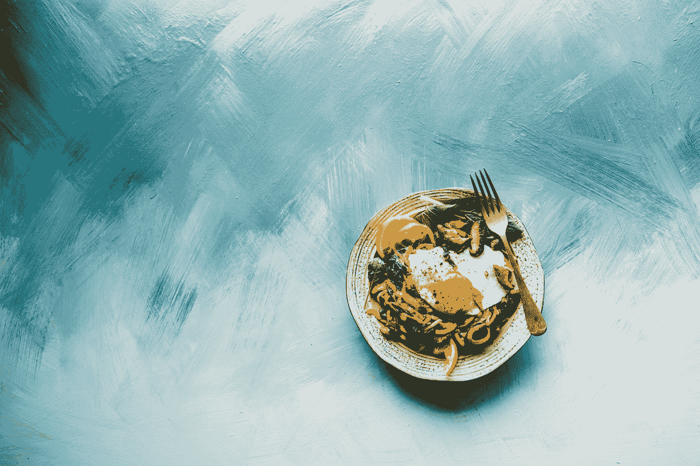

# 如何从假稀缺中获利

> 原文：<https://medium.datadriveninvestor.com/fake-scarcity-441bd4fa4f97?source=collection_archive---------17----------------------->

Photo by [Brooke Lark](https://unsplash.com/@brookelark?utm_source=medium&utm_medium=referral) on [Unsplash](https://unsplash.com?utm_source=medium&utm_medium=referral)

当人们想到经济学时，他们会想到研究金钱。然而，经济学并不仅限于此。经济学研究(稀缺)资源的划分。因此，资源的匮乏是经济学中一个非常有趣的话题，但它远远超出了金钱的范畴。

想象你在一家餐馆里。你正在看菜单，试图决定吃什么。然后你的目光落在“特价商品”上只有这家餐馆做的菜，在别的地方吃不到。或者供应、数量或时间有限的菜肴。你今天可以吃小牛肉，但明天不行。

 [## 2019 年值得关注的 20 种数字营销趋势和技术|数据驱动的投资者

### Faisal 在加拿大工作，拥有金融/经济和计算机方面的背景。他一直积极从事外汇交易…

www.datadriveninvestor.com](https://www.datadriveninvestor.com/2019/02/04/20-digital-marketing-trends-techniques-to-watch-out-for-in-2019/) 

让我给你第二个场景。一加是一家中国智能手机供应商，大约五年前发布了第一款手机 OnePlus One。虽然这些规格都列在他们的网站上，并向所有人开放，但该公司并没有什么真正的优势。智能手机市场竞争激烈，已经接近饱和。如果你想进入，你需要与一个大写的“c”竞争。现在，一加可以使出浑身解数:最好的规格，明星代言，在线营销(阅读:垃圾邮件)。但是没有，他们没有用它把我们都打死，而是只给了少数人。一加的发行数量有限。不仅如此，只有第一批购买了手机的人才能向最多三个人发出购买手机的邀请。没有邀请，没有电话！

一加的策略可能看起来与我们习惯的激进营销策略极其相悖。然而，从行为经济学的角度来看，这很有意义。以餐馆为例，当一种产品或服务带有紧迫感或独特性时，人们会更想得到它。人们会经历严重的 FOMO:害怕错过。这是一个巨大的决策驱动力。对许多人来说，害怕可能错过一些伟大的东西是太多了。这是一种确保我们永远不会面对另一个人说:“不，我没试过。”他们回答说:“太遗憾了，这是我经历过的最好的事情。”对许多人来说，那时所经历的负面感觉往往是难以承受的。

让排他性影响我们的决策不一定是一个问题。在餐馆的例子中，理由是你可以随时回来尝试另一道“标准”菜肴。这是一个完全正确的推理，如果你打算或可能会回到餐馆。如果这道菜真的是独家的，因为通常，这只是另一种营销策略。我怎么知道这个？斯洛文尼亚卢布尔雅那的一名服务员告诉我，他工作的餐馆已经提供“独家”小牛肉五年了。那不是他们随便告诉我们的，游客！

当谈到谈判策略时，紧迫性可以决定一笔交易的成败。我曾经听说过一个人试图卖掉一辆汽车的故事。他把它发布在网上，有需求，人们想来看车。他为人们设计了看车的时段。关键是，他计划的时间有一点重叠。当一个人在他们的约会结束时，权衡“体验”汽车的成本和收益，下一个人就会出现。两个可能的新主人将会见面。他们会意识到另一个人在争夺他们想要的东西，或者至少是他们认为想要的东西。人类是好胜的。成为这辆车的新主人几乎是一场竞争。“有很多需求”这句话，如果你真的能看到需求，效果会更好。在你面前，检查什么是你的车。突然，在你头脑中还没有完全构想出这个概念的情况下，你正在和前任车主握手，确保你先到达车旁。傻逼。

我并不讨厌这个策略。我喜欢它。如果我不是那么优柔寡断的话，天知道我会有多难受！谁会想到那会是一项资产呢？！不管怎样，这个策略奏效了。一加发布了一加 Six，它和之前的手机一样成功。它已经成为智能手机市场的一个重要竞争对手。说实话，除了最初的排他性，这是一个很好的品牌，定价非常有竞争力，所以它的成功并不太牵强。但是最初的邀请系统给了这款手机制造影响所需要的宣传。这足以让一加脱颖而出，给它一个坚实的开端。请鼓掌。

从公司到消费者:让我们再次关注你。当人们试图向你推销有时间限制的东西时:“现在买，明天交易就结束了”，或者排他性:“我们只卖 100 件商品。立即购买，成为少数幸运儿之一！”你可能想对此半信半疑。大多数时候，这只是营销策略。仅此而已。如果我现在回到卢布尔雅那，那份小牛肉还会在菜单上。诚然，我真的很喜欢它。在你问之前，是的，我有一部一加手机，我也很满意。我会在这个品牌呆上一段时间。我从没说过我对这种把戏免疫。我也是，开玩笑，想成为少数幸运儿之一！

*你可以找到这篇文章中使用的参考资料，以及更多关于* [*【金钱上的头脑】*](https://www.moneyonthemind.org/blog) 的精彩文章