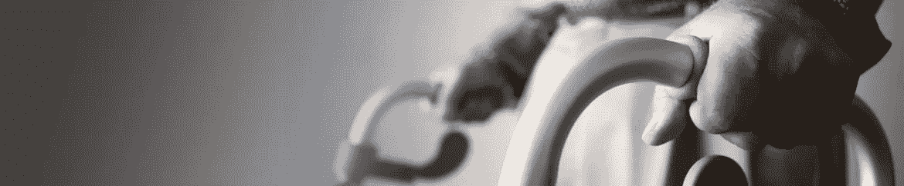
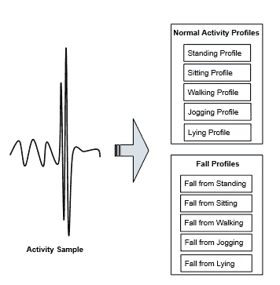
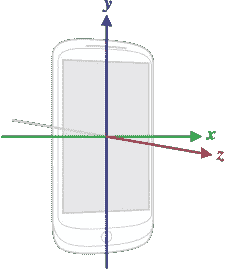
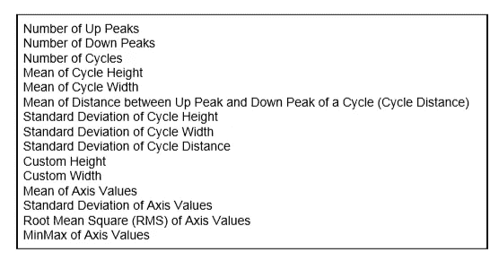
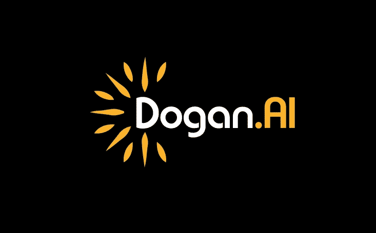

# 跌倒跟踪:使用智能手机进行自动跌倒检测

> 原文：<https://medium.datadriveninvestor.com/falltrak-automatic-fall-detection-using-smartphones-f9ae1dd3c35f?source=collection_archive---------3----------------------->

跌倒是老年人受伤和住院的主要原因。据估计，75 岁以上的老人住院和独立生活的跌倒发生率每年至少为 30%。根据疾病控制和预防中心的数据，每年有 280 万老年人因跌倒而在急诊室接受治疗。五分之一的此类跌倒会导致严重伤害，如骨折或头部受伤。跌倒的后果很大程度上取决于跌倒后人保持独立的时间间隔。跌倒检测问题的传统解决方案包括为人们提供个人应急响应系统(PERS)，这是一种小型、轻便、电池供电的设备，带有老年人可以携带的“帮助”按钮。然而，问题是它需要用户按下“帮助”按钮，如果受害者失去知觉，这可能是不可能的。因此，有必要建立一个能够自动检测跌倒并发出求助请求的系统。根据爱立信移动报告，到 2020 年，全球智能手机用户将达到 61 亿。这意味着几乎每个人都将携带智能手机，其中包括大量老年人。如果智能手机包含跌倒检测系统，老年人就不需要像 PERS 那样购买和携带额外的设备。当检测到有人跌倒时，智能手机可以自动向紧急联系人发送信息。下面的图 1 显示了我们的模型如何从智能手机获取传感器数据，并将其转换为不同的活动配置文件。

Fig. 1: Creating normal activity profiles and fall profiles from activity samples.

我们收集了 10 名用户的正常活动和跌倒数据。我们创建了一个用于数据收集的 Android 应用程序。LG Nexus 5 手机用于从五个传感器收集数据:加速度计、陀螺仪、磁力计、线性加速度和重力。Android 传感器数据是沿着三个轴获得的:X、Y 和 z。图 2 显示了 Android 传感器 API 使用的坐标系。

Fig. 2: Three axes of an Android device used by the Sensor API. Source: [https://source.android.com/](https://source.android.com/).

我们使用从五个传感器收集的数据评估了我们的两步跌倒检测方法:加速度计、陀螺仪、磁力计、线性加速度和重力。我们试验了五种机器学习分类器，即支持向量机(SVM)、K 近邻(KNN)、朴素贝叶斯(NB)、决策树(DT)和随机森林(RF)。为了训练分类器，我们结合了传感器所有三个轴的特征:X、Y 和 Z。因为我们从传感器的一个轴提取了 15 个特征，所以训练样本由 45 个(3*15)特征组成。类似地，我们的传感器测试样本也由 45 个特征组成。下面的图 3 显示了从每个轴提取的 15 个特征。

Fig. 3: List of Features.

对于每个传感器，我们使用 60%的数据进行训练，其余 40%的数据进行测试。我们提出的跌倒检测方法首先执行多类分类，然后将多类预测转换为二元决策(跌倒或非跌倒)。我们进行了一系列初步实验，以确定多类别分类的适当类别。用户可以通过智能手机使用这个[应用](https://github.com/doganai/Android-Sensor-Collection)快速开始收集传感器数据。收集完数据后，他们可以获取原始数据并在 FallTrak [存储库](http://www.falltrak.com)中运行 *main.py* 。

 [## 不管准备好了没有，革命就在我们面前|数据驱动的投资者

### “对于技术如何影响我们的生活和重塑经济，我们必须形成全面的全球共识……

www.datadriveninvestor.com](https://www.datadriveninvestor.com/2019/02/12/ready-or-not-the-revolution-is-upon-us/) 

**App:**[https://play.google.com/store/apps/details?id=com.fall.track](https://play.google.com/store/apps/details?id=com.fall.track)

**研究论文:**[https://ieeexplore.ieee.org/document/8784089](https://ieeexplore.ieee.org/document/8784089)

**多安 AI** 为全球客户提供**机器学习咨询**。如果您对实施人工智能感兴趣，请不要犹豫[联系我们](http://www.dogan.ai/)。

电子邮箱:john@dogan.ai

网址: [www.dogan.ai](http://www.dogan.ai/)

