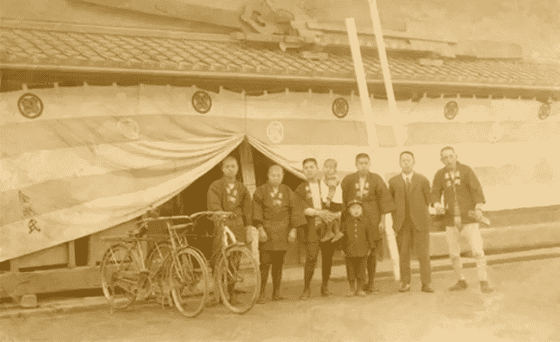

# 家族企业，家庭危机

> 原文：<https://medium.datadriveninvestor.com/family-business-family-crisis-c7cd6148ac37?source=collection_archive---------17----------------------->

理查德·沃尔曼博士和 T2 博士克里斯·梅里特博士

## 为什么六分之五的家族企业在第二代就失败了？

我们分三个部分来探讨家族企业转型的话题。首先，我们阐述了家族企业享有的独特优势，并描述了它们对家族企业取得**成功**的贡献。接下来，我们来看看这些因素是如何损害家族企业的，如果不加以控制，会把它推向失败的边缘。最后，我们描述一个管理家族企业**过渡**的流程。这提供了一个三步“医疗”模式:评估、诊断和干预。我们相信，这种方法不仅能让你的家族企业存活到下一代，还能让它成为兴旺发达的精英群体。

# **1:家族企业成功的原因**

## 关系是相对优势的关键

如果你住在日本，需要修复一座寺庙，你可能会相信谷米孔株式会社的服务。它成立于近 1500 年前，所以如果它今天还在运行，那么它一定是在做正确的事情。孔谷米被认为是世界上最古老的持续经营的企业。而且，像许多古老的公司一样，它是由一个家族经营的。

历史悠久的家族企业在全世界都受到尊敬。国际 Hénokiens 协会汇集了近 50 家欧洲和日本的家族企业，这些企业都经营了 200 多年。其专属成员涵盖从手工生产者、重工业到私人银行等各种行业。

但是家族企业不仅仅是一种古老而普遍的现象。它们占西欧 GDP 的三分之二，占美国 GDP 的一半。美国学者 Anderson 和 Reeb 对标准普尔 500 公司的一项研究发现，平均而言，它们的表现优于非家族竞争对手。从统计数据来看，资产回报率更高，家族企业的资产市值(托宾 q 值)高出 10%。这种较高的性能有一个显而易见的原因:人。

Kongo Gumi Ltd in Japan is the world’s oldest continuously-operating firm, and a family business

在家族企业中，商业伙伴也是亲戚。这意味着两种主要的人际关系——交换关系和公共关系——在家族企业中共存。在公共关系中，选择不是为了利润最大化。心理学家玛丽琳·加涅(Marylène Gagné)描述了家族企业决策为何会将福利置于金钱之上。这包括一个被称为社会情感财富(SEW)的价值指标:非经济效用，如家庭和睦、原则和声誉。

优先发展 SEW 改变了企业的行为方式。例如，路易斯·戈麦斯-梅希亚教授和他的同事回顾了 1200 家西班牙橄榄油生产商 50 多年的决策过程。他们发现，当被给予加入合作社的选择时，家族企业总是选择持续的独立而不是更高的收入。根据利润的逻辑，这些面向社区的战略可能显得次优。

然而，这样的决策并不自动意味着损失或失败。事实上，伦敦商学院的 Nigel Nicholson 认为，这种以家庭为导向的行为所创造的文化对商业非常有益。关系中嵌入的因素——如特殊知识、高社会资本和品牌认同——可以给家族企业带来竞争优势。

企业成为家庭、价值观和文化的一种表达。例如，正如投资顾问马克·丹尼尔所描述的，顾客和客户认为家族企业更值得信赖。此外，由于家族与公司密不可分，成员们在情感上融入公司，并关心建立和维护公司的声誉和遗产。没有人比创始人更投入感情。

佛蒙特大学的 Pramodita Sharma 教授描述了创始人在家族企业中扮演的关键角色。他们通常是勇敢的先锋和创新者。强大的心理纽带意味着创始人平均比非家族企业的高管多呆三年(17.6 年比 6.4 年，丹尼尔·麦康纳在对美国首席执行官的研究中发现)。尽管身处困境，他们还是经常做出更多努力，表现出持续的高水平精力和对公司未来的承诺。

Founders are pivotal to family businesses, going the extra mile because of strong psychological ties to the firm

能够在向规模化过渡的同时保持其价值观、精神和声誉的家族企业，可以在全球层面取得成功。宝马、三星、H&M 和路易威登都能够实现这种平衡。这些家族企业出现在所有主要行业的最佳表现名单上。但它们是成功的故事。

每一个利用竞争优势发展壮大的家族企业，都有两个失败了。正如家族企业专家约翰·l·沃德教授指出的那样，不到 30%的家族企业能活到第二代，而只有 13%能活到第三代。虽然家庭因素是一些企业取得非凡成功的原因，但同样的关系也可能是它们失败的原因。

这就是心理学的用武之地。

# **2:家族企业失败的原因**

## 个性和病态会把一个好生意变坏

20 世纪初，一个雄心勃勃的年轻意大利人在佛罗伦萨开了一家卖皮革制品的小店。生意兴隆，新的分店开张了。但是，不到一个世纪，古琦欧·古琦建立的公司就破产了。他的儿孙们互相争斗，密谋反对，挥霍了他的财富。这场悲剧的最后一幕发生在 1995 年，毛里齐奥·古驰被一名职业杀手杀害。在 Maurizio 剥夺了他的前妻 Patrizia 的企业继承权后，她被判犯有策划谋杀罪。今天，古驰家族不再经营这家公司；只有他们的名字流传下来。

这个故事看起来像是电影剧本中的情节。然而，除了致命的高潮，这是一个非常普通的家族企业的故事。尽管拥有相对优势，大多数家族企业很快以失败告终。根据家族企业专家约翰·l·沃德教授的研究，近 70%的家族企业在第二代时倒闭，到了第三代，只有 17%的企业幸存下来。为什么每六家家族企业中就有五家遭遇这种命运？

Family relationships can also be significant sources of tension in family businesses

答案在于他们关系的阴暗面。增强信任、声誉和情感投资的紧密关系也可能毁掉一家公司。商业决策通常会不公平地影响家庭成员，产生赢家和输家。离婚和再婚等家庭事件会对企业产生重大影响，分割资产或调整文化。古驰是一个悲剧性的例子，说明了这些后果会有多严重。

正如伦敦商学院(London Business School)的奈杰尔尼科尔森(Nigel Nicholson)所指出的，还有许多其他著名的家庭纠纷或“基因政治”案例，将公司推向了毁灭的边缘。当父权制创始人亨利·福特拒绝将权力移交给他能干的孙子小亨利时，福特汽车公司几乎倒闭。老亨利一直坚持经营到 82 岁，只是在他的持股儿媳埃莉诺发出最后通牒后才放弃控制权。

像亨利·福特这样的创始人在成功和失败中同样重要。魅力非凡的远见卓识者和敢于冒险的企业家在他们的公司规模小、灵活且可控的情况下表现出色。但转型——比如任命继任者或扩大规模——需要更强的责任感和专业精神，挑战创始人的权力。正如管理专家伊莎贝尔·勒布雷顿-米勒所说，适应新环境的能力至关重要。在这样的危机时刻，病理特征会出现。

冒险、交易和竞争精神都有阴暗面。心理学家保罗·巴比亚克和罗伯特·黑尔用“企业精神病患者”一词来形容那些兼具魅力和操纵能力的人，许多商业领袖都具备这两种特质。他们发现，在一个样本中，大约 4%的美国高管符合精神病患者的临床标准——这一比例是其他人群的四倍。“黑暗”人格特质可以在商业中适应——它们与韧性、决心和出色的交易结果相关联。但当创始人或其他关键家族成员在转型中受到挑战时，有毒特质可能会浮出水面，给公司带来严重破坏。

同样，创始人与其配偶、子女和兄弟姐妹的关系都有可能毒害一家家族企业。在依恋问题上可以发现警告信号:家庭关系的特点是养育还是怀疑？偏袒还是排斥？共存还是胁迫？无法将破坏性的个人情绪与逻辑决策分开的创始人可能会在心理上“陷入困境”——他们的身份与他们的业务密不可分。

Some founders find it hard to pass on the baton

即使在离开后，创始人也经常在场。耶鲁大学管理学院的 Jeffrey Sonnenfeld 绘制了创始人在公司的“影子”类型图。他采访了 50 位退休的首席执行官，发现退休的方式从良性的(亲善大使)到彻头彻尾的敌意(流亡的“将军”策划政变)。

因此，理解家族企业中的关键人物和关系对于衡量风险至关重要。评估家族文化和病理是投资者尽职调查的一部分。然而，为了更简单的性能指标，它通常被忽略。即使有了这些知识，干预本身也是一个挑战。

# **3。管理家族企业转型:三步指南**

## 继任是一个神话。成功的转变是真实的。

家族企业有机会获得巨大的成功，但也有很大的失败机会。家族关系给予公司相对于竞争对手的比较优势，但也可能是他们的毁灭。关键的转变点——比如创始人的退出、第二代家族成员的进入，或者私人股本参与的扩大规模——都有可能把好事变成坏事。数字不会说谎:70%的家族企业在第二代时就倒闭了。那么，公司和投资者如何最大化他们成功的机会呢？回答:通过应用三步计划来找到现有的弱点，并将其转化为优势。这些步骤遵循一个医学模型:1)评估；2)诊断；3)介入。

1.评估:首先，我们需要理解家族企业的“DNA”及其“基因政治”。家族和事务所是什么关系？谁是创始人，他或她的领导风格是什么？公司的关键价值观和原则是什么，它们是如何随着时间的推移而演变的？需要一种临床方法来绘制这些人为因素，其中对关键人员的深入访谈、家族病史和心理特征分析至关重要。这将告诉我们现在那里有什么，以及它是如何发展的。外部顾问最适合评估创始人和后代之间的爱恨情仇(IBM)、兄弟竞争(阿迪达斯)和对公司身份的不同看法(古驰)等特征。外人可以在复杂的家庭环境中看到更大的图景。

Careful assessment will map out the ‘gene politics’ present in a family business

2.诊断:第二，我们标记需要改变的内容。创始人和公司的关系中有哪些有害的人格特征和病态？危机来袭时会加深和分裂的断层线在哪里？我们需要找到减轻风险、重新定向和强化的方法，将负债转化为资产。这样的评估能够避免不合格的、不合适的家庭成员在 20 世纪 70 年代差点毁掉吉尼斯啤酒吗？

我们还需要决定什么不会改变。我们希望公司保留这种独特的家庭文化的哪些方面？我们必须提炼出每个家族企业的“精髓”——它的社会情感财富——以确保它在转型后仍然植根于企业之中。当路威酩轩集团接管酒庄时，它将贵族家族成员从董事会中剔除，但保留了他们 400 年酿酒传统的品牌。

3.干预:第三，我们制定变革蓝图。我们可能已经诊断出了病症，但如果认为我们可以改变(比如说)创始人的个性，那就错了。相反，我们需要改变他们周围的结构，以 a)保持他们独特的优势；和 b)最小化问题的潜在危害；同时 c)最大化扩展和繁荣的能力。这包括在以前创始人可能从未受到挑战的领域鼓励新思维，如产品创新或决策系统。

最常见的情况是，创始人需要放弃对公司的部分控制权。许多人认为这意味着单一的第二代家庭成员掌权。但是继任是一个神话。相反，大多数家族企业将需要过渡:将创始人的多重角色分开，并将它们分配给最适合这项任务的家族和非家族员工。一些家庭成员可能需要将他们的角色正式化。这可能需要重新分配资源，这可能会遇到阻力或引发冲突。

专业化和职业化为公司的精英管理铺平了道路。员工需要明确的角色、适当的培训、定期的绩效评估以及对努力和成功的奖励(奖金、晋升)。这里的清晰和结构将避免与独裁相关的裙带关系。但是，公司独特的家族因素(如价值观、身份)应该得到维护，并在整个公司内进行沟通。它们还需要反映在今天预期的环境和慈善活动的企业社会责任计划中。

这种三步模式可以适用于所有家族企业，尽管干预的精确公式在每个案例中会有所不同，因为每个家族都有自己独特的特质。这种大规模的变化可能会造成创伤，需要谨慎管理。理想情况下，干预应该发生在危机发生之前:死亡、离婚、冲突、失败。一旦损害已经造成，可能已经太晚了。家族企业为转型做的准备越充分，就越有可能成为幸存下来的少数派，并进入蓬勃发展的精英群体。

**家族企业:选择参考书目**

安德森，R. C .，& Reeb，D. M. (2003 年)。创始家族所有权与企业绩效:来自标准普尔 500 的证据。*《金融杂志》*，58(3)，1301–1328。

Babiak，p .，Neumann，C. S .，和 Hare，R. D. (2010 年)。企业精神变态:说到做到。*行为科学与法律*，28，174–193 页。

丹尼尔·汉密尔顿公司。家族遗产和领导力:在充满挑战的时代保护真正的家族财富。新加坡:约翰·威利的儿子们。

Gagné、p . Sharma 和 a . De Massis(2014 年)。家族企业中的组织行为研究。《欧洲工作和组织心理学杂志》，第 23 卷第 5 期，第 643-656 页。

戈麦斯-梅希亚，L. R .，海恩斯，K. T .，努涅斯-尼克尔，m .，雅各布森，K. J. L .，莫亚诺-富恩特斯，J. (2007 年)。家族企业中的社会情感财富和商业风险:来自西班牙橄榄油厂的证据。*行政科学季刊*，52，106–137 页。

戈登和尼科尔森(2008 年)。*家族战争:家族企业中的经典冲突以及如何应对*。伦敦:科根·佩奇。

勒布雷顿-米勒(2004 年)。有效 FOB 继承的综合模型。*创业理论与实践*，28(4)，305–328。

麦康纳博士(2000 年)。家族控制企业中的家族 CEO 与非家族 CEO:薪酬水平与绩效敏感度的检验。*家族企业评论*，13，121–131 页。

Sharma，P. (2004 年)。家族企业研究领域综述:现状和未来方向。*家族企业评论*，17(1)，1–36。

索南菲尔德，J. A .，&斯宾塞，P. L. (1989)。一家家族企业的离职族长。*家族企业评论*，2355–375。

沃德，J. L. (2011 年)。*保持家族企业健康:如何规划持续增长、盈利和家族领导力。纽约:帕尔格雷夫·麦克米伦。*