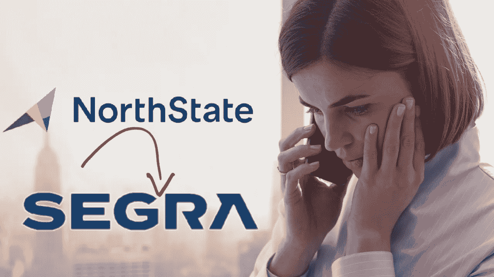

# 家族公司出售给企业收购方 Segra

> 原文：<https://medium.datadriveninvestor.com/family-company-sells-out-to-corporate-acquirer-segra-e16d4014748a?source=collection_archive---------3----------------------->

Photo by [Mario Caruso](https://unsplash.com/@giggiulena?utm_source=medium&utm_medium=referral) on [Unsplash](https://unsplash.com?utm_source=medium&utm_medium=referral)

# 为什么 North State 与 Segra 合并对股东来说是个好消息——但对工人和顾客来说可能是个坏消息

12 月 9 日，位于北卡罗来纳州海波因特的北方国家电信公司[宣布](https://myfox8.com/2019/12/09/northstate-will-be-acquired-by-segra/)已经同意与 MTN 基础设施公司的子公司合并，该公司与其他子公司一起以 Segra 的名义开展业务。这似乎是一个小型家族企业出售给大得多的企业的经典案例。像往常一样，有一个财务故事，一个工人故事，和一个客户故事。

# 金融故事:“我们有钱了！”

总部位于北卡罗来纳州夏洛特的 Segra 已同意以每股 80 美元的现金收购 North State 的 A 类和 B 类普通股，这比截至 12 月 6 日的收盘价分别上涨了 31.1%(A 类)和 34.5%(B 类)。这相当于约 2 . 4 亿美元的企业价值。

在我们看来，说 Segra 支付溢价收购 North State 是轻描淡写。他们出价过高，这解释了为什么 North State 的董事会一致同意收购。

# 工人的故事:“裁员与忠诚”

虽然 Segra 对 North State 的估值严重过高和薪酬过高的说法对 North State 的首席执行官和股东来说是好消息，但对 North State 的大约 400 名员工来说不太可能是好消息。很难想象未来几个月不会出现大规模裁员。正如 Investopedia.com:*的[所指出的，“从历史上看，合并往往会遏制失业。这主要归因于冗余操作和提高效率的努力。”](https://www.investopedia.com/ask/answers/041515/what-does-merger-or-acquisition-mean-target-companys-employees.asp)*

 [## 外汇投资如何帮助偿还债务|数据驱动的投资者

### 外汇是对外汇市场的投资，不同国家的货币在外汇市场上进行兑换

www.datadriveninvestor.com](https://www.datadriveninvestor.com/2019/02/13/how-forex-investment-helps-to-repay-your-debts/) 

在[卡罗莱纳数字电话](https://carolinadigitalphone.com/)，我们永远不会高兴看到任何人失业——不管他们是否为竞争对手工作。我们希望那些被解雇的人得到他们需要和应该得到的支持、培训和机会。我们还希望没有被解雇的北州员工能够经受住从一家家族企业(北州成立于 1895 年)转型为一家覆盖多个州的大型企业集团的压力和“文化冲击”。

具有讽刺意味的是，如果不是工人们的辛勤工作和奉献精神，北州立大学一开始就不会被 Segra 觊觎——更不用说被大幅高估了；这些人将来也会收到解雇通知书。

# 客户故事:“挫折即将来临”

同样令人担忧的是，此次收购可能会对 North State 在 High Point、Thomasville、Archdale、Randleman、Jamestown、Trinity、Greensboro 和 Kernersville 的客户产生影响。我们预计服务标准会有很大的变化——而且不会变得更好。

North State 专注于服务住宅和商业客户。Segra 专注于为运营商、企业、政府和医疗保健机构提供服务。事实上，很难相信在合并完成后(甚至之前),北州的新老板会提供同样的“小企业响应和关注”,这几十年来对北州的客户一直非常重要。North State 的住宅和商业客户可能会得到更多，而不是更少。

# 底线

虽然未来仍有待观察，但在我们 20 多年的业务中，我们已经多次看到这种情况在电信行业发生——通常唯一获胜的群体是金字塔顶端的那些人。对于敬业的员工和忠诚的客户来说，情况就大不一样了，也糟糕得多。不幸的是，我们预计同样的事情会在这里发生。

# 关于卡罗莱纳州数字电话:

[卡罗莱纳数字电话](https://carolinadigitalphone.com/businessvoip/)是[托管电话服务](https://carolinadigitalphone.com/local-service-provider/)的先驱，提供提高商业、教育和政府电话功能的产品，同时降低其总体成本。该公司的产品以其卓越的价值脱颖而出，包括极具竞争力的价格、业内最丰富的功能集、易于部署和许多用户友好的软件包，从包括拨号音和 VoIP 电话在内的完整交钥匙设置到可与现有座机、手机或 VoIP 电话配合使用的自动呼叫应答和路由解决方案。在 CarolinaDigitalPhone.com[了解更多信息](https://carolinadigitalphone.com/best-customer-service-for-hosted-voip-for-business/)