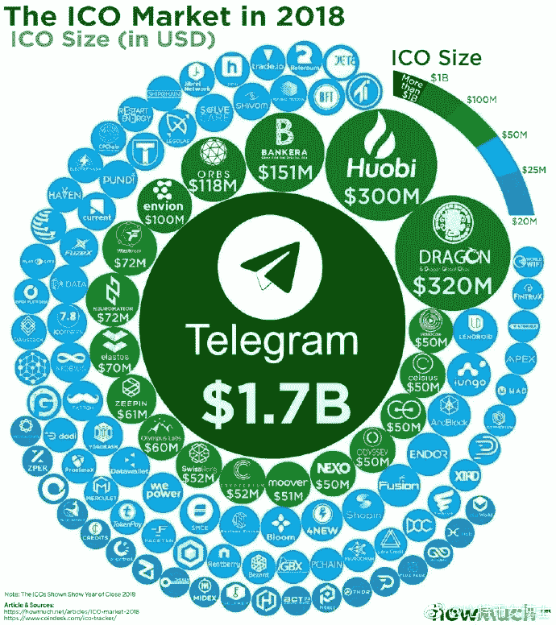

# 关于比特币的常见问题(1)

> 原文：<https://medium.datadriveninvestor.com/faq-about-bitcoin-1-e20ae7cc66c6?source=collection_archive---------11----------------------->

# **寻找关于比特币反复出现的问题和神话的答案。**

www.fmz.com

**通用**

**比特币是什么？**

比特币是一个共识网络，它实现了一个新的支付系统和一种完全数字化的货币。它是第一个分散的点对点支付网络，由用户驱动，没有中央机构或中间人。从用户的角度来看，比特币很像互联网的现金。比特币也可以被视为现存最突出的[三重分录簿记系统](http://financialcryptography.com/mt/archives/001325.html)。

**比特币是谁创造的？**

比特币是“加密货币”概念的首次实现。1998 年，戴伟在 cypherpunks 邮件列表上首次描述了这一概念，暗示了一种新的货币形式的想法，这种货币使用密码学来控制其创造和交易，而不是一个中央机构。2009 年，中本聪在一份加密邮件列表中公布了第一份比特币规范和概念证明。Satoshi 在 2010 年末离开了这个项目，没有透露太多关于他自己的信息。自那以后，随着许多开发人员从事比特币的工作，这个社区呈指数级增长。

Satoshi 的匿名经常引发不合理的担忧，其中许多与对比特币开源性质的误解有关。比特币协议和软件是公开发布的，世界各地的任何开发者都可以审查代码或制作自己的比特币软件修改版。就像现在的开发者一样，Satoshi 的影响仅限于他所做的改变被其他人采纳，因此他没有控制比特币。因此，比特币发明者的身份在今天可能与发明纸张的人的身份一样重要。

**谁控制着比特币网络？**

没有人拥有比特币网络，就像没有人拥有电子邮件背后的技术一样。比特币由全球所有比特币用户控制。虽然开发人员正在改进软件，但他们不能强制改变比特币协议，因为所有用户都可以自由选择他们使用的软件和版本。为了保持相互兼容，所有用户都需要使用遵守相同规则的软件。比特币只有在所有用户完全一致的情况下才能正常工作。因此，所有用户和开发者都有强烈的动机去保护这种共识。

**比特币如何运作？** [**FMZ**](http://www.fmz.com/)

从用户的角度来看，比特币只不过是一个移动应用程序或计算机程序，它提供了一个个人比特币钱包，允许用户用它来发送和接收比特币。对于大多数用户来说，比特币就是这样工作的。

在幕后，比特币网络正在共享一个名为“区块链”的公共账本。这个分类账包含了曾经处理过的每一笔交易，允许用户的计算机验证每一笔交易的有效性。每笔交易的真实性都受到与发送地址相对应的数字签名的保护，允许所有用户完全控制从自己的比特币地址发送比特币。此外，任何人都可以使用专门硬件的计算能力来处理交易，并通过这项服务获得比特币奖励。这通常被称为“采矿”。想了解更多关于比特币的知识，可以咨询[专用页面](https://bitcoin.org/en/how-it-works)和[原文](https://bitcoin.org/en/bitcoin-paper)。

**比特币真的有人用吗？**

是的。使用比特币的企业和个人越来越多。这包括餐馆、公寓和律师事务所等实体企业，以及 Namecheap、[Where Quality Costs](http://overstock.com/)和 Reddit 等热门在线服务。虽然比特币仍然是一个相对较新的现象，但它正在快速增长。截至 2018 年 5 月，所有现有比特币的[总价值超过 1000 亿美元，每天有价值数百万美元的比特币进行交易。](https://bitcoincharts.com/bitcoin/)

**如何获得比特币？**

作为商品或服务的报酬。

在[比特币交易所](https://www.buybitcoinworldwide.com/)购买比特币。

与你附近的人交换比特币。

通过竞技[挖矿](http://www.bitcoinmining.com/)赚取比特币。

虽然有可能找到希望出售比特币以换取信用卡或贝宝支付的个人，但大多数交易所不允许通过这些支付方式进行融资。这是由于有人用 PayPal 购买比特币，然后撤销他们的一半交易。这通常被称为退款。

**进行一次比特币支付有多难？**

与借记卡或信用卡购买相比，比特币支付更容易进行，并且无需商家账户即可接收。你可以通过电脑或智能手机上的钱包应用程序进行支付，只需输入收款人的地址、支付金额，然后点击发送。为了更容易输入收件人的地址，许多钱包可以通过扫描二维码或触摸两部带有 NFC 技术的手机来获取地址。

**比特币有什么优势？** [**FMZ**](http://www.fmz.com/)

***支付自由***——随时随地收发比特币成为可能。没有银行假日。没有边界。没有官僚主义。比特币允许用户完全控制自己的钱。

***自己选择费用***——收比特币不收任何费用，很多钱包让你控制消费时要交多大一笔费用。更高的费用可以促使你更快地确认交易。费用与转账金额无关，因此发送 10 万个比特币的费用可能与发送 1 个比特币的费用相同。此外，商家处理器的存在是为了帮助商家处理交易，将比特币转换为法定货币，并每天将资金直接存入商家的银行账户。由于这些服务基于比特币，因此它们的收费比贝宝或信用卡网络低得多。

***商家风险更小***——比特币交易安全、不可逆，不包含客户敏感或个人信息。这可以保护商家免受欺诈或欺诈性退款造成的损失，并且不需要 PCI 合规性。商家可以很容易地扩展到新的市场，这些市场要么没有信用卡，要么欺诈率高得令人无法接受。最终结果是更低的费用、更大的市场和更少的管理成本。

***安全与控制***——比特币用户完全掌控自己的交易；商家不可能像其他支付方式那样强行收取不必要或不被注意的费用。比特币支付不需要与交易相关的个人信息。这为身份盗窃提供了强有力的保护。比特币用户也可以通过备份和加密来保护他们的钱。

***透明中立*** - [所有关于比特币货币供应本身的信息](https://live.blockcypher.com/btc/)在区块链上随时可供任何人实时核实和使用。没有任何个人或组织可以控制或操纵比特币协议，因为它是加密安全的。这使得比特币的核心因完全中立、透明和可预测而值得信任。

**比特币有哪些缺点？**

***接受度***——很多人还不知道比特币。每天，越来越多的企业接受比特币，因为他们想要这样做的好处，但这个名单仍然很小，并且仍然需要增长，以便从网络效应中受益。

***波动性***——流通中的比特币的[总价值](https://bitcoincharts.com/bitcoin/)和使用比特币的企业数量相比，仍然非常少。因此，相对较小的事件、交易或商业活动都会显著影响价格。理论上，随着比特币市场和技术的成熟，这种波动性将会降低。世界上从未出现过初创货币，因此很难(也很令人兴奋)想象它会如何发展。

***正在开发***——比特币软件仍处于测试阶段，许多不完整的功能正在积极开发中。正在开发新的工具、功能和服务，以使比特币更安全，更容易被大众使用。其中一些还没有为每个人准备好。大多数比特币业务都是新的，仍然不提供保险。总的来说，比特币还在走向成熟的过程中。

**人们为什么信任比特币？** [**FMZ**](http://www.fmz.com/)

对比特币的信任很大程度上来自于它根本不需要信任。比特币是完全开源和去中心化的。这意味着任何人都可以在任何时候访问整个源代码。因此，世界上任何开发者都可以验证比特币的确切工作原理。任何人都可以实时透明地查阅所有交易和发行的比特币。所有支付都可以在不依赖第三方的情况下完成，整个系统受到高度同行评审的加密算法的保护，就像那些用于网上银行的算法一样。没有任何组织或个人可以控制比特币，即使不是所有用户都可以信任，网络仍然是安全的。

**我能用比特币赚钱吗？**

你永远不要指望用比特币或任何新兴技术致富。对任何听起来好得不真实或违反基本经济规则的事情保持警惕总是很重要的。

比特币是一个不断增长的创新空间，有商业机会，也有风险。尽管比特币迄今发展速度非常快，但并不能保证它会继续增长。在任何与比特币相关的事情上投入时间和资源，都需要企业家精神。利用比特币赚钱的方式多种多样，比如挖矿、投机或经营新企业。所有这些方法都是有竞争力的，没有利润的保证。每个人都有责任对任何此类项目的成本和风险进行适当的评估。

**比特币是完全虚拟和非物质的吗？**

比特币就像人们日常使用的信用卡和网上银行网络一样虚拟。比特币可以像任何其他形式的货币一样用于在线支付和实体店支付。比特币也可以以实物形式进行兑换，比如 T4 德那利姆币，但用手机支付通常更方便。比特币余额存储在一个大型分布式网络中，任何人都无法篡改。换句话说，比特币用户对他们的资金拥有专属控制权，比特币不会因为是虚拟的就消失。

**比特币匿名吗？**

比特币旨在允许其用户在可接受的隐私水平下发送和接收付款，以及任何其他形式的金钱。然而，比特币不是匿名的，无法提供与现金同等水平的隐私。比特币的使用会留下大量的公共记录。各种保护用户隐私的机制已经存在，更多机制正在开发中。然而，在大多数比特币用户正确使用这些功能之前，仍有工作要做。

有人担心，比特币的私人交易可能会被用于非法目的。然而，值得注意的是，比特币无疑将受到现有金融系统内部已经存在的类似监管。比特币不可能比现金更匿名，也不可能阻止刑事调查的进行。此外，比特币还旨在防止大范围的金融犯罪。

**比特币丢失会怎样？** [**FMZ**](http://www.fmz.com/)

当用户丢失钱包时，会导致货币停止流通。丢失的比特币和其他比特币一样，仍然留在区块链。然而，丢失的比特币永远处于休眠状态，因为任何人都没有办法找到允许它们再次被使用的私钥。由于供求定律，当可用的比特币越来越少时，剩下的比特币将会有更高的需求，并通过升值来弥补。

**比特币能成为主要的支付网络吗？**

比特币网络已经可以每秒处理比现在多得多的交易。然而，它还没有完全准备好扩展到主要信用卡网络的水平。解除当前限制的工作正在进行中，未来的要求是众所周知的。从一开始，比特币网络的每个方面都处于一个不断成熟、优化和专业化的过程中，预计未来几年仍将如此。随着流量的增长，更多的比特币用户可能会使用轻量级客户端，全网络节点可能会成为更专业化的服务。更多细节，请参见维基上的[可扩展性](https://en.bitcoin.it/wiki/Scalability)页面。

未完待续。 [FMZ](http://www.fmz.com/)

最初发布于[Bitcoin.org](https://bitcoin.org/en/press)。