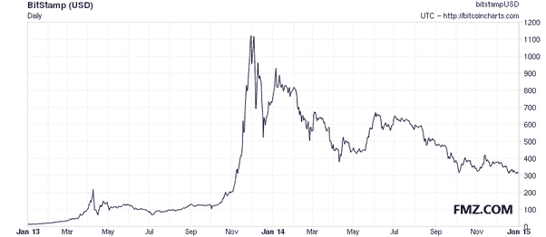

# 关于比特币的常见问题(2)

> 原文：<https://medium.datadriveninvestor.com/faq-about-bitcoin-2-f6cea288f70e?source=collection_archive---------15----------------------->

[www.fmz.com](http://www.fmz.com/)

**法律**

**比特币合法吗？**

据我们所知，[大多数司法管辖区的立法都没有将比特币定为非法](https://en.wikipedia.org/wiki/Legality_of_bitcoin_by_country)。然而，一些司法管辖区(如阿根廷和俄罗斯)严格限制或禁止外币。其他司法管辖区(如泰国)可能会限制某些实体(如比特币交易所)的许可。

不同司法管辖区的监管机构正在采取措施，为个人和企业提供如何将这种新技术与正式的受监管金融系统相结合的规则。例如，美国财政部下属的金融犯罪执法网络(FinCEN)发布了不具约束力的指南，说明如何对涉及虚拟货币的某些活动进行定性。

**比特币对非法活动有用吗？**

比特币就是钱，钱从来都是合法和非法两种用途。现金、信用卡和当前的银行系统在用于资助犯罪方面远远超过了比特币。比特币可以在支付系统中带来重大创新，这种创新的好处通常被认为远远超过其潜在的缺点。

比特币旨在让货币变得更加安全，这是一个巨大的进步，也可以成为防范多种形式金融犯罪的重要手段。例如，比特币是完全不可能伪造的。用户可以完全控制自己的支付，不会收到未经批准的费用，如信用卡欺诈。比特币交易是不可逆的，不会受到欺诈性退款的影响。比特币使用非常强大和有用的机制，如备份、加密和多重签名，使金钱免受盗窃和损失。

有人担心比特币可能对犯罪分子更有吸引力，因为它可以用于私人和不可逆的支付。然而，这些特征已经存在于现金和电汇中，它们被广泛地使用和确立。比特币的使用无疑将受到现有金融系统内部已经存在的类似监管，比特币也不太可能阻止刑事调查的进行。总的来说，重要的突破在它们的好处被充分理解之前被认为是有争议的，这是很常见的。互联网是说明这一点的一个很好的例子。

**比特币能被监管吗？** [**FMZ**](http://www.fmz.com/)

没有几乎所有用户的合作，比特币协议本身是无法修改的，用户可以选择自己使用的软件。试图在全球比特币网络的规则中将特殊权利分配给一个地方当局是不现实的。任何富裕的组织都可以选择投资采矿硬件来控制网络的一半计算能力，并能够阻止或逆转最近的交易。然而，不能保证他们能保留这种权力，因为这需要比世界上所有其他矿商投入更多的资金。

然而，监管比特币的使用是可能的，就像监管任何其他工具一样。就像美元一样，比特币可以用于各种目的，其中一些可以根据每个司法管辖区的法律被视为合法或不合法。在这方面，比特币与任何其他工具或资源没有什么不同，在每个国家可能受到不同的监管。限制性监管也可能使比特币的使用变得困难，在这种情况下，很难确定有多少比例的用户会继续使用这项技术。选择禁止比特币的政府会阻止国内企业和市场的发展，将创新转移到其他国家。一如既往，监管者面临的挑战是开发高效的解决方案，同时不损害新兴市场和业务的增长。

**比特币和税收呢？**

比特币不是一种法定货币，在任何司法管辖区都具有法定货币地位，但无论使用何种媒介，通常都会产生纳税义务。许多不同的司法管辖区有各种各样的立法，可能会导致比特币产生收入、销售、工资、资本收益或其他形式的纳税义务。

**比特币和消费者保护怎么样？**

比特币让人们可以按照自己的方式进行交易。每个用户都可以以类似于现金的方式发送和接收付款，但他们也可以参与更复杂的合同。多重签名允许网络仅在特定数量的定义的一组人同意签署交易时才接受交易。这使得创新的纠纷调解服务在未来得以发展。这种服务可以让第三方在其他方不同意的情况下批准或拒绝交易，而不控制他们的资金。与现金和其他支付方式不同，比特币总是会留下交易确实发生过的公开证据，这可能会被用于针对有欺诈行为的企业的追索权。

还值得注意的是，虽然商家通常依靠他们的公众声誉来维持业务并支付员工工资，但在与新消费者打交道时，他们无法获得同等水平的信息。比特币的工作方式允许个人和企业免受欺诈性退款的影响，同时让消费者在不愿意信任特定商家时可以选择要求更多保护。

**经济**

**比特币是如何产生的？**

**新的比特币是通过一个被称为“挖掘”的竞争和去中心化的过程产生的。这一过程包括个人因其服务而得到网络的奖励。比特币矿工正在使用专门的硬件处理交易和保护网络，并收集新的比特币作为交换。**

**比特币协议的设计方式是以固定的速率创造新的比特币。这使得比特币挖矿成为一项竞争非常激烈的业务。随着越来越多的矿商加入这个网络，盈利变得越来越困难，矿商必须寻求效率以降低运营成本。没有中央权力机构或开发商有任何权力控制或操纵系统，以增加他们的利润。世界上的每个比特币节点都会拒绝任何不符合它期望系统遵循的规则的东西。**

**比特币以一种递减且可预测的速度被创造出来。随着时间的推移，每年创造的新比特币数量会自动减半，直到比特币发行完全停止，共有 2100 万个比特币存在。至此，比特币矿工很可能将完全由众多小额交易费支撑。**

****比特币为什么有价值？****

**比特币之所以有价值，是因为它是一种有用的货币形式。比特币具有基于数学属性的货币特征(耐用性、便携性、可替代性、稀缺性、可分性和可识别性)，而不是依赖于物理属性(如黄金和白银)或对中央机构的信任(如法定货币)。简而言之，比特币是有数学做后盾的。有了这些属性，一种形式的货币保持价值所需要的就是信任和采纳。就比特币而言，这可以通过其不断增长的用户、商户和创业公司基础来衡量。与所有货币一样，比特币的价值只直接来自愿意接受它们作为支付手段的人。**

****比特币的价格是由什么决定的？****

**比特币的价格是由供求关系决定的。当对比特币的需求增加时，价格就会上涨，当需求下降时，价格就会下跌。流通中的比特币数量有限，新的比特币以可预测的速度不断减少，这意味着需求必须跟随这一通胀水平，以保持价格稳定。因为与它可能成为的市场相比，比特币仍然是一个相对较小的市场，它不需要大量的资金来推动市场价格上涨或下跌，因此比特币的价格仍然非常波动。**

**一段时间内的比特币价格:**

****

****比特币会变得一文不值吗？****

**是的。历史上充斥着失败和不再使用的货币，比如魏玛共和国时期的德国马克(T2)和最近的津巴布韦元(T4)。尽管以前的货币失败通常是由于比特币无法实现的恶性通货膨胀，但技术故障、竞争性货币、政治问题等总是有可能发生。作为一个基本的经验法则，任何货币都不应该被认为是绝对安全的。自诞生以来，比特币多年来一直被证明是可靠的，比特币有很大的潜力继续增长。然而，没有人能够预测比特币的未来。**

****比特币是泡沫吗？** [**FMZ**](http://www.fmz.com/)**

**价格的快速上涨并不构成泡沫。将导致突然向下修正的人为高估构成了泡沫。成千上万的市场参与者基于个人行为的选择是比特币价格波动的原因，因为市场寻求价格发现。情绪变化的原因可能包括对比特币信心的丧失，并非基于比特币经济基本面的价值和价格之间的巨大差异，刺激投机需求的新闻报道增加，对不确定性的恐惧，以及老式的非理性繁荣和贪婪。**

****比特币是庞氏骗局吗？****

**庞氏骗局是一种欺诈性的投资操作，从投资者自己的钱或后续投资者支付的钱中支付回报，而不是从经营企业的个人获得的利润中支付回报。庞氏骗局旨在当没有足够多的新参与者时，以最后投资者为代价而崩溃。**

**比特币是一个没有中央权威的自由软件项目。因此，没有人能够对投资回报做出虚假陈述。像黄金、美元、欧元、日元等其他主要货币一样。购买力没有保证，汇率自由浮动。这导致了波动性，比特币的所有者可以不可预测地赚钱或赔钱。除了投机，比特币也是一种支付系统，具有有用和竞争的属性，正被成千上万的用户和企业使用。**

****比特币不是不公平地让早期使用者受益吗？****

**一些早期采用者拥有大量比特币，因为他们冒险将时间和资源投入到一项未经证实的技术中，这项技术几乎没有人使用，也更难妥善保护。许多早期采用者在比特币变得有价值之前花费了大量比特币相当多的时间，或者只购买了少量比特币，没有获得巨额收益。不能保证比特币的价格会上涨或下跌。这非常类似于投资一家早期创业公司，要么通过其实用性和知名度获得价值，要么永远不会突破。比特币还在起步阶段，已经用非常长远的眼光设计了；很难想象它如何能更少地偏向早期用户，今天的用户可能是也可能不是明天的早期用户。**

****比特币的有限数量不会成为一种限制吗？****

**比特币的独特之处在于，只有 2100 万个比特币会被创造出来。然而，这永远不会是一个限制，因为交易可以用比特币的更小的子单位来计价，例如比特——1 比特币有 1，000，000 个比特。随着平均交易规模的下降，比特币可以分割成最多 8 位小数(0.000 000 01)，如果未来需要，甚至可以分割成更小的单位。**

****比特币不会陷入通缩螺旋吗？** [**FMZ**](http://www.fmz.com/)**

**通货紧缩螺旋理论认为，如果预计价格会下跌，人们会将购买转移到未来，以便从较低的价格中受益。需求的下降将反过来导致商家降低价格来刺激需求，使问题变得更糟，并导致经济萧条。**

**尽管这一理论是央行行长们为通胀辩护的一种流行方式，但它似乎并不总是正确的，而且在经济学家中被认为是有争议的。消费电子产品是一个价格不断下跌但并不萧条的市场的例子。同样，比特币的价值随着时间的推移而上升，但比特币经济的规模也随之大幅增长。因为比特币的价值和经济规模在 2009 年都是从零开始的，所以比特币是一个反例，表明它有时肯定是错的。**

**尽管如此，比特币并非旨在成为一种通缩货币。更准确的说法是，比特币打算在最初几年膨胀，在以后几年变得稳定。流通中的比特币数量唯一会下降的时候，是人们因为没有备份而不小心丢失了钱包。有了稳定的货币基础和稳定的经济，货币的价值应该保持不变。**

****投机和波动不是比特币的问题吗？****

**这是一个先有鸡还是先有蛋的问题。为了稳定比特币的价格，一个大规模的经济需要有更多的企业和用户来发展。为了发展大规模经济，企业和用户将寻求价格稳定。**

**幸运的是，波动性并不影响比特币作为支付系统将资金从 A 点转移到 b 点的主要好处。企业可以即时将比特币支付转换为本币，从而从比特币的优势中获利，而不受价格波动的影响。由于比特币提供了许多有用和独特的功能和属性，许多用户选择使用比特币。有了这样的解决方案和激励措施，比特币有可能成熟并发展到价格波动将变得有限的程度。**

****如果有人买下所有现存的比特币会怎么样？****

****迄今发行的比特币只有一小部分在交易市场上出售。比特币市场竞争激烈，这意味着比特币的价格会根据供求关系而上涨或下跌。此外，未来几十年，新的比特币将继续发行。因此，即使是最坚定的买家也不可能买下现有的所有比特币。然而，这种情况并不意味着市场不容易受到价格操纵的影响；它仍然不需要大量的资金来推动市场价格上涨或下跌，因此比特币迄今为止仍然是一种不稳定的资产。****

******如果有人创造了更好的数字货币呢？******

****这是有可能的。目前，比特币仍然是最受欢迎的去中心化虚拟货币，但不能保证它会保持这一地位。受比特币的启发，已经有了一套替代货币。然而，假设一种新货币在现有市场上超越比特币需要重大改进可能是正确的，尽管这仍然不可预测。只要不改变协议的基本部分，比特币也可以采用竞争货币的改进。****

****未完待续。 [FMZ](http://www.fmz.com/)****

****最初发表于 Bitcoin.org 的[。](https://bitcoin.org/en/faq)****