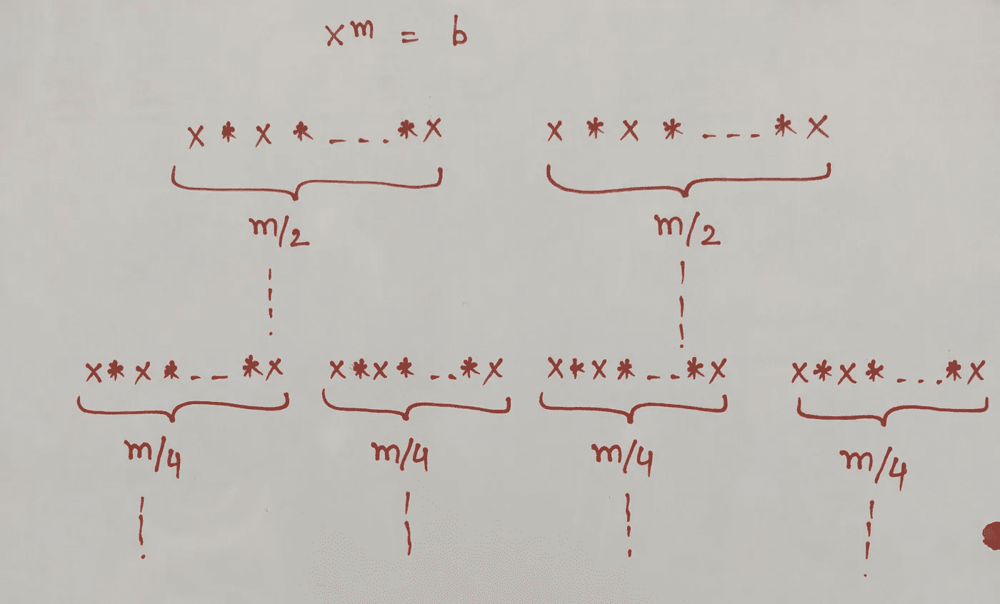
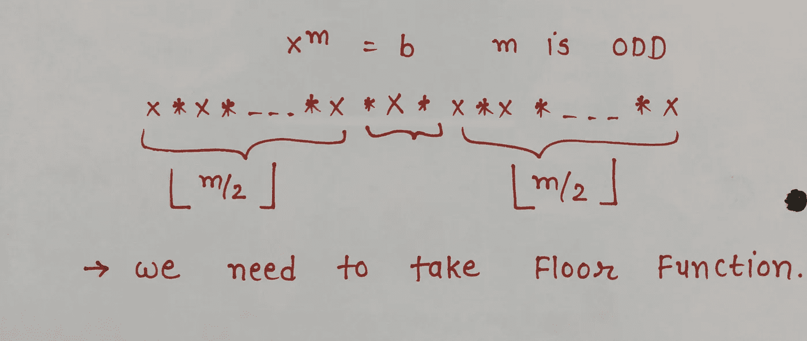
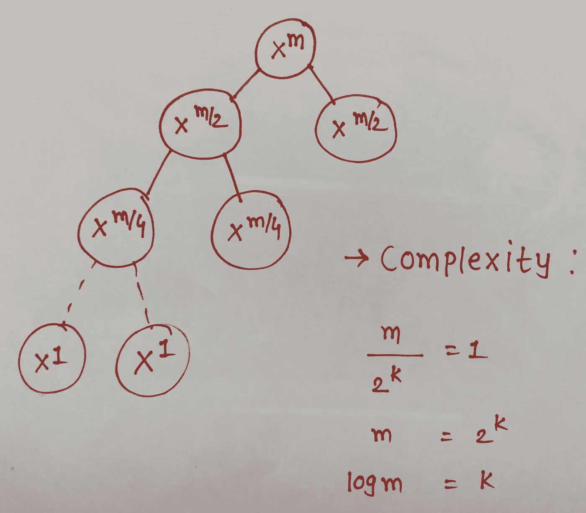

# 使用动态规划的快速取幂

> 原文：<https://medium.datadriveninvestor.com/fast-exponentiation-using-dynamic-programming-48e36285e320?source=collection_archive---------5----------------------->


NOTE: Photo by [Markus Spiske](https://unsplash.com/@markusspiske?utm_source=unsplash&utm_medium=referral&utm_content=creditCopyText) on [Unsplash](https://unsplash.com/search/photos/number-cryptography?utm_source=unsplash&utm_medium=referral&utm_content=creditCopyText)

***模幂运算*** 计算整数 a 的 n 次方(指数)除以正整数 b(模数)后的余数。所以我们需要使用我将在本文中讨论的 ***快速取幂*** 方法来加快计算速度。

## 问题:

> 给定 a，b 和 n，其中 n≥0，0≤a **快速取幂使用。我们可以用 2 的幂(二进制)或 10 的幂(十进制)来表示“不”。比如，**

a^x = (a^p)* (a^q )* (a^r)
其中 x=p+q+r

简单的算法是

```
y = a
for (i=2, 3, ….., n)
    y = ya(modm);
return y;
```

但是它包含了导致 ***O(n)*** 复杂度的(n-1)调制。但是我们希望复杂度更低，所以我们使用了 ***快速取幂运算。***

假设我们现在取 n=x^m，我们想在更短的时间内计算 n。这里我们能做的就是简单地[分而治之](https://en.wikipedia.org/wiki/Divide-and-conquer_algorithm)来简化计算。



If m is Even

如果 m 是奇数，那么我们必须在乘法之间加一个 x。



If m is Odd

如果是奇数，我们需要取底函数来计算各项。通过计算我们可以说，如果 m / 2^e=为 1，那么它就是最后一项。(其中 e 只是所需的幂的数量)。

所以我们可以把这一项作为一个函数，用来计算我们算法的复杂度。

功能应该是，

> f(m/2^e)=x

***f(0)=1*** 这是我们已经知道的。



Time Complexity using Recursion Tree Method

所以时间复杂度将是， ***O(logm)*** 这远远优于以前的 ***O(m)。***

如果 n 是 2 的幂，比如说 n=2^k，那么计算速度要快得多: ***只需简单地平方 a，k 乘以*** 。例如，我们想计算一个^⁸⁴(mod，所以我们需要先计算 12⁸⁴，然后是最后一项。我们对计算 12⁸⁴感兴趣，所以我们可以把这个指数分解成 2 的幂。

所以 84 可以用 ***二进制项*** 来表示，像
84=64 + 16 +4
它给我们简化。怎么会？让我想想…

> 12⁴ = 12 * 12
> 再一次 12 = 12 * 12
> 现在，12 ⁶ = 12⁸ * 12⁸
> 12⁸ = 12⁴ *12⁴，这是我们在前面的步骤中已经计算过的。

如你所见，我们有重复的步骤。那么 ***动态编程*** 部分来了。我们只需要做很少的计算，我们把大问题分成小部分，然后把小部分合并，得到解决方案。大多数公钥密码学都依赖于我们快速计算各项的能力。

## 算法:

int power(int x，int m){

如果(m==0)

返回 1；

else if(m==1)

返回 x；

否则{

int r =幂(x，m/2)；//递归调用函数

if(m%2==0) //如果 m 是偶数

返回 r * r

否则//如果 m 是奇数

返回 r * x * r

}

}

***快速取幂就这样。***

感谢阅读。

参考资料:

高拉夫森:【https://youtu.be/-3Lt-EwR_Hw】T4

维基百科:[https://en.wikipedia.org/wiki/Exponentiation_by_squaring](https://en.wikipedia.org/wiki/Exponentiation_by_squaring)