# FastAi 和 Render:创建和部署计算机视觉模型的快捷方式

> 原文：<https://medium.datadriveninvestor.com/fastai-and-render-quick-and-easy-way-to-create-and-deploy-computer-vision-models-14fd3f903cfc?source=collection_archive---------2----------------------->

[](http://www.track.datadriveninvestor.com/1B9E)

我非常兴奋，我正在参加 *FastAi 课程:程序员实用深度学习，v3。*我刚刚完成了第一课**“图像分类”**，我想尝试我的第一个项目，甚至更多，尝试部署它，因为我阅读了他们提供的步骤，使采取你自己的生产模型。

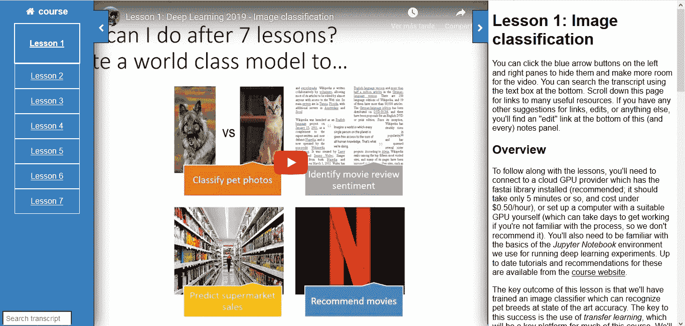

如果你想更多地了解这门课程，我在参考资料部分分享了下面的链接。

# FastAi 是什么？

**FastAi** 是一个新的深度学习开源库。这个库建立在 **PyTorch** 之上，为最重要的深度学习应用和数据类型提供单一一致的 API。

FastAi 库使用现代最佳实践简化了快速准确的神经网络训练。它基于在 [fast.ai](http://www.fast.ai) 进行的深度学习最佳实践的研究，包括对`[vision](https://docs.fast.ai/vision.html#vision)`、`[text](https://docs.fast.ai/text.html#text)`、`[tabular](https://docs.fast.ai/tabular.html#tabular)`和`[collab](https://docs.fast.ai/collab.html#collab)`(协同过滤)的“开箱即用”支持。

# 让我们使用 FastAi 创建一个计算机视觉模型

使用 FastAi 创建和部署计算机视觉模型的简单方式会让您感到惊讶。我将创建一个计算机视觉模型来检测农作物中的疾病。该应用程序将检测 38 个不同的类。我以前在 PyTorch 的这个项目中工作过，并且使用了 **PlantVillage 数据集。**

[](https://www.datadriveninvestor.com/2019/03/22/fixing-photography/) [## 修复摄影-数据驱动的投资者

### 汤姆·津伯洛夫在转向摄影之前曾在南加州大学学习音乐。作为一个…

www.datadriveninvestor.com](https://www.datadriveninvestor.com/2019/03/22/fixing-photography/) 

让我们从导入库开始，特别是 vision 模块。视觉模块包含我们定义数据集和训练计算机视觉模型所需的一切。它还包含所有不同的子模块来进行训练:**视觉。image** 定义图像对象以应用转换， **vision.transforms** 包含数据扩充的转换**，vision.data** ，包含 ImageDataBunch 的定义以构建 DataBunch，以及 **vision.learner** 使用预训练的卷积神经网络构建和微调模型或从头开始训练随机初始化的模型。

```
from fastai import *
from fastai.vision import *
from pathlib import Path
```

让我们从图像文件夹(训练和有效数据集)创建一个数据分组。批量大小为 32，定义图像大小为 224:

```
data = ImageDataBunch.from_folder(path=Path('PlantVillage/').resolve(), train='train', valid='val', dl_tfms=get_transforms(), num_workers=0, bs=32, size=224).normalize(imagenet_stats)
```

可视化一些数据:

```
data.show_batch(rows=3, figsize=(5,5))
```

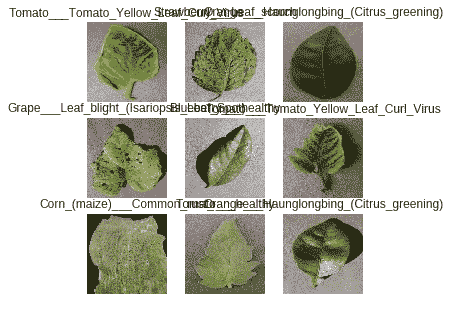

现在，让我们创建一个名为 **learn_50** 的*学习器*对象来训练一个卷积神经网络(用 cnn_learner)。我加载了预训练模型 *ResNet 50* 并运行了 3 个时期。在每个时期之后，所有的*指标*都将被打印:

```
learn_50 = cnn_learner(data, models.resnet50, metrics=[accuracy, error_rate])
learn_50.fit_one_cycle(3)
```

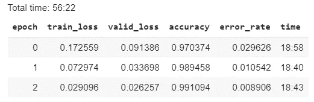

看看这 3 个纪元的精确度！

让我们绘制培训和验证损失图:

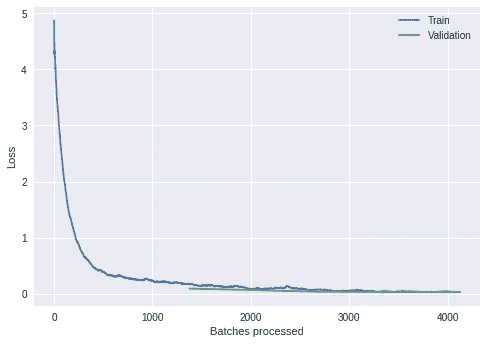

一点也不差，对吧？

让我们把模型留给推论:

```
learn_50.export('trained_model50.pkl')
```

保存模型后，我使用 Google Drive 上传文件并获得可共享的链接，这是我在**渲染**时需要的，我们将使用云服务来部署我们的计算机视觉模型。

# Render:一个新的云提供商，使得在生产中部署 Web 应用变得简单

当我听说 Render 时，我发现这是一种部署我的计算机视觉模型的好方法。Render 是一个统一的平台，可以构建和托管您所有的应用程序和网站，具有免费的 SSL、全球 CDN 和从 GitHub 自动部署。

你不会相信在那里部署一个模型有多容易。你所需要的只是在 Render 上的一个新账户，你在 GitHub 上的项目，以及在云服务中上传你的模型。

让我们开始:

**渲染时创建账户**

我已经创建了一个帐户并部署了一些 Web 应用程序，您可以在我的控制面板中看到:

创建账户后你需要做的第一件事是点击**新网络服务:**


我喜欢 Render 的地方是你可以从你的 GitHub Repos 中选择。你只需要将你的 GitHub 账号与 Render 同步即可。

这是我们在 Render 上部署模型的基本结构:

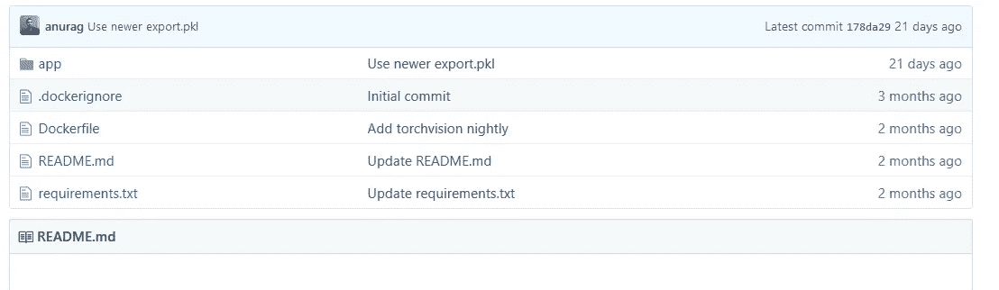

您可以在此处分叉此回购:

[](https://github.com/render-examples/fastai-v3) [## render-examples/fastai-v3

### 在 Render-Render-examples/fastai-v3 上部署 fastai v3 模型的入门应用程序

github.com](https://github.com/render-examples/fastai-v3) 

您唯一需要做的事情就是修改 **server.py** 文件，并更改下面几行:

```
# Change the export_file_url. I used Google Drive link: export_file_url =  'https://drive.google.com/uc?export=download&id=1C8Sj6KCLvajZPyqAg2z5fLDKuulePiCS' #Write the model's name:
export_file_name = 'export3.pkl' #Write all the classes:

classes = ['Apple___Apple_scab', 'Apple___Black_rot', 'Apple___Cedar_apple_rust', 'Apple___healthy', 'Blueberry___healthy', 'Cherry_(including_sour)___Powdery_mildew', 'Cherry_(including_sour)___healthy', 'Corn_(maize)___Cercospora_leaf_spot Gray_leaf_spot', 'Corn_(maize)__Common_rust', 'Corn_(maize)___Northern_Leaf_Blight', 'Corn_(maize)___healthy, Grape___Black_rot', 'Grape___Esca_(Black_Measles)', 'Grape___Leaf_blight_(Isariopsis_Leaf_Spot)', 'Grape___healthy, Orange___Haunglongbing_(Citrus_greening)', 'Peach___Bacterial_spot', 'Peach___healthy', 'Pepper, _bell___Bacterial_spot', 'Pepper,_bell___healthy', 'Potato___Early_blight', 'Potato___Late_blight', 'Potato___healthy', 'Raspberry___healthy', 'Soybean___healthy', 'Squash___Powdery_mildew', 'Strawberry___Leaf_scorch', 'Strawberry___healthy', 'Tomato___Bacterial_spot', 'Tomato___Early_blight', 'Tomato___Late_blight', 'Tomato___Leaf_Mold', 'Tomato___Septoria_leaf_spot', 'Tomato___Spider_mites Two-spotted_spider_mite', 'Tomato___Target_Spot', 'Tomato___Tomato_Yellow_Leaf_Curl_Virus', 'Tomato___Tomato_mosaic_virus', 'Tomato___healthy'                       ]
```

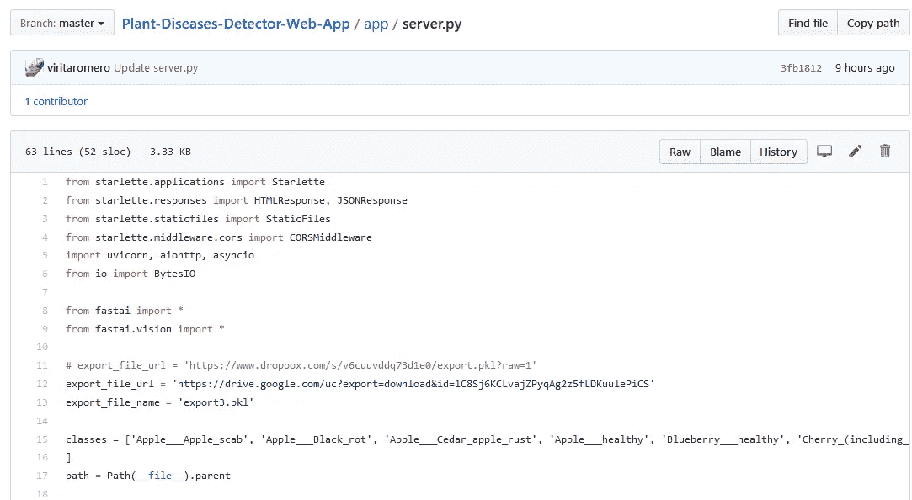

现在，回到 Render，通过点击**连接一个新的 repo:** 来查找您想要部署的 Repo

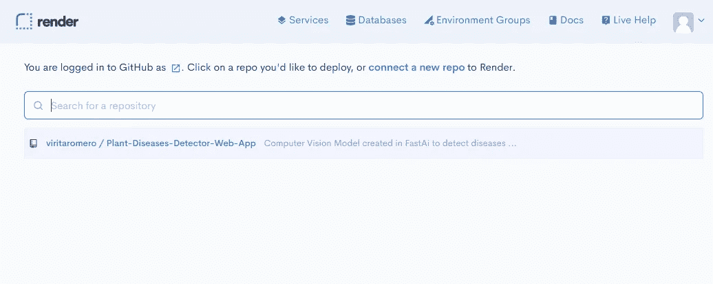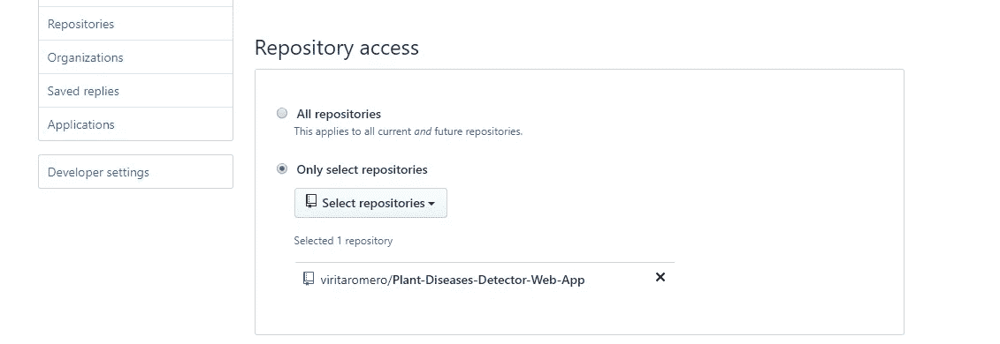

选择 Repo 后，您将命名 Web 服务并继续:

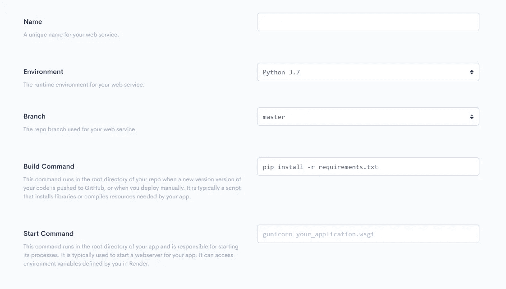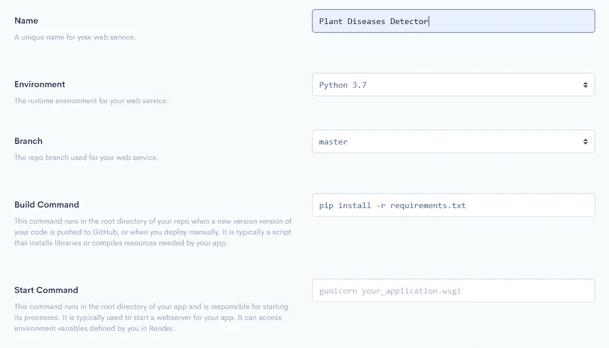

您将看到这个黑屏正在执行部署 Web 服务所必需的操作:

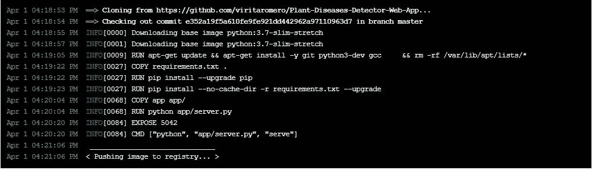

该过程完成后，您将看到此屏幕，在上面，您将看到访问您的应用程序的链接:

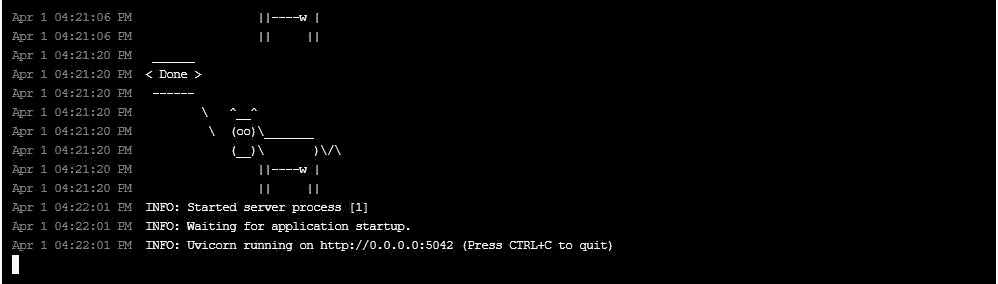

我喜欢 Render 的另一点是，每次你更新 GitHub Repo 中的内容时，Web 服务也会得到更新。您可以在这里看到我对项目所做的所有更改:

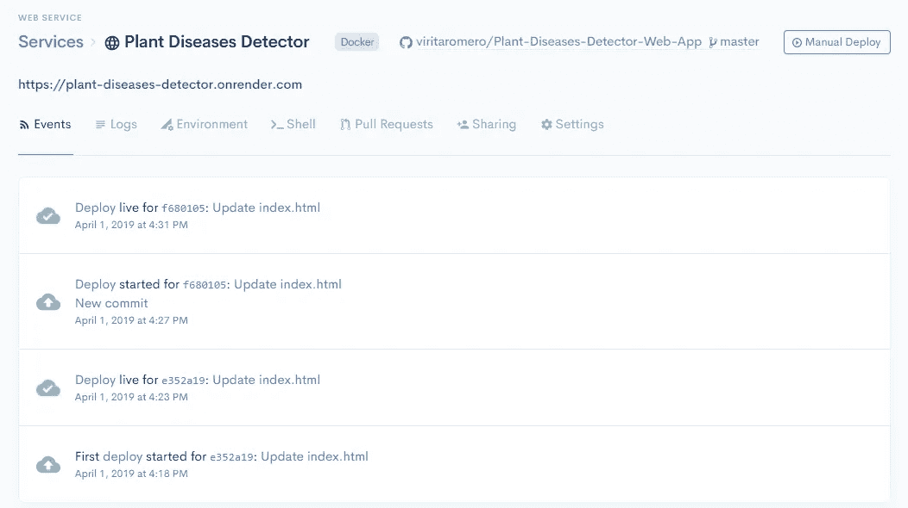

您可以通过此链接访问我的应用程序:

[https://plant-diseases-detector.onrender.com](https://plant-diseases-detector.onrender.com/)

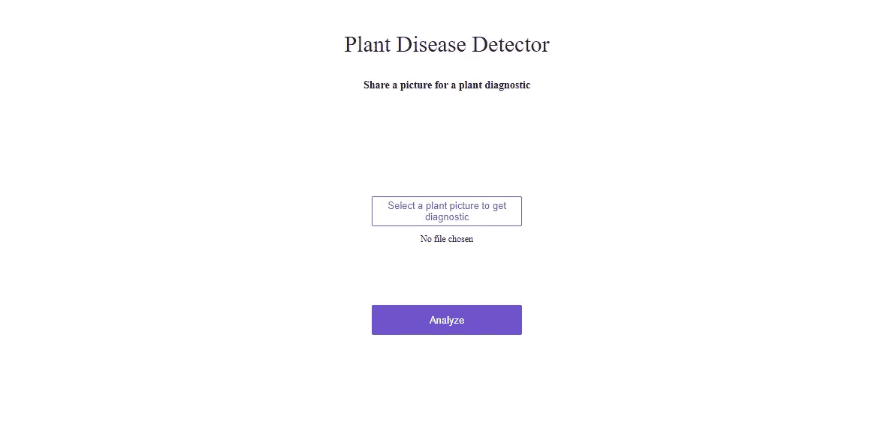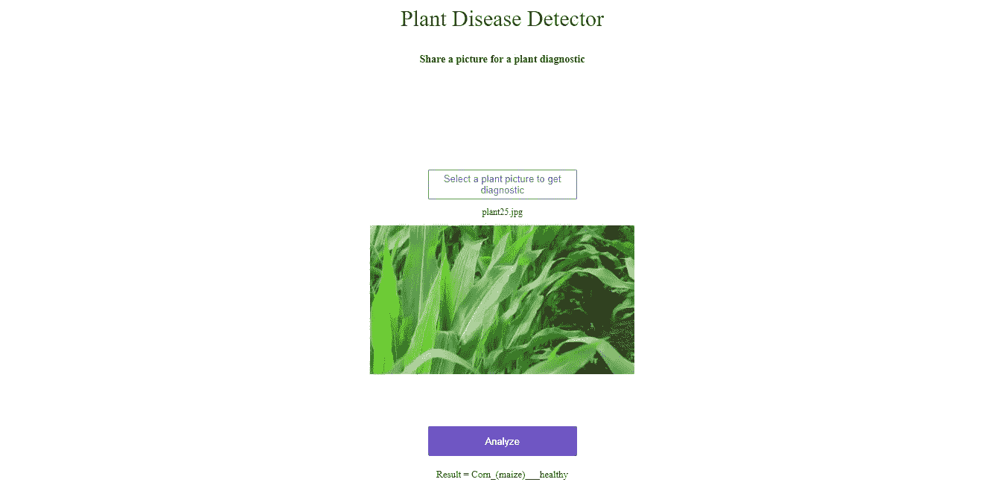

尝试自己创建和部署模型！

# 参考

**使用 Render 将模型部署到 Web 应用程序的步骤**

[](https://course.fast.ai/deployment_render.html) [## 在 Render | fast.ai 课程 v3 上部署

### 如果你只是想在 Render 上测试初始部署，starter repo 设置为使用 Jeremy 的 bear 分类…

course.fast.ai](https://course.fast.ai/deployment_render.html) 

**快艾**

[](https://www.fast.ai/) [## fast.ai 让神经网络再次变得不酷

### 但对我来说，这是一个跳进去的理由！我喜欢参与项目的早期阶段，我相信这将…

www.fast.ai](https://www.fast.ai/) 

**渲染上 fastai v3 模型部署的启动程序**[**https://render.com**](https://render.com)

[](https://github.com/render-examples/fastai-v3) [## render-examples/fastai-v3

### 在 Render-Render-examples/fastai-v3 上部署 fastai v3 模型的入门应用程序

github.com](https://github.com/render-examples/fastai-v3)