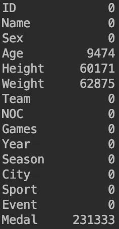
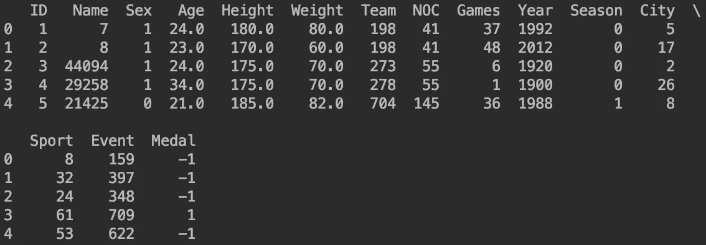

# “更快、更高、更强”——ML 谈奥运

> 原文：<https://medium.datadriveninvestor.com/faster-higher-stronger-ml-on-olympics-e0268d9d198?source=collection_archive---------9----------------------->

每个人都兴奋地等待了 4 年，等待这些事件的到来。没错，我说的是奥运会。在这里，我将写下我在[兰迪·H·格里芬](https://www.kaggle.com/heesoo37)的 [Kaggle](https://www.kaggle.com/heesoo37/120-years-of-olympic-history-athletes-and-results) 上发现的与奥运会相关的数据集。

> “所以你希望在奥运会上征服，我的朋友？我也是……但首先要记住条件和后果。你必须让自己遵守纪律；饮食有规律，避免蛋糕和甜食；不管你喜不喜欢，在指定的时间锻炼身体，不管天气是冷是热；随意戒除冷饮和葡萄酒。然后，在冲突本身中，你很可能会弄脱臼你的手腕或扭伤你的脚踝，吞下大量的灰尘，被严重殴打，在所有这些事情之后，被打败。”
> 
> **—爱比克泰德** ( **镶嵌与碎片的话语**)


“man on running field” by [Braden Collum](https://unsplash.com/@bradencollum?utm_source=medium&utm_medium=referral) on [Unsplash](https://unsplash.com?utm_source=medium&utm_medium=referral)

# D ata

该数据集有 15 个属性和 271k 个样本，这是我将在 Medium 上研究的最大数据集。我将做一些掘金作为这项研究的主要目的，给定的信息与运动员是否赢得奖牌有关。

```
Attributes:ID    -> Each athlete's unique number 
Name  -> 134732 Unique Values
Sex 
Age
Height 
Weight
Team
NOC    -> National Olympic Committee
Games  -> Year and season
Year   -> 1896 - 2016
Season -> Summer or Winter
City
Sport
Event
Medal  -> Gold, Silver, Bronze, or NA 
```



missing values chart

由于数据集有 271k 行，最好检查缺失值。

```
print(df.isnull().sum())
```

这里可以看出；年龄、身高和体重列缺少值。这些色谱柱对于获得准确的结果非常重要。因此，柱不能作为柱被移除，它们需要被替换。

# 预处理

首先，在熊猫的数据帧结构中取一个数据；

```
**import** pandas **as** pd

olympics_csv = pd.read_csv('athlete_events.csv')

df = pd.DataFrame(olympics_csv)
```

为了替换缺失的值，应该适当地填写年龄、体重和身高。此外，许多列需要编号，它们是:姓名、性别、团队、NOC、游戏、季节、城市、运动和事件。

以熊猫馆特色编号的勋章价值；

```
df['Medal']  = df.groupby(['Medal']).ngroup()
```

如果运动员赢了:

*   黄金-> **1**
*   银->2
*   铜牌->3
*   输-> **-1**

体重、年龄和身高用各栏的平均值代替；

```
df['Weight'] = df['Weight'].fillna(df['Weight'].mean().astype(int))

df['Height'] = df['Height'].fillna(df['Height'].mean().astype(int))df['Age'] = df['Age'].fillna(df['Age'].mean().astype(int))
```

对于其他列；

```
df['Name']   = df.groupby(['Name']).ngroup()
df['Sex']    = df.groupby(['Sex']).ngroup()
df['Team']   = df.groupby(['Team']).ngroup()
df['NOC']    = df.groupby(['NOC']).ngroup()
df['Games']  = df.groupby(['Games']).ngroup()
df['Season'] = df.groupby(['Season']).ngroup()
df['City']   = df.groupby(['City']).ngroup()
df['Sport']  = df.groupby(['Sport']).ngroup()
df['Event']  = df.groupby(['Event']).ngroup()
```

操作后，除年龄列外，所有列都被填充并编号；



df.head() #first 5 rows

最后，将训练值一分为二，用于以后的建模；

```
X = np.array(df.iloc[:,0:-1])
Y = np.array([[df['Medal']]])
```

y 需要重塑；

```
Y = Y.reshape(271116)
```

# 创建 SGD 分类器模型

```
X_train, X_test, y_train, y_test = train_test_split(X,Y, test_size=0.2, random_state = 5)

clf = linear_model.SGDClassifier()
clf.fit(X, Y)

y_pred = clf.predict(X_test)
print("Accuracy score of SGD: ",accuracy_score(y_test,y_pred))
```

# 创建朴素贝叶斯模型

```
model = GaussianNB()
model.fit(X_train, y_train)

y_pred = model.predict(X_test)
print("Accuracy score of Naive Bayes:",accuracy_score(y_test,y_pred))
```

# 创建内核近似模型

这个模型是 sci-kit 的模型模式推荐的，所以为什么不试试呢。开玩笑的。

> 在机器学习中，**核方法**是一类用于模式分析的算法，其最著名的成员是支持向量机(SVM)。**模式分析的一般任务是发现和研究数据集中关系的一般类型**。
> 
> -维基百科上说的内核方法

这个解释和目的重叠了。ML 算法期望找到模式。

```
rbf_feature = RBFSampler(gamma=1, random_state=1)
X_features = rbf_feature.fit_transform(X)
clf = SGDClassifier()
clf.fit(X_features, Y)

print("Accuracy score of Kernel Approximation:",clf.score(X_features, Y))
```

# 结论和结果

首先是结果；

```
Accuracy score of SGD: 0.84731853054
Accuracy score of Naive Bayes: 0.854012983181
Accuracy score of Kernel Approximation: 0.853262072323
```

在该数据集中，发现所有三个模型的精度水平都低于预期，并且该输出有一个相当大的点；

*   用平均值填充缺失值

总共填充了 132.520 个值，这个庞大的数字显示了它对算法的影响。

我相信我会回来提高准确度。

*最后，我的 GitHub 库可以到达* [*这里*](https://github.com/MertEfeSevim/MLonOlympics) *。*