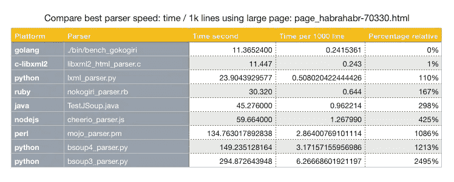
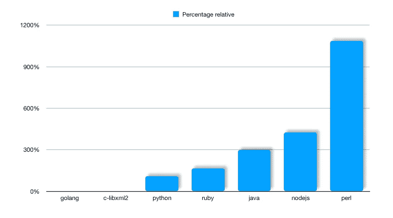

# 最快的 HTML 解析器:Python vs Ruby vs Java vs C vs GoLang vs Ruby vs node . JS/JS vs Perl…

> 原文：<https://medium.datadriveninvestor.com/fastest-html-parser-available-now-f677a68b81dd?source=collection_archive---------2----------------------->

我创建了一个基准，在多个平台(Python、Ruby、Java、Golang、C、Nodes / Javascript、Perl……)上运行最流行的 HTML 解析器，看看谁是目前最快的解析器。

创建这个项目是为了对现有的最佳解析器实现进行基准测试，以使我们的搜索服务 [SerpAPI](https://serpapi.com) 尽可能高效。 [SerpAPI](https://serpapi.com) 大规模提供本地化的谷歌搜索，并为任何谷歌搜索返回 JSON 响应([图片搜索](https://serpapi.com/images-results)、[购物](https://serpapi.com/shopping-results)、[新闻](https://serpapi.com/news-results)..)

存储库位于此处。
[https://github.com/serpapi/html-parsers-benchmark](https://github.com/serpapi/html-parsers-benchmark)

该方法包括多次解析页面(x100)并记录解析器处理 HTML 内容所花费的时间。然后，对解析后的文档执行一个简单的查询来验证解析结果。

此表显示了大型 HTML 文件的结果。

x100 read / parser — 1.6M / 47k lines HTML file

让我们归一化并绘制值。

Normalized parsing time across best parsers for multiple platforms

越少越快越好！！

*   表现最好的是 Golang 和 C，结果非常相似。
*   Python LIBXML2 表现相当不错。
*   Ruby 的速度和 Python 差不多。
*   测试的 Java 解析器速度较慢。
*   Perl 解析器已经像语言一样过时了。
*   对于这项任务，NodeJS 非常慢。

请注意，这个结果可能会因工作负载的不同而有很大差异。例如，由于 Java 启动时间的原因，小页面 Java 可能比 Ruby 慢 10 倍。我鼓励在您机器上运行这些测试。命令相当简单:

$ git clone[https://github.com/serpapi/html-parsers-benchmark](https://github.com/serpapi/html-parsers-benchmark)
$ make build
$ make fetch _ all run _ all CSV repeat = 100
$ cat report . CSV

我们执行这些测试是为了构建 SerpAPI，我们选择“Ruby + Nokogiri”作为获胜者。Ruby 非常灵活，易于实现，同时表现出良好的性能。这项服务每天在一个 Linux 系统上解析超过一百万个 HTML 页面。

我希望你喜欢这篇文章，我会不断更新更多的数据。

保持简单和愚蠢。