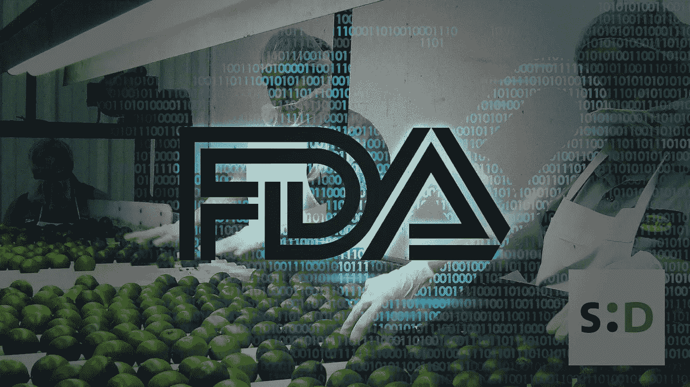

# FDA“探索”区块链技术用途的新举措

> 原文：<https://medium.datadriveninvestor.com/fdas-new-initiative-to-explore-usage-of-blockchain-technology-559385269e69?source=collection_archive---------9----------------------->

2019 年 6 月 7 日星期五，美国美国食品药品监督管理局机构发布了一份新闻稿，作为世界食品安全日的一部分。新闻稿的本质是讨论美国在全球食品安全中的角色。

在这份报告中，食品政策和反应部副部长 Frank Yiannas 讨论了不安全食品对全球人民的影响。

 [## 创新警报:区块链 3.0、Terra 协议、ICO 门户和更多数据驱动的投资者

### 尽管过去几个月加密货币的价格波动很小，但这项技术并没有停止发展…

www.datadriveninvestor.com](https://www.datadriveninvestor.com/2019/03/16/innovation-alert-blockchain-3-0-terra-protocol-an-ico-portal-more/) 

他解释说，每年全球有 42 万人死于食源性病原体。他还解释说，超过四分之一的受影响者是 5 岁以下的儿童，强调了全球社会采取行动的必要性。

*“全世界每年有 420，000 人死亡，其中 125，000 人是 5 岁以下儿童”*

目前，美国负责从 200 多个国家或地区进口大约 15%的全球食品供应。这包括美国公民食用的大约三分之一的新鲜蔬菜、一半以上的新鲜水果和几乎所有的海鲜。

上述统计强调了来自全球任何地方的食物病原体对美国食品工业的影响。并强调了在全球范围内对食品安全采取行动的必要性。

## 区块链来拯救？

在这份报告中，Yiannas 讨论了美国食品和药物管理局为改善全球食品安全质量而计划调查的举措。其中之一是*“更智能的食品安全新时代”*——由 Yiannas 和 FDA 代理专员 Ned Sharpless 发起的倡议。

在解释该倡议的目的时，Yiannas 明确表示*智能食品安全新时代*的重点是*“利用新兴技术推进我们的食品安全目标”*。

他继续指出，这种方法导致美国食品和药物管理局探索正在社会和企业中使用的技术，包括*[*区块链*](https://somethingdecent.co.uk/tag/blockchain) *、传感器技术、物联网和人工智能*。*

*Yiannas 进一步解释说，上述技术将有助于美国食品和药物管理局创建一个*“更加数字化、可追溯和更加安全的食品系统。”*。*

*虽然报告没有提到任何具体的区块链项目，但美国食品和药物管理局正在研究区块链技术的使用案例，这只能是一个好迹象。*

*爱，和平和幸福。*

*[查看此内容的防字时间戳证书](https://somethingdecent.co.uk/news/blockchain/fdas-new-initiative-to-explore-usage-of-blockchain-technology/#wordproof)*

*原文：<https://somethingdecent.co.uk/news/blockchain/fdas-new-initiative-to-explore-usage-of-blockchain-technology/>*